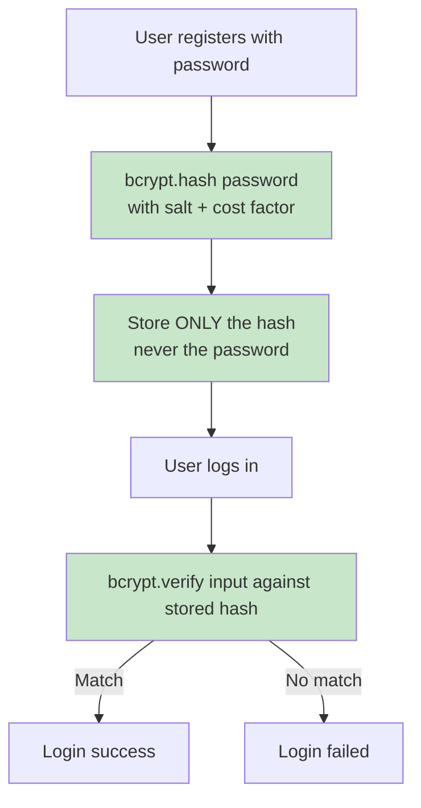
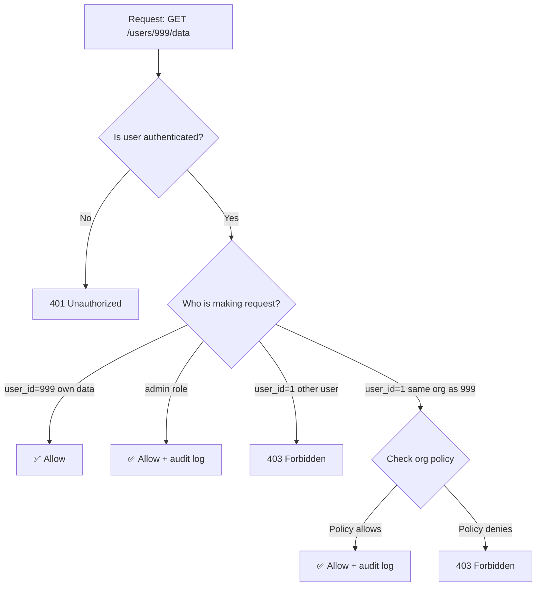

# 03 — Security

> **Questions 21–30** | Protecting your API from attacks and vulnerabilities

---

## Question 21 — API Stores Passwords in Plain Text
🟢 Junior | ★★★ Very Common

### The Scenario
> *"You join a company and discover their API stores passwords in plain text in the database. If the database is breached, all users are compromised. How do you fix this and migrate existing users?"*

### The Answer

```
NEVER DO THIS:
users table: { id: 1, email: "john@ex.com", password: "mysecret123" }

                    ↓ Database breach ↓
Attacker reads:     password = "mysecret123"  ← GAME OVER

DO THIS INSTEAD:
users table: { id: 1, email: "john@ex.com", password_hash: "$2b$12$KIX..." }

                    ↓ Database breach ↓
Attacker reads:     password_hash = "$2b$12$KIX..."
                    Cannot reverse to original password ✅
```



### Code Example — Password Hashing + Migration Strategy

```python
import bcrypt
import asyncio
from fastapi import FastAPI, HTTPException, Depends
from fastapi.security import HTTPBasic, HTTPBasicCredentials
from pydantic import BaseModel
from sqlalchemy.ext.asyncio import AsyncSession
from enum import Enum

app = FastAPI()
security = HTTPBasic()

class HashAlgorithm(Enum):
    PLAIN = "plain"    # Old broken way
    BCRYPT = "bcrypt"  # Current secure way
    ARGON2 = "argon2"  # Even better (memory-hard)

class UserCreate(BaseModel):
    email: str
    password: str

def hash_password(password: str) -> str:
    """Hash password with bcrypt (work factor 12 is recommended for 2024)"""
    # bcrypt automatically generates a unique salt
    password_bytes = password.encode("utf-8")
    hashed = bcrypt.hashpw(password_bytes, bcrypt.gensalt(rounds=12))
    return hashed.decode("utf-8")

def verify_password(plain_password: str, hashed_password: str) -> bool:
    """Verify password against hash — safe against timing attacks"""
    try:
        return bcrypt.checkpw(
            plain_password.encode("utf-8"),
            hashed_password.encode("utf-8")
        )
    except Exception:
        return False

@app.post("/auth/register")
async def register(user: UserCreate):
    """Store only the hash, never the plain password"""
    # Validate password strength
    if len(user.password) < 8:
        raise HTTPException(400, "Password must be at least 8 characters")
    
    # Hash before any database interaction
    password_hash = hash_password(user.password)
    
    # Store hash only
    # await db.execute("INSERT INTO users (email, password_hash) VALUES (?, ?)",
    #                  user.email, password_hash)
    
    return {"message": "User created", "email": user.email}
    # NEVER return: {"password": user.password} ← plain text in response!

@app.post("/auth/login")
async def login(credentials: HTTPBasicCredentials = Depends(security)):
    """Authenticate user — constant time comparison prevents timing attacks"""
    # Fetch user from database
    # user = await db.fetchone("SELECT * FROM users WHERE email = ?", credentials.username)
    user = {"email": "test@example.com", "password_hash": hash_password("testpassword")}
    
    # IMPORTANT: Always run verify even if user not found
    # This prevents timing-based user enumeration
    stored_hash = user["password_hash"] if user else "$2b$12$invalid_hash_to_prevent_timing"
    
    is_valid = verify_password(credentials.password, stored_hash)
    
    if not user or not is_valid:
        raise HTTPException(
            status_code=401,
            detail="Invalid credentials",
            headers={"WWW-Authenticate": "Basic"},
        )
    
    return {"message": "Login successful"}

# ---- MIGRATION STRATEGY for existing plain text passwords ----
"""
MIGRATION PLAN (no downtime, gradual):

Step 1: Add password_hash column to users table
  ALTER TABLE users ADD COLUMN password_hash VARCHAR(255);
  ALTER TABLE users ADD COLUMN password_algo VARCHAR(20) DEFAULT 'plain';

Step 2: On every successful login, hash and migrate that user's password
  - User logs in with plain text
  - Verify against plain text column (temporarily)
  - Hash password and store in password_hash column
  - Set password_algo = 'bcrypt'

Step 3: After 30-90 days (most active users migrated):
  - Force password reset for remaining 'plain' users
  - Remove plain text password column

Step 4: Deploy code that ONLY uses password_hash
"""

async def migrate_on_login(user_id: int, plain_password: str, db: AsyncSession):
    """Migrate user from plain text to bcrypt hash on their next login"""
    user = await db.get(User, user_id)
    
    if user.password_algo == "plain":
        # Still using plain text — migrate now
        if user.password == plain_password:  # Verify against old plain text
            # Migrate to bcrypt
            user.password_hash = hash_password(plain_password)
            user.password_algo = "bcrypt"
            user.password = None  # Remove plain text!
            await db.commit()
            return True
        return False
    
    # Already migrated — use bcrypt
    return verify_password(plain_password, user.password_hash)
```

### Key Takeaways
> - 💡 **Never store plain text passwords** — use bcrypt or argon2
> - 💡 **bcrypt cost factor 12** is the current recommended minimum (2024)
> - 💡 **Always hash even for wrong user** — prevents timing-based user enumeration
> - 💡 **Migration**: add hash column → migrate on login → force reset remaining users
> - 💡 **argon2** is even stronger than bcrypt (winner of Password Hashing Competition)

---

## Question 22 — Brute Force Attack on Login Endpoint
🟡 Mid | ★★★ Very Common

### The Scenario
> *"Your login endpoint is being hit 10,000 times per minute by a bot trying to guess passwords. Server load is high and legitimate users can't log in. How do you protect against brute force attacks?"*

### The Answer

```
BRUTE FORCE ATTACK PATTERN:
10,000 req/min from different IPs trying:
password1, password2, password123, admin, ...

DEFENSE LAYERS:

Layer 1: Rate limiting (per IP and per account)
Layer 2: Progressive delays (exponential backoff)
Layer 3: Account lockout (temporary, not permanent)
Layer 4: CAPTCHA after N failures

            ┌─────────────────────────────────┐
Bot Attack  │ Rate limit: 5 attempts/IP/min   │──► 429 Too Many Requests
(10K req/m) │                                 │
            │ Per-account: 10 attempts/15min  │──► 429 + account lockout
            │                                 │
            │ Progressive delays: 1s, 2s, 4s  │──► Bot slows down
            └─────────────────────────────────┘
```

### Code Example — Multi-Layer Rate Limiting

```python
import time
import asyncio
import hashlib
from typing import Optional
from fastapi import FastAPI, Request, HTTPException, Depends
from fastapi.responses import JSONResponse
import redis.asyncio as redis_async

app = FastAPI()
redis_client = redis_async.Redis(host="localhost", port=6379, decode_responses=True)

class RateLimiter:
    """Token bucket rate limiter using Redis"""
    
    async def check_rate_limit(
        self,
        key: str,
        max_requests: int,
        window_seconds: int,
        cost: int = 1
    ) -> tuple[bool, int, int]:
        """
        Returns: (allowed, remaining, reset_time)
        Uses sliding window algorithm
        """
        now = int(time.time())
        window_start = now - window_seconds
        
        pipe = redis_client.pipeline()
        # Remove expired entries
        pipe.zremrangebyscore(key, 0, window_start)
        # Count current window
        pipe.zcard(key)
        # Add current request
        pipe.zadd(key, {f"{now}:{id(pipe)}": now})
        # Set TTL
        pipe.expire(key, window_seconds)
        results = await pipe.execute()
        
        current_count = results[1]
        
        if current_count >= max_requests:
            reset_time = int(await redis_client.zrange(key, 0, 0, withscores=True)[0][1]) + window_seconds
            return False, 0, reset_time
        
        remaining = max_requests - current_count - 1
        return True, remaining, now + window_seconds

rate_limiter = RateLimiter()

async def get_client_ip(request: Request) -> str:
    """Extract real IP, handling proxies"""
    forwarded = request.headers.get("X-Forwarded-For")
    if forwarded:
        return forwarded.split(",")[0].strip()
    return request.client.host

@app.post("/auth/login")
async def login(request: Request, credentials: dict):
    client_ip = await get_client_ip(request)
    email = credentials.get("email", "").lower().strip()
    
    # Layer 1: IP-based rate limit (100 req/hour per IP)
    ip_key = f"ratelimit:ip:{client_ip}"
    allowed, remaining, reset = await rate_limiter.check_rate_limit(
        ip_key, max_requests=100, window_seconds=3600
    )
    if not allowed:
        raise HTTPException(
            status_code=429,
            detail="Too many requests from your IP",
            headers={
                "X-RateLimit-Limit": "100",
                "X-RateLimit-Remaining": "0",
                "X-RateLimit-Reset": str(reset),
                "Retry-After": str(reset - int(time.time()))
            }
        )
    
    # Layer 2: Per-account rate limit (10 failed attempts per 15 min)
    account_fail_key = f"login:fails:{hashlib.md5(email.encode()).hexdigest()}"
    fail_count = int(await redis_client.get(account_fail_key) or 0)
    
    if fail_count >= 10:
        ttl = await redis_client.ttl(account_fail_key)
        raise HTTPException(
            status_code=429,
            detail=f"Account temporarily locked. Try again in {ttl} seconds.",
            headers={"Retry-After": str(ttl)}
        )
    
    # Layer 3: Progressive delay (slows down brute force without full lockout)
    if fail_count >= 5:
        delay = 2 ** (fail_count - 5)  # 1s, 2s, 4s, 8s, ...
        delay = min(delay, 30)  # Max 30 second delay
        await asyncio.sleep(delay)
    
    # Attempt authentication
    user = await authenticate_user(email, credentials.get("password", ""))
    
    if not user:
        # Increment failure counter
        await redis_client.incr(account_fail_key)
        await redis_client.expire(account_fail_key, 900)  # Reset after 15 min
        
        # Don't reveal if email exists or not
        raise HTTPException(401, "Invalid email or password")
    
    # Reset failure counter on success
    await redis_client.delete(account_fail_key)
    
    return {"access_token": "jwt_token_here", "token_type": "bearer"}

async def authenticate_user(email: str, password: str) -> Optional[dict]:
    """Stub — replace with real authentication"""
    return None
```

### Key Takeaways
> - 💡 **Combine IP + account rate limiting** — bots use many IPs, one victim account
> - 💡 **Progressive delays** slow brute force without locking out legitimate users
> - 💡 **Don't reveal if email exists** — "Invalid email or password" (not "Email not found")
> - 💡 **Temporary lockout** (15 min) not permanent — legitimate users get back in
> - 💡 **CAPTCHA** after 3-5 failures for added protection

---

## Question 23 — SQL Injection Vulnerability
🟡 Mid | ★★★ Very Common

### The Scenario
> *"A security audit reveals SQL injection vulnerabilities throughout your Flask API. How do you find them all and fix them systematically?"*

### The Answer

```
SQL INJECTION EXAMPLE:

VULNERABLE code:
  email = request.args.get("email")
  query = f"SELECT * FROM users WHERE email = '{email}'"
  
User input: ' OR '1'='1
Final query: SELECT * FROM users WHERE email = '' OR '1'='1'
Result: Returns ALL users! ← DATA BREACH

FIX — Parameterized queries:
  query = "SELECT * FROM users WHERE email = %s"
  cursor.execute(query, (email,))
  
User input: ' OR '1'='1
Final query: SELECT * FROM users WHERE email = ''' OR ''1''=''1'
Result: No users found (treats input as literal string) ✅
```

### Code Example — Safe Database Queries

```python
# ❌ VULNERABLE — Never do this!
def get_user_VULNERABLE(email: str):
    query = f"SELECT * FROM users WHERE email = '{email}'"
    # If email = "' OR '1'='1", this returns all users!
    cursor.execute(query)

# ✅ SAFE — Always use parameterized queries
def get_user_SAFE_raw_sql(email: str):
    query = "SELECT * FROM users WHERE email = %s"
    cursor.execute(query, (email,))  # Parameter is NEVER interpolated into SQL string
    return cursor.fetchone()

# ✅ EVEN BETTER — Use SQLAlchemy ORM (automatically parameterized)
from sqlalchemy import select
from sqlalchemy.ext.asyncio import AsyncSession
from fastapi import FastAPI, Depends

app = FastAPI()

async def get_user_by_email(email: str, db: AsyncSession):
    """SQLAlchemy ORM - never vulnerable to SQL injection"""
    result = await db.execute(
        select(User).where(User.email == email)  # Parameterized automatically
    )
    return result.scalar_one_or_none()

async def search_users(search_term: str, db: AsyncSession):
    """Safe LIKE query with parameterization"""
    # ❌ WRONG: WHERE name LIKE '%{search_term}%'
    # ✅ RIGHT: Use SQLAlchemy's ilike() or explicit parameterization
    result = await db.execute(
        select(User).where(User.name.ilike(f"%{search_term}%"))
    )
    return result.scalars().all()

# For raw SQL when needed (e.g., complex queries):
from sqlalchemy import text

async def complex_query(user_id: int, start_date: str, db: AsyncSession):
    """Raw SQL with named parameters (safe)"""
    result = await db.execute(
        text("SELECT * FROM orders WHERE user_id = :user_id AND created_at > :start_date"),
        {"user_id": user_id, "start_date": start_date}  # Parameters, not string interpolation
    )
    return result.fetchall()

# Flask + SQLAlchemy equivalent
"""
from flask_sqlalchemy import SQLAlchemy

db = SQLAlchemy()

class User(db.Model):
    id = db.Column(db.Integer, primary_key=True)
    email = db.Column(db.String(255))
    name = db.Column(db.String(255))

# Safe query
def get_user(email):
    return User.query.filter_by(email=email).first()  # Parameterized automatically
"""

# Input validation layer
from pydantic import BaseModel, field_validator
import re

class UserSearchParams(BaseModel):
    email: str
    search: str = ""
    
    @field_validator("email")
    @classmethod
    def validate_email(cls, v: str) -> str:
        # Validate email format
        if not re.match(r"^[^@]+@[^@]+\.[^@]+$", v):
            raise ValueError("Invalid email format")
        return v.lower().strip()
    
    @field_validator("search")
    @classmethod
    def validate_search(cls, v: str) -> str:
        # Limit search term length, strip dangerous characters
        v = v.strip()[:100]
        # Remove characters that could affect SQL even with parameterization
        # (defensive approach — parameterization alone is sufficient)
        return v
```

### Key Takeaways
> - 💡 **Parameterized queries** (not string formatting) are the complete fix
> - 💡 **ORM (SQLAlchemy, Django ORM)** automatically uses parameterized queries
> - 💡 **Never use f-strings** to build SQL queries — ever
> - 💡 **Input validation** is defense-in-depth but NOT a substitute for parameterization
> - 💡 **Use `bandit -r .`** to scan your codebase for SQL injection patterns

---

## Question 24 — JWT Tokens Being Stolen and Reused
🟡 Mid | ★★★ Very Common

### The Scenario
> *"Users report that their accounts are being accessed without their knowledge. Investigation reveals JWT tokens are being stolen (XSS, network sniffing) and reused by attackers. How do you implement proper JWT security?"*

### The Answer

```
JWT SECURITY PROBLEMS AND SOLUTIONS:

PROBLEM 1: Long-lived tokens (24h, 7 days)
  → If stolen, attacker has 24h-7 days of access
  FIX: Short-lived access tokens (15 minutes)

PROBLEM 2: No way to invalidate tokens before expiry
  → Even after password change, old token still works!
  FIX: Token blacklisting with Redis + JTI claims

PROBLEM 3: Refresh token not rotated
  → Single refresh token can be used indefinitely
  FIX: Rotate refresh token on every use

JWT REFRESH FLOW (SECURE):

┌────────┐         ┌─────────┐         ┌───────┐
│ Client │         │   API   │         │ Redis │
└────────┘         └─────────┘         └───────┘
     │                  │                   │
     │  login()         │                   │
     │─────────────────►│                   │
     │                  │ Store refresh_jti │
     │                  │──────────────────►│
     │  access_token    │                   │
     │  (15 min)        │                   │
     │  refresh_token   │                   │
     │◄─────────────────│                   │
     │                  │                   │
     │  (15 min later)  │                   │
     │  refresh(refresh_token)              │
     │─────────────────►│                   │
     │                  │ Check jti valid?  │
     │                  │──────────────────►│
     │                  │◄──────────────────│
     │                  │ Invalidate old jti│
     │                  │ Store new jti     │
     │                  │──────────────────►│
     │  new_access_token│                   │
     │  NEW refresh_token (rotated!)        │
     │◄─────────────────│                   │
```

### Code Example — Secure JWT Implementation

```python
import jwt
import uuid
import time
from datetime import datetime, timedelta
from typing import Optional
from fastapi import FastAPI, HTTPException, Depends, Header
from fastapi.security import HTTPBearer, HTTPAuthorizationCredentials
import redis.asyncio as redis_async

app = FastAPI()
redis_client = redis_async.Redis(host="localhost", port=6379, decode_responses=True)
security = HTTPBearer()

SECRET_KEY = "your-secret-key-256-bits-minimum"  # Use env var in production!
ACCESS_TOKEN_EXPIRE_MINUTES = 15   # Short-lived
REFRESH_TOKEN_EXPIRE_DAYS = 30     # Longer-lived but rotated

def create_access_token(user_id: int, email: str) -> str:
    """Create short-lived access token"""
    jti = str(uuid.uuid4())  # Unique token ID for blacklisting
    payload = {
        "sub": str(user_id),
        "email": email,
        "jti": jti,
        "type": "access",
        "iat": datetime.utcnow(),
        "exp": datetime.utcnow() + timedelta(minutes=ACCESS_TOKEN_EXPIRE_MINUTES),
    }
    return jwt.encode(payload, SECRET_KEY, algorithm="HS256")

def create_refresh_token(user_id: int) -> tuple[str, str]:
    """Create refresh token and return (token, jti)"""
    jti = str(uuid.uuid4())
    payload = {
        "sub": str(user_id),
        "jti": jti,
        "type": "refresh",
        "iat": datetime.utcnow(),
        "exp": datetime.utcnow() + timedelta(days=REFRESH_TOKEN_EXPIRE_DAYS),
    }
    token = jwt.encode(payload, SECRET_KEY, algorithm="HS256")
    return token, jti

async def verify_token(token: str, token_type: str = "access") -> dict:
    """Verify token signature, expiry, and blacklist"""
    try:
        payload = jwt.decode(token, SECRET_KEY, algorithms=["HS256"])
    except jwt.ExpiredSignatureError:
        raise HTTPException(401, "Token expired")
    except jwt.InvalidTokenError:
        raise HTTPException(401, "Invalid token")
    
    # Check token type
    if payload.get("type") != token_type:
        raise HTTPException(401, f"Expected {token_type} token")
    
    # Check blacklist
    jti = payload.get("jti")
    is_blacklisted = await redis_client.get(f"blacklist:{jti}")
    if is_blacklisted:
        raise HTTPException(401, "Token has been revoked")
    
    return payload

async def get_current_user(credentials: HTTPAuthorizationCredentials = Depends(security)) -> dict:
    return await verify_token(credentials.credentials, "access")

@app.post("/auth/login")
async def login(email: str, password: str):
    # Authenticate user (stub)
    user_id = 1
    
    # Create tokens
    access_token = create_access_token(user_id, email)
    refresh_token, refresh_jti = create_refresh_token(user_id)
    
    # Store refresh token JTI in Redis
    await redis_client.setex(
        f"refresh:{refresh_jti}",
        REFRESH_TOKEN_EXPIRE_DAYS * 86400,
        str(user_id)
    )
    
    return {
        "access_token": access_token,
        "refresh_token": refresh_token,  # Store in httpOnly cookie in frontend!
        "token_type": "bearer",
        "expires_in": ACCESS_TOKEN_EXPIRE_MINUTES * 60
    }

@app.post("/auth/refresh")
async def refresh_token(refresh_token: str):
    """Rotate refresh token — old one is invalidated"""
    payload = await verify_token(refresh_token, "refresh")
    
    jti = payload["jti"]
    user_id = int(payload["sub"])
    
    # Verify JTI exists in Redis (not yet used/revoked)
    stored_user_id = await redis_client.get(f"refresh:{jti}")
    if not stored_user_id:
        raise HTTPException(401, "Refresh token already used or expired")
    
    # ROTATE: Delete old JTI (prevents reuse)
    await redis_client.delete(f"refresh:{jti}")
    
    # Create NEW tokens
    new_access_token = create_access_token(user_id, "user@example.com")
    new_refresh_token, new_refresh_jti = create_refresh_token(user_id)
    
    # Store new refresh JTI
    await redis_client.setex(
        f"refresh:{new_refresh_jti}",
        REFRESH_TOKEN_EXPIRE_DAYS * 86400,
        str(user_id)
    )
    
    return {
        "access_token": new_access_token,
        "refresh_token": new_refresh_token,
        "token_type": "bearer"
    }

@app.post("/auth/logout")
async def logout(credentials: HTTPAuthorizationCredentials = Depends(security)):
    """Blacklist access token immediately"""
    payload = await verify_token(credentials.credentials)
    jti = payload["jti"]
    exp = payload["exp"]
    
    # Add to blacklist until natural expiry
    ttl = int(exp - time.time())
    if ttl > 0:
        await redis_client.setex(f"blacklist:{jti}", ttl, "1")
    
    return {"message": "Logged out successfully"}

@app.get("/me")
async def get_profile(current_user: dict = Depends(get_current_user)):
    return {"user_id": current_user["sub"], "email": current_user["email"]}
```

### Key Takeaways
> - 💡 **Access tokens: 15 minutes** — limit damage if stolen
> - 💡 **Refresh tokens: rotate on every use** — detect theft (if stolen, old one fails)
> - 💡 **JTI claim + Redis blacklist** enables instant token revocation
> - 💡 **Store refresh tokens in httpOnly cookies** — not localStorage (XSS protection)
> - 💡 **Use HTTPS only** — tokens in transit must be encrypted

---

## Question 25 — Different Auth for Mobile and Web Clients
🟡 Mid | ★★☆ Common

### The Scenario
> *"Your API serves both a web app and a mobile app. Web uses sessions, mobile needs token-based auth. They have different security requirements. How do you design this?"*

### The Answer

```
OAUTH2 FLOWS BY CLIENT TYPE:

Web App (server-side):
  Authorization Code flow → Most secure
  Client secret stays on server

Mobile App:
  Authorization Code + PKCE → No client secret needed
  Code verifier/challenge prevents code interception

Machine-to-Machine:
  Client Credentials flow → Service accounts
```

### Code Example — Multi-Auth Middleware

```python
from fastapi import FastAPI, Depends, HTTPException, Request
from fastapi.security import OAuth2PasswordBearer, APIKeyHeader
from typing import Optional, Union

app = FastAPI()

# Multiple auth schemes
oauth2_scheme = OAuth2PasswordBearer(tokenUrl="token", auto_error=False)
api_key_header = APIKeyHeader(name="X-API-Key", auto_error=False)

async def get_current_user(
    request: Request,
    token: Optional[str] = Depends(oauth2_scheme),
    api_key: Optional[str] = Depends(api_key_header),
) -> dict:
    """
    Support multiple auth methods:
    1. Bearer JWT token (web/mobile users)
    2. API key (third-party integrations)
    3. Session cookie (web app)
    """
    # Method 1: JWT Bearer token (mobile apps, SPAs)
    if token:
        try:
            payload = jwt.decode(token, SECRET_KEY, algorithms=["HS256"])
            return {"user_id": payload["sub"], "auth_method": "jwt"}
        except jwt.InvalidTokenError:
            raise HTTPException(401, "Invalid token")
    
    # Method 2: API Key (backend integrations)
    if api_key:
        user = await verify_api_key(api_key)
        if user:
            return {"user_id": user["id"], "auth_method": "api_key"}
        raise HTTPException(401, "Invalid API key")
    
    # Method 3: Session cookie (web apps)
    session_id = request.cookies.get("session_id")
    if session_id:
        user = await get_session_user(session_id)
        if user:
            return {"user_id": user["id"], "auth_method": "session"}
    
    raise HTTPException(401, "Authentication required")

@app.get("/api/profile")
async def get_profile(current_user: dict = Depends(get_current_user)):
    return {
        "user_id": current_user["user_id"],
        "auth_method_used": current_user["auth_method"]
    }

async def verify_api_key(api_key: str) -> Optional[dict]:
    """Verify API key from database"""
    # Look up hashed API key in database
    import hashlib
    key_hash = hashlib.sha256(api_key.encode()).hexdigest()
    # return await db.fetchone("SELECT * FROM api_keys WHERE key_hash = ?", key_hash)
    return None

async def get_session_user(session_id: str) -> Optional[dict]:
    """Get user from session store"""
    session_data = await redis_client.get(f"session:{session_id}")
    if session_data:
        import json
        return json.loads(session_data)
    return None

SECRET_KEY = "secret"
import jwt
import redis.asyncio as redis_async
redis_client = redis_async.Redis()
```

### Key Takeaways
> - 💡 **Web apps**: Session cookies (httpOnly) or Authorization Code flow
> - 💡 **Mobile apps**: PKCE flow (no client secret) or short-lived JWTs
> - 💡 **B2B integrations**: API keys (hashed in DB, never stored plain)
> - 💡 **Support multiple auth methods** in one middleware for flexibility
> - 💡 **API keys**: hash before storing (SHA-256), prefix for identification

---

## Question 26 — Employee Accessing Other Users' Data
🔴 Senior | ★★★ Very Common

### The Scenario
> *"You discover that an employee used the API to access 1000 customer records they shouldn't have access to. The API has no object-level permission checks. How do you fix this?"*

### The Answer

```
BOLA (Broken Object Level Authorization) — OWASP API #1 Vulnerability:

VULNERABLE:
  GET /users/{user_id}/data
  
  Anyone authenticated can access any user_id!
  Token for user=1 can request /users/999/data

SECURE:
  GET /users/{user_id}/data
  
  Check: Does current_user have permission to access user_id?
  - Is current_user == user_id? (own data)
  - Does current_user have admin role?
  - Does current_user's organization own this resource?
```



### Code Example — Object-Level Permissions + RBAC

```python
from enum import Enum
from typing import Optional
from fastapi import FastAPI, Depends, HTTPException
from functools import wraps

app = FastAPI()

class Role(Enum):
    USER = "user"
    MANAGER = "manager"
    ADMIN = "admin"
    SUPER_ADMIN = "super_admin"

ROLE_HIERARCHY = {
    Role.USER: 0,
    Role.MANAGER: 1,
    Role.ADMIN: 2,
    Role.SUPER_ADMIN: 3,
}

def require_role(minimum_role: Role):
    """Decorator to check minimum role requirement"""
    def decorator(func):
        @wraps(func)
        async def wrapper(*args, current_user: dict = None, **kwargs):
            user_role = Role(current_user.get("role", "user"))
            if ROLE_HIERARCHY[user_role] < ROLE_HIERARCHY[minimum_role]:
                raise HTTPException(403, f"Requires {minimum_role.value} role or higher")
            return await func(*args, current_user=current_user, **kwargs)
        return wrapper
    return decorator

async def check_object_permission(
    current_user: dict,
    resource_owner_id: int,
    allow_roles: list[Role] = None
) -> bool:
    """
    Check if current user can access a resource owned by resource_owner_id.
    Returns True if allowed, raises HTTPException if not.
    """
    allow_roles = allow_roles or [Role.ADMIN, Role.SUPER_ADMIN]
    user_role = Role(current_user.get("role", "user"))
    user_id = int(current_user.get("user_id"))
    
    # User accessing their own resource
    if user_id == resource_owner_id:
        return True
    
    # User has elevated role
    if user_role in allow_roles:
        # Audit log elevated access
        await audit_log(
            actor_id=user_id,
            action="elevated_access",
            resource_owner=resource_owner_id,
            role_used=user_role.value
        )
        return True
    
    # Access denied
    raise HTTPException(
        status_code=403,
        detail="You don't have permission to access this resource"
    )

@app.get("/users/{user_id}/profile")
async def get_user_profile(
    user_id: int,
    current_user: dict = Depends(get_current_user_stub)
):
    """SECURE: Check object-level permission before returning data"""
    await check_object_permission(current_user, user_id)
    
    # Only reached if permission check passes
    return await fetch_user_profile(user_id)

@app.get("/users/{user_id}/orders")
async def get_user_orders(
    user_id: int,
    current_user: dict = Depends(get_current_user_stub)
):
    """Users can see own orders, managers can see team's orders"""
    user_role = Role(current_user.get("role", "user"))
    current_user_id = int(current_user.get("user_id"))
    
    if current_user_id == user_id:
        # Own orders
        return await fetch_orders(user_id)
    elif user_role in [Role.MANAGER, Role.ADMIN]:
        # Check if user is in manager's team
        if await is_in_team(current_user_id, user_id):
            await audit_log(current_user_id, "view_team_orders", user_id)
            return await fetch_orders(user_id)
    
    raise HTTPException(403, "Not authorized")

async def audit_log(actor_id: int, action: str, resource_owner: int, **kwargs):
    """Always audit sensitive data access"""
    print(f"AUDIT: user={actor_id} action={action} resource_owner={resource_owner} data={kwargs}")
    # In production: write to audit_logs table or SIEM

async def get_current_user_stub():
    return {"user_id": "1", "role": "user"}

async def fetch_user_profile(user_id: int):
    return {"user_id": user_id, "name": "John"}

async def fetch_orders(user_id: int):
    return []

async def is_in_team(manager_id: int, user_id: int) -> bool:
    return False
```

### Key Takeaways
> - 💡 **Check object ownership on EVERY sensitive endpoint** — not just authentication
> - 💡 **BOLA is OWASP API Security #1** — most common API security vulnerability
> - 💡 **Audit log all elevated access** — especially admin accessing user data
> - 💡 **Principle of least privilege** — default deny, explicitly allow
> - 💡 **Rate limit data export endpoints** to detect bulk data exfiltration

---

## Question 27 — Malicious Script Uploaded Through File Upload
🟡 Mid | ★★☆ Common

### The Scenario
> *"An attacker uploaded a PHP script disguised as an image file. Your server executed it when accessed via browser. How do you secure file uploads?"*

### The Answer

```
ATTACK VECTORS:
1. Rename shell.php to shell.jpg → Upload → Access /uploads/shell.jpg
2. Upload HTML file → Browser executes as HTML
3. Upload ZIP bomb → Extract → Fill disk
4. Upload huge file → Fill disk / exhaust memory

DEFENSE LAYERS:
1. Magic bytes validation (not extension!)
2. Store outside web root (can't be executed via browser)
3. Serve via API (with content-type header)
4. Virus scan before processing
5. Random filename (not user-provided)
6. Size limits
```

### Code Example — Secure File Upload

```python
import hashlib
import magic  # python-magic library
import os
import uuid
from pathlib import Path
from typing import Optional
from fastapi import FastAPI, UploadFile, File, HTTPException
import aiofiles

app = FastAPI()

# Store uploads OUTSIDE web root — not in /static/uploads/
UPLOAD_BASE = Path("/var/app/secure_uploads")  # Not web-accessible!
UPLOAD_BASE.mkdir(parents=True, exist_ok=True)

# Allowed file types: MIME type → allowed extensions
ALLOWED_TYPES = {
    "image/jpeg": [".jpg", ".jpeg"],
    "image/png": [".png"],
    "image/gif": [".gif"],
    "image/webp": [".webp"],
    "application/pdf": [".pdf"],
}

MAX_FILE_SIZE = 10 * 1024 * 1024  # 10MB

def get_mime_type_from_bytes(data: bytes) -> str:
    """Get real MIME type from file bytes (not filename/extension!)"""
    return magic.from_buffer(data, mime=True)

def safe_filename(original_filename: str) -> str:
    """Generate safe random filename, preserving extension"""
    # Extract and validate extension
    ext = Path(original_filename).suffix.lower()
    # Generate random name — never trust user-provided filename
    return f"{uuid.uuid4().hex}{ext}"

@app.post("/upload/image")
async def upload_image(file: UploadFile = File(...)):
    """Secure file upload with multiple validation layers"""
    
    # 1. Check file size (content-length can be spoofed, so also check during read)
    if file.size and file.size > MAX_FILE_SIZE:
        raise HTTPException(413, f"File too large (max {MAX_FILE_SIZE // 1024 // 1024}MB)")
    
    # 2. Read first chunk for magic bytes detection
    first_chunk = await file.read(2048)
    await file.seek(0)
    
    # 3. Validate MIME type using magic bytes (NOT the Content-Type header or filename!)
    actual_mime = get_mime_type_from_bytes(first_chunk)
    
    if actual_mime not in ALLOWED_TYPES:
        raise HTTPException(
            400,
            f"File type '{actual_mime}' not allowed. Allowed: {list(ALLOWED_TYPES.keys())}"
        )
    
    # 4. Check if extension matches MIME type (defense in depth)
    original_ext = Path(file.filename or "").suffix.lower()
    if original_ext and original_ext not in ALLOWED_TYPES.get(actual_mime, []):
        raise HTTPException(
            400,
            f"Extension '{original_ext}' doesn't match detected type '{actual_mime}'"
        )
    
    # 5. Generate safe random filename
    safe_name = safe_filename(file.filename or "upload.bin")
    file_path = UPLOAD_BASE / safe_name
    
    # 6. Stream to disk (no memory accumulation)
    total_size = 0
    file_hash = hashlib.sha256()
    
    async with aiofiles.open(file_path, "wb") as f:
        while chunk := await file.read(65536):  # 64KB chunks
            total_size += len(chunk)
            if total_size > MAX_FILE_SIZE:
                await aiofiles.os.remove(file_path)
                raise HTTPException(413, "File too large")
            file_hash.update(chunk)
            await f.write(chunk)
    
    # 7. TODO: Virus scan
    # await scan_with_clamav(file_path)
    
    return {
        "file_id": safe_name,
        "size_bytes": total_size,
        "mime_type": actual_mime,
        "sha256": file_hash.hexdigest(),
        "access_url": f"/files/{safe_name}"
    }

@app.get("/files/{file_id}")
async def serve_file(file_id: str):
    """Serve files through API — sets correct Content-Type, prevents execution"""
    # Validate file_id doesn't contain path traversal
    if ".." in file_id or "/" in file_id or "\\" in file_id:
        raise HTTPException(400, "Invalid file ID")
    
    file_path = UPLOAD_BASE / file_id
    if not file_path.exists():
        raise HTTPException(404, "File not found")
    
    # Detect MIME type for correct Content-Type header
    mime = get_mime_type_from_bytes(file_path.read_bytes()[:2048])
    
    from fastapi.responses import FileResponse
    return FileResponse(
        str(file_path),
        media_type=mime,
        headers={
            "Content-Disposition": f"attachment; filename={file_id}",  # Forces download
            "X-Content-Type-Options": "nosniff",  # Prevent MIME sniffing
        }
    )
```

### Key Takeaways
> - 💡 **Magic bytes, not file extension** — a PHP file named `.jpg` is still PHP
> - 💡 **Store outside web root** — uploaded files should never be directly accessible by URL
> - 💡 **Serve via API** — set Content-Type and Content-Disposition headers
> - 💡 **Random filenames** — never use user-provided filename on disk
> - 💡 **Consider ClamAV** for virus scanning uploaded files

---

## Question 28 — Public API Being Scraped by Competitors
🟡 Mid | ★★☆ Common

### The Scenario
> *"You discover a competitor is systematically scraping all your public API data — product catalog, pricing, everything. How do you prevent this?"*

### The Answer

### Code Example — API Scraping Prevention

```python
import hashlib
import time
import redis.asyncio as redis_async
from fastapi import FastAPI, Request, HTTPException, Header
from typing import Optional
import re

app = FastAPI()
redis_client = redis_async.Redis(host="localhost", port=6379, decode_responses=True)

# Fingerprinting: Build a unique fingerprint from request characteristics
async def build_fingerprint(request: Request) -> str:
    """Build request fingerprint from multiple signals"""
    components = [
        request.client.host,
        request.headers.get("user-agent", ""),
        request.headers.get("accept-language", ""),
        request.headers.get("accept-encoding", ""),
    ]
    return hashlib.md5("|".join(components).encode()).hexdigest()

@app.middleware("http")
async def scraping_prevention_middleware(request: Request, call_next):
    # 1. Require API key for sensitive endpoints
    if request.url.path.startswith("/api/products"):
        api_key = request.headers.get("X-API-Key")
        if not api_key:
            raise HTTPException(401, "API key required")
    
    # 2. Detect bot-like behavior
    user_agent = request.headers.get("user-agent", "")
    bot_patterns = ["python-requests", "scrapy", "curl", "wget", "bot", "crawler"]
    
    if any(pattern in user_agent.lower() for pattern in bot_patterns):
        # Return 200 with empty/fake data (honeypot) — confuse scrapers
        if "bot" in user_agent.lower():
            from fastapi.responses import JSONResponse
            return JSONResponse({"data": [], "total": 0})
    
    # 3. Rate limit aggressively for scrapers
    fingerprint = await build_fingerprint(request)
    key = f"scrape_detect:{fingerprint}"
    
    count = await redis_client.incr(key)
    await redis_client.expire(key, 60)
    
    # More than 100 requests per minute = likely scraper
    if count > 100:
        raise HTTPException(
            429,
            "Rate limit exceeded",
            headers={"Retry-After": "3600"}
        )
    
    return await call_next(request)

# Honeypot endpoint: add "hidden" endpoint that only scrapers hit
@app.get("/api/hidden-data")
async def honeypot_endpoint(request: Request):
    """Visible only to scrapers via robots.txt disallow"""
    ip = request.client.host
    # Flag this IP as a scraper
    await redis_client.setex(f"scraper:{ip}", 86400, "1")
    # Return fake data
    return {"data": "nothing useful here"}
```

### Key Takeaways
> - 💡 **API keys with rate tiers** — free tier gets 100 req/day, not unlimited
> - 💡 **Fingerprinting** detects scrapers even when IPs rotate
> - 💡 **Honeypot endpoints** — link in robots.txt `Disallow`, legitimate users won't hit it
> - 💡 **Return 200 with empty data** instead of 429 — confuses scrapers more
> - 💡 **Legal**: Terms of Service + DMCA notice is often more effective than technical blocks

---

## Question 29 — Secure Service-to-Service Communication
🔴 Senior | ★★☆ Common

### The Scenario
> *"In your microservices architecture, 20 services call each other. Currently no authentication between services — any service can call any other service. How do you secure this?"*

### The Answer

```
mTLS HANDSHAKE (MUTUAL TLS):

Service A                            Service B
    │                                    │
    │─── "Hi, I'm Service A"  ─────────►│
    │◄── "OK. Prove it. Here's  ────────│
    │     my certificate too"            │
    │─── "Here's my certificate,  ─────►│
    │     signed by our CA"             │
    │◄── "Both certs valid. ────────────│
    │     Encrypted channel established"│
    │═══════ ENCRYPTED CHANNEL ═════════│
    │─── Request ──────────────────────►│
    │◄── Response ──────────────────────│

Both sides verify each other's identity!
```

### Code Example — Service-to-Service JWT Auth

```python
import jwt
import time
import httpx
from fastapi import FastAPI, HTTPException, Depends
from fastapi.security import HTTPBearer, HTTPAuthorizationCredentials

app = FastAPI()
security = HTTPBearer()

# Each service has its own signing key (or use shared infrastructure key)
SERVICE_NAME = "order-service"
SERVICE_SECRET = "order-service-secret-key"

def create_service_token(calling_service: str, target_service: str, ttl: int = 60) -> str:
    """Create short-lived token for service-to-service call"""
    payload = {
        "iss": calling_service,          # Issuer (who is calling)
        "sub": calling_service,          # Subject
        "aud": target_service,           # Audience (who should accept)
        "iat": int(time.time()),
        "exp": int(time.time()) + ttl,   # Very short TTL (60 seconds)
        "type": "service"
    }
    return jwt.encode(payload, SERVICE_SECRET, algorithm="HS256")

async def verify_service_token(
    credentials: HTTPAuthorizationCredentials = Depends(security)
) -> dict:
    """Verify incoming service-to-service token"""
    try:
        payload = jwt.decode(
            credentials.credentials,
            SERVICE_SECRET,
            algorithms=["HS256"],
            audience=SERVICE_NAME,  # Must be addressed to THIS service
        )
    except jwt.ExpiredSignatureError:
        raise HTTPException(401, "Service token expired")
    except jwt.InvalidAudienceError:
        raise HTTPException(401, "Token not intended for this service")
    except jwt.InvalidTokenError:
        raise HTTPException(401, "Invalid service token")
    
    if payload.get("type") != "service":
        raise HTTPException(401, "Expected service token")
    
    return payload

# Internal endpoint — only accepts service tokens
@app.get("/internal/users/{user_id}")
async def get_user_internal(
    user_id: int,
    caller: dict = Depends(verify_service_token)
):
    """Internal endpoint callable only by other services"""
    print(f"Called by service: {caller['iss']}")
    return {"user_id": user_id, "name": "John"}

# How to call another service
async def call_user_service(user_id: int) -> dict:
    """Make authenticated service-to-service call"""
    token = create_service_token(
        calling_service="order-service",
        target_service="user-service"
    )
    
    async with httpx.AsyncClient() as client:
        response = await client.get(
            f"http://user-service/internal/users/{user_id}",
            headers={"Authorization": f"Bearer {token}"},
            timeout=5.0
        )
        response.raise_for_status()
        return response.json()
```

### Key Takeaways
> - 💡 **mTLS** is the gold standard for service-to-service auth (use Istio/Linkerd)
> - 💡 **Service JWTs**: short TTL (60s), include `iss` (caller) and `aud` (target)
> - 💡 **Separate internal endpoints** from public endpoints (`/internal/` prefix)
> - 💡 **Network policies** in Kubernetes restrict which pods can talk to which
> - 💡 **Zero-trust**: authenticate every request even on internal network

---

## Question 30 — CORS Misconfiguration
🟢 Junior | ★★★ Very Common

### The Scenario
> *"Your API's CORS configuration allows `Access-Control-Allow-Origin: *` with `Access-Control-Allow-Credentials: true`. A security audit flags this. How do you fix it?"*

### The Answer

```
CORS PROBLEM:
  Access-Control-Allow-Origin: *
  Access-Control-Allow-Credentials: true

  This is INVALID per spec AND dangerous!
  Any website can make authenticated requests to your API using the user's cookies.

FIX:
  Access-Control-Allow-Origin: https://app.yourcompany.com
  Access-Control-Allow-Credentials: true
  
  Only your specific frontend can make authenticated requests.
```

### Code Example — Secure CORS Configuration

```python
from fastapi import FastAPI
from fastapi.middleware.cors import CORSMiddleware
import os

app = FastAPI()

# Read allowed origins from environment variable
ALLOWED_ORIGINS = os.getenv(
    "CORS_ALLOWED_ORIGINS",
    "https://app.yourcompany.com,https://admin.yourcompany.com"
).split(",")

# Add CORS middleware with proper restrictions
app.add_middleware(
    CORSMiddleware,
    allow_origins=ALLOWED_ORIGINS,         # Whitelist specific origins, NEVER use ["*"] with credentials
    allow_credentials=True,                # Allow cookies/auth headers
    allow_methods=["GET", "POST", "PUT", "PATCH", "DELETE"],  # Explicit methods
    allow_headers=["Content-Type", "Authorization", "X-Request-ID"],  # Explicit headers
    expose_headers=["X-Request-ID", "X-RateLimit-Remaining"],  # Headers visible to browser JS
    max_age=3600,                          # Cache preflight results for 1 hour
)

# Dynamic origin validation for multi-tenant apps
from fastapi import Request
from fastapi.middleware.base import BaseHTTPMiddleware
from fastapi.responses import Response

ALLOWED_ORIGIN_PATTERNS = [
    r"^https://[\w-]+\.yourcompany\.com$",  # *.yourcompany.com subdomains
    r"^https://app\.yourcompany\.com$",
]

class DynamicCORSMiddleware(BaseHTTPMiddleware):
    async def dispatch(self, request: Request, call_next):
        origin = request.headers.get("origin", "")
        
        # Check if origin is allowed
        import re
        is_allowed = any(
            re.match(pattern, origin) 
            for pattern in ALLOWED_ORIGIN_PATTERNS
        )
        
        if request.method == "OPTIONS":
            # Preflight request
            response = Response()
            if is_allowed:
                response.headers["Access-Control-Allow-Origin"] = origin
                response.headers["Access-Control-Allow-Credentials"] = "true"
                response.headers["Access-Control-Allow-Methods"] = "GET, POST, PUT, DELETE"
                response.headers["Access-Control-Allow-Headers"] = "Content-Type, Authorization"
                response.headers["Access-Control-Max-Age"] = "3600"
            return response
        
        response = await call_next(request)
        
        if is_allowed:
            response.headers["Access-Control-Allow-Origin"] = origin  # Reflect exact origin
            response.headers["Access-Control-Allow-Credentials"] = "true"
            response.headers["Vary"] = "Origin"  # Important: Tell caches this varies by origin
        
        return response
```

### Key Takeaways
> - 💡 **Never combine `Allow-Origin: *` with `Allow-Credentials: true`** — browsers reject this
> - 💡 **Whitelist specific origins** from environment variables
> - 💡 **Reflect the exact origin** (not `*`) when using credentials
> - 💡 **Set `Vary: Origin`** so CDN/proxies don't cache wrong CORS headers
> - 💡 **Use environment variables** for allowed origins — different per environment

---

*Next: [04 — Architecture & Design →](./04-architecture-design.md)*
