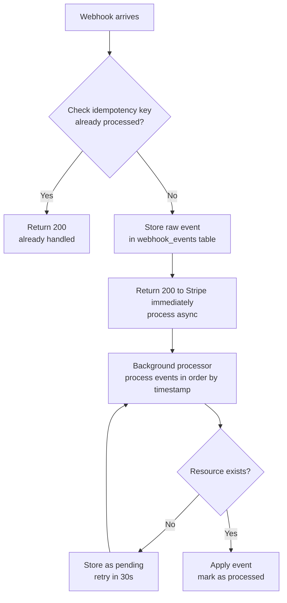
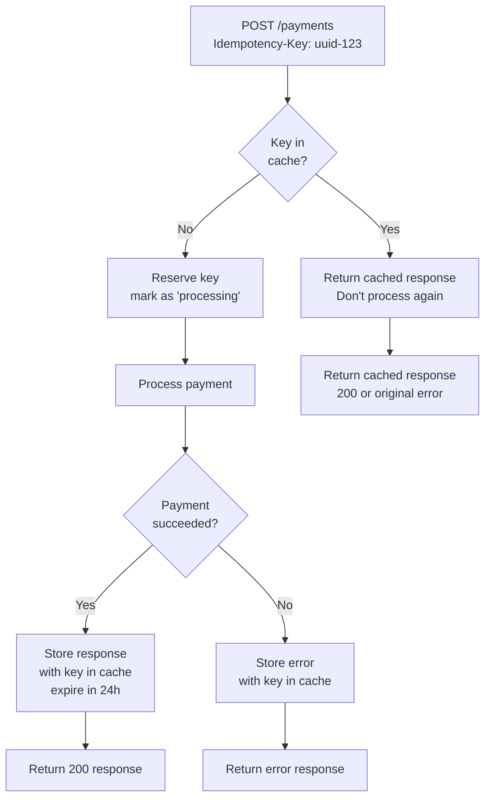
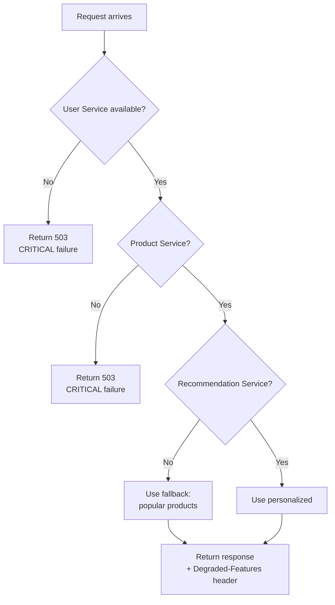

# 07 — Real-World Integration

> **Questions 61–70** | Handling complex real-world integration scenarios

---

## Question 61 — Payment Webhook Arrives Out of Order
🔴 Senior | ★★☆ Common

### The Scenario
> *"Stripe sends webhooks: `payment.created` → `payment.succeeded`. But sometimes `payment.succeeded` arrives BEFORE `payment.created`. Your handler tries to update a payment that doesn't exist yet. How do you handle out-of-order webhook delivery?"*

### The Answer

```
OUT-OF-ORDER WEBHOOK SCENARIO:

Expected order:       What actually arrives:
1. payment.created   1. payment.succeeded  ← ERROR: payment not in DB yet!
2. payment.updated   2. payment.created
3. payment.succeeded 3. payment.updated

CAUSES:
- Webhook retries from different Stripe servers
- Network delays
- Different webhook endpoints processing at different speeds
```



### Code Example — Idempotent Webhook Handler

```python
import hashlib
import json
import hmac
import time
from fastapi import FastAPI, Request, HTTPException, BackgroundTasks
from sqlalchemy.ext.asyncio import AsyncSession
from pydantic import BaseModel
from typing import Optional
from datetime import datetime

app = FastAPI()

STRIPE_WEBHOOK_SECRET = "whsec_..."

class WebhookEvent(BaseModel):
    id: str
    type: str
    data: dict
    created: int

async def verify_stripe_signature(request: Request) -> dict:
    """Verify webhook came from Stripe (not an attacker)"""
    payload = await request.body()
    sig_header = request.headers.get("stripe-signature", "")
    
    # Parse signature header
    timestamp = None
    signatures = []
    for item in sig_header.split(","):
        key, value = item.strip().split("=", 1)
        if key == "t":
            timestamp = int(value)
        elif key == "v1":
            signatures.append(value)
    
    if not timestamp or not signatures:
        raise HTTPException(400, "Invalid signature header")
    
    # Check timestamp (prevent replay attacks — reject if > 5 minutes old)
    if abs(time.time() - timestamp) > 300:
        raise HTTPException(400, "Webhook timestamp too old")
    
    # Compute expected signature
    signed_payload = f"{timestamp}.{payload.decode()}"
    expected_sig = hmac.new(
        STRIPE_WEBHOOK_SECRET.encode(),
        signed_payload.encode(),
        hashlib.sha256
    ).hexdigest()
    
    if expected_sig not in signatures:
        raise HTTPException(400, "Invalid signature")
    
    return json.loads(payload)

@app.post("/webhooks/stripe")
async def stripe_webhook(
    request: Request,
    background_tasks: BackgroundTasks,
    db: AsyncSession = ...,
):
    """
    STEP 1: Verify, store, acknowledge (under 100ms)
    STEP 2: Process asynchronously (don't block Stripe)
    """
    # Verify signature
    event_data = await verify_stripe_signature(request)
    event_id = event_data["id"]
    
    # Check idempotency — already processed?
    existing = await db.execute(
        "SELECT id FROM webhook_events WHERE stripe_event_id = $1", event_id
    )
    if existing:
        return {"status": "already_processed"}  # 200 OK — don't retry
    
    # Store raw event IMMEDIATELY (before processing)
    await db.execute(
        """
        INSERT INTO webhook_events 
            (stripe_event_id, event_type, payload, received_at, status)
        VALUES ($1, $2, $3, $4, 'pending')
        """,
        event_id,
        event_data["type"],
        json.dumps(event_data),
        datetime.utcnow()
    )
    await db.commit()
    
    # Process in background (after responding to Stripe)
    background_tasks.add_task(process_webhook_event, event_id, event_data, db)
    
    # Return 200 quickly — Stripe considers anything else a failure
    return {"status": "accepted"}

async def process_webhook_event(event_id: str, event: dict, db):
    """Process webhook event with retry logic for out-of-order events"""
    event_type = event["type"]
    max_retries = 5
    
    for attempt in range(max_retries):
        try:
            if event_type == "payment_intent.succeeded":
                await handle_payment_succeeded(event["data"]["object"], db)
            elif event_type == "payment_intent.payment_failed":
                await handle_payment_failed(event["data"]["object"], db)
            elif event_type == "customer.subscription.deleted":
                await handle_subscription_cancelled(event["data"]["object"], db)
            
            # Mark as processed
            await db.execute(
                "UPDATE webhook_events SET status = 'processed' WHERE stripe_event_id = $1",
                event_id
            )
            await db.commit()
            return
        
        except ResourceNotFoundError:
            # Out-of-order delivery — resource doesn't exist yet
            if attempt < max_retries - 1:
                wait_time = 2 ** attempt  # Exponential: 1s, 2s, 4s, 8s, 16s
                import asyncio
                await asyncio.sleep(wait_time)
                continue
            
            # Mark as pending for manual review
            await db.execute(
                "UPDATE webhook_events SET status = 'pending_retry' WHERE stripe_event_id = $1",
                event_id
            )
            await db.commit()
        
        except Exception as e:
            await db.execute(
                """UPDATE webhook_events SET status = 'failed', error = $1 
                   WHERE stripe_event_id = $2""",
                str(e), event_id
            )
            await db.commit()
            break

async def handle_payment_succeeded(payment_intent: dict, db):
    """Handle successful payment"""
    payment_id = payment_intent["id"]
    
    # Fetch payment from YOUR database
    payment = await db.fetchrow(
        "SELECT * FROM payments WHERE stripe_payment_intent_id = $1", payment_id
    )
    
    if not payment:
        raise ResourceNotFoundError(f"Payment {payment_id} not found — out of order?")
    
    # Update payment status
    await db.execute(
        "UPDATE payments SET status = 'succeeded', paid_at = NOW() WHERE id = $1",
        payment["id"]
    )
    
    # Trigger fulfillment
    await trigger_order_fulfillment(payment["order_id"])

class ResourceNotFoundError(Exception):
    pass

async def handle_payment_failed(payment_intent: dict, db):
    pass

async def handle_subscription_cancelled(subscription: dict, db):
    pass

async def trigger_order_fulfillment(order_id: str):
    pass
```

### Key Takeaways
> - 💡 **Always return 200 immediately** — Stripe retries on non-200 responses
> - 💡 **Store raw event first, then process** — never lose a webhook
> - 💡 **Verify HMAC signature** — never trust unverified webhooks
> - 💡 **Idempotency key (event ID)** prevents double-processing retries
> - 💡 **Exponential backoff retry** handles out-of-order delivery

---

## Question 62 — Generate PDF Reports Taking 30 Seconds
🟡 Mid | ★★☆ Common

### The Scenario
> *"Users request PDF reports from your API. Generating takes 30 seconds. Currently the API blocks for 30 seconds — users get timeouts. How do you redesign this?"*

### The Answer

```
ASYNC REPORT GENERATION PATTERN:

❌ CURRENT (30s timeout):
  POST /reports → [waits 30 seconds] → PDF binary

✅ ASYNC PATTERN:
  POST /reports       → 202 { job_id: "123" }   (immediate)
  GET /jobs/123       → { status: "processing", progress: 45 }
  GET /jobs/123       → { status: "done", download_url: "..." }
  GET /reports/download/123 → [PDF file]
```

### Code Example — Async PDF Generation

```python
import asyncio
import uuid
from fastapi import FastAPI, BackgroundTasks
from fastapi.responses import StreamingResponse
import io

app = FastAPI()

report_jobs = {}

async def generate_pdf_report(job_id: str, params: dict):
    """Background task: generate PDF"""
    report_jobs[job_id]["status"] = "processing"
    
    # Simulate slow PDF generation
    for i in range(10):
        await asyncio.sleep(3)  # 30 seconds total
        report_jobs[job_id]["progress"] = (i + 1) * 10
    
    # Generate PDF (use weasyprint, reportlab, or puppeteer)
    pdf_content = generate_pdf_bytes(params)
    
    # Store to S3 or temp storage
    download_key = f"reports/{job_id}.pdf"
    # await s3.put_object(Body=pdf_content, Key=download_key)
    
    report_jobs[job_id] = {
        "status": "completed",
        "progress": 100,
        "download_url": f"/reports/{job_id}/download",
        "expires_at": "2024-12-31T23:59:59Z"
    }

@app.post("/reports/generate", status_code=202)
async def request_report(
    report_type: str,
    date_from: str,
    date_to: str,
    background_tasks: BackgroundTasks
):
    """Start async report generation — returns immediately"""
    job_id = str(uuid.uuid4())
    report_jobs[job_id] = {"status": "queued", "progress": 0}
    
    background_tasks.add_task(
        generate_pdf_report,
        job_id,
        {"type": report_type, "from": date_from, "to": date_to}
    )
    
    return {
        "job_id": job_id,
        "status": "queued",
        "check_url": f"/jobs/{job_id}",
        "estimated_seconds": 30
    }

@app.get("/jobs/{job_id}")
async def get_job_status(job_id: str):
    if job_id not in report_jobs:
        from fastapi import HTTPException
        raise HTTPException(404, "Job not found")
    return {"job_id": job_id, **report_jobs[job_id]}

@app.get("/reports/{job_id}/download")
async def download_report(job_id: str):
    """Download completed report"""
    job = report_jobs.get(job_id)
    if not job or job["status"] != "completed":
        from fastapi import HTTPException
        raise HTTPException(404, "Report not ready")
    
    # In production: redirect to S3 pre-signed URL
    # return RedirectResponse(url=s3_presigned_url)
    
    # Or stream directly
    pdf_content = b"PDF binary content here"
    return StreamingResponse(
        io.BytesIO(pdf_content),
        media_type="application/pdf",
        headers={"Content-Disposition": f"attachment; filename=report_{job_id}.pdf"}
    )

def generate_pdf_bytes(params: dict) -> bytes:
    """Generate actual PDF — use weasyprint or reportlab"""
    return b"%PDF-1.4..."  # Placeholder
```

### Key Takeaways
> - 💡 **202 Accepted** = "Started processing, check back later"
> - 💡 **Poll pattern**: client polls `/jobs/{id}` every few seconds
> - 💡 **Store to S3** and return pre-signed download URL — don't hold PDF in memory
> - 💡 **Cache common reports** (same params = same output within a time window)
> - 💡 **Set report expiry** — clean up old reports after 7 days

---

## Question 63 — API Needs Multi-Language Content
🟢 Junior | ★★☆ Common

### The Scenario
> *"Your API serves users globally. Content needs to be returned in the user's language. Products have descriptions in 10 languages. How do you design the i18n (internationalization) for your API?"*

### The Answer

```
CONTENT NEGOTIATION FOR LANGUAGE:

Client:  GET /products/123 
         Accept-Language: fr-FR, fr;q=0.9, en;q=0.5

Server:  Content-Language: fr-FR
         { "description": "Un produit excellent..." }
```

### Code Example — Multi-Language Content

```python
from fastapi import FastAPI, Request, Header, Query
from typing import Optional
import gettext
import os

app = FastAPI()

# Translations dictionary (in production, use .po/.mo files or database)
TRANSLATIONS = {
    "en": {
        "welcome": "Welcome",
        "not_found": "Resource not found",
        "invalid_input": "Invalid input",
    },
    "fr": {
        "welcome": "Bienvenue",
        "not_found": "Ressource introuvable",
        "invalid_input": "Saisie invalide",
    },
    "es": {
        "welcome": "Bienvenido",
        "not_found": "Recurso no encontrado",
        "invalid_input": "Entrada no válida",
    },
    "de": {
        "welcome": "Willkommen",
        "not_found": "Ressource nicht gefunden",
        "invalid_input": "Ungültige Eingabe",
    },
}

SUPPORTED_LANGUAGES = set(TRANSLATIONS.keys())
DEFAULT_LANGUAGE = "en"

def parse_accept_language(accept_language: str) -> list[str]:
    """Parse Accept-Language: fr-FR, fr;q=0.9, en;q=0.5"""
    if not accept_language:
        return [DEFAULT_LANGUAGE]
    
    languages = []
    for part in accept_language.split(","):
        part = part.strip()
        if ";q=" in part:
            lang, quality = part.rsplit(";q=", 1)
            try:
                q = float(quality)
            except ValueError:
                q = 0
        else:
            lang, q = part, 1.0
        
        lang = lang.strip().lower()
        # Normalize: fr-FR → fr
        lang_short = lang.split("-")[0]
        languages.append((lang_short, q))
    
    # Sort by quality descending
    languages.sort(key=lambda x: x[1], reverse=True)
    return [lang for lang, q in languages]

def get_language(
    accept_language: str,
    lang_override: Optional[str] = None
) -> str:
    """Get best available language"""
    if lang_override and lang_override in SUPPORTED_LANGUAGES:
        return lang_override
    
    preferred = parse_accept_language(accept_language)
    for lang in preferred:
        if lang in SUPPORTED_LANGUAGES:
            return lang
    
    return DEFAULT_LANGUAGE

def t(key: str, lang: str) -> str:
    """Translate a message key to the given language"""
    return TRANSLATIONS.get(lang, TRANSLATIONS[DEFAULT_LANGUAGE]).get(key, key)

@app.get("/products/{product_id}")
async def get_product(
    product_id: str,
    request: Request,
    accept_language: str = Header(default="en"),
    lang: Optional[str] = Query(None, description="Override language: en, fr, es, de")
):
    """Return product in requested language"""
    language = get_language(accept_language, lang)
    
    # In production: fetch product with translation from database
    # SELECT p.*, pt.description, pt.name
    # FROM products p
    # JOIN product_translations pt ON p.id = pt.product_id
    # WHERE p.id = ? AND pt.language = ?
    
    product = {
        "id": product_id,
        "name": {
            "en": "Wireless Headphones",
            "fr": "Casque Sans Fil",
            "es": "Auriculares Inalámbricos",
            "de": "Kabellose Kopfhörer"
        }.get(language, "Wireless Headphones"),
        "description": {
            "en": "Premium audio quality",
            "fr": "Qualité audio premium",
            "es": "Calidad de audio premium",
            "de": "Premium-Audioqualität"
        }.get(language, "Premium audio quality"),
    }
    
    from fastapi.responses import JSONResponse
    return JSONResponse(
        content=product,
        headers={"Content-Language": language}
    )

@app.get("/health")
async def health_check(
    accept_language: str = Header(default="en")
):
    """Returns localized error messages"""
    lang = get_language(accept_language)
    return {"message": t("welcome", lang), "language": lang}
```

### Key Takeaways
> - 💡 **Accept-Language header** is the HTTP standard for language negotiation
> - 💡 **Store translations in DB** for content (products, categories)
> - 💡 **Store translations in files** (.po/.mo) for static UI messages
> - 💡 **Allow `?lang=fr` override** for explicit language selection
> - 💡 **Always fall back to English** if requested language not available

---

## Question 64 — Rate Limiting with Different Tiers
🟡 Mid | ★★☆ Common

### The Scenario
> *"Your API has three tiers: Free (100 req/day), Pro (10,000 req/day), Enterprise (unlimited). How do you implement tiered rate limiting?"*

### The Answer

```
TOKEN BUCKET ALGORITHM:

Each user gets a "bucket" of tokens.
Each request consumes 1 token.
Tokens refill at a constant rate.

Free tier:     100 tokens, refills 100/day (0.001 per second)
Pro tier:    10,000 tokens, refills at 10K/day (0.116 per second)
Enterprise: Unlimited

               ╔═══════════════╗
               ║  Token Bucket ║
         ┌────►║  ████░░░░░░   ║── Request consumes 1 token
         │     ║  7/10 tokens  ║
  Refill  │     ╚═══════════════╝
 (constant│
   rate)  │     When bucket empty:
         │     → 429 Too Many Requests
         └─    → Retry-After header
```

### Code Example — Tiered Rate Limiting with Redis

```python
import time
import asyncio
from enum import Enum
from fastapi import FastAPI, Request, HTTPException, Depends
import redis.asyncio as redis_async

app = FastAPI()
redis_client = redis_async.Redis(host="localhost", port=6379, decode_responses=True)

class PlanTier(Enum):
    FREE = "free"
    PRO = "pro"
    ENTERPRISE = "enterprise"

RATE_LIMITS = {
    PlanTier.FREE: {
        "requests_per_day": 100,
        "requests_per_minute": 10,
        "burst": 20,
    },
    PlanTier.PRO: {
        "requests_per_day": 10000,
        "requests_per_minute": 100,
        "burst": 200,
    },
    PlanTier.ENTERPRISE: {
        "requests_per_day": None,  # Unlimited
        "requests_per_minute": None,
        "burst": None,
    },
}

async def get_user_plan(api_key: str) -> PlanTier:
    """Look up user's subscription tier from API key"""
    # In production: cache this in Redis with TTL
    plan = await redis_client.hget(f"apikey:{api_key}", "plan")
    if not plan:
        return PlanTier.FREE
    return PlanTier(plan)

async def check_rate_limit(user_id: str, plan: PlanTier) -> dict:
    """
    Token bucket rate limiting using Redis.
    Returns remaining requests and reset time.
    """
    limits = RATE_LIMITS[plan]
    
    # Enterprise has no limits
    if limits["requests_per_minute"] is None:
        return {"remaining": 999999, "limit": 999999, "reset": int(time.time()) + 60}
    
    # Use sliding window for minute-level limit
    minute_key = f"ratelimit:{user_id}:minute:{int(time.time() // 60)}"
    day_key = f"ratelimit:{user_id}:day:{int(time.time() // 86400)}"
    
    pipe = redis_client.pipeline()
    pipe.incr(minute_key)
    pipe.expire(minute_key, 120)
    pipe.incr(day_key)
    pipe.expire(day_key, 172800)
    results = await pipe.execute()
    
    minute_count = results[0]
    day_count = results[2]
    
    minute_limit = limits["requests_per_minute"]
    day_limit = limits["requests_per_day"]
    
    # Check minute limit
    if minute_count > minute_limit:
        next_minute = (int(time.time() // 60) + 1) * 60
        raise HTTPException(
            status_code=429,
            detail={
                "error": "Rate limit exceeded",
                "limit_type": "per_minute",
                "limit": minute_limit,
                "reset_at": next_minute,
                "upgrade_url": "/billing/upgrade"
            },
            headers={
                "X-RateLimit-Limit": str(minute_limit),
                "X-RateLimit-Remaining": "0",
                "X-RateLimit-Reset": str(next_minute),
                "Retry-After": str(next_minute - int(time.time()))
            }
        )
    
    # Check daily limit
    if day_limit and day_count > day_limit:
        next_day = (int(time.time() // 86400) + 1) * 86400
        raise HTTPException(
            status_code=429,
            detail={
                "error": "Daily rate limit exceeded",
                "limit": day_limit,
                "plan": plan.value,
                "reset_at": next_day,
                "upgrade_url": "/billing/upgrade"
            },
            headers={
                "Retry-After": str(next_day - int(time.time()))
            }
        )
    
    return {
        "remaining_minute": minute_limit - minute_count,
        "remaining_day": (day_limit - day_count) if day_limit else None,
        "reset_at": (int(time.time() // 60) + 1) * 60
    }

@app.middleware("http")
async def rate_limiting_middleware(request: Request, call_next):
    # Extract API key (from header or query param)
    api_key = (
        request.headers.get("X-API-Key") or
        request.query_params.get("api_key")
    )
    
    if not api_key:
        return await call_next(request)  # Let auth handle unauthenticated requests
    
    plan = await get_user_plan(api_key)
    rate_info = await check_rate_limit(api_key, plan)
    
    response = await call_next(request)
    
    # Add rate limit headers to all responses
    response.headers["X-RateLimit-Limit"] = str(RATE_LIMITS[plan]["requests_per_minute"] or "unlimited")
    response.headers["X-RateLimit-Remaining"] = str(rate_info["remaining_minute"])
    response.headers["X-RateLimit-Reset"] = str(rate_info["reset_at"])
    response.headers["X-Plan"] = plan.value
    
    return response
```

### Key Takeaways
> - 💡 **Redis sliding window** algorithm for distributed rate limiting
> - 💡 **Multiple windows** (per minute + per day) for granular control
> - 💡 **Add rate limit headers** — clients know their quota and reset time
> - 💡 **Return upgrade URL** in 429 response — convert rate-limited users to paid
> - 💡 **Cache plan lookups** in Redis — don't hit DB on every request

---

## Question 65 — Handle Idempotent POST Requests
🟡 Mid | ★★★ Very Common

### The Scenario
> *"A user's browser makes a payment request. The network drops after the request is sent but before the response arrives. The browser retries. Your API processes the payment TWICE — double charge! How do you make POST endpoints idempotent?"*

### The Answer

```
IDEMPOTENCY KEY PATTERN:

Request 1 (original):
  POST /payments
  Idempotency-Key: client-generated-uuid-123
  Body: { amount: 100, card: "pm_xxx" }
  
  → Server processes, charges card, saves with key uuid-123
  → Response: { payment_id: "pay_abc", status: "succeeded" }

Request 2 (retry, network dropped original response):
  POST /payments
  Idempotency-Key: client-generated-uuid-123  ← SAME KEY
  Body: { amount: 100, card: "pm_xxx" }
  
  → Server finds uuid-123 in cache
  → Returns SAME response: { payment_id: "pay_abc", status: "succeeded" }
  → Card NOT charged again ✅
```



### Code Example — Idempotency Key Implementation

```python
import json
import time
import uuid
from fastapi import FastAPI, Request, Response, Header, HTTPException
from typing import Optional
import redis.asyncio as redis_async

app = FastAPI()
redis_client = redis_async.Redis(host="localhost", port=6379, decode_responses=True)

IDEMPOTENCY_TTL = 86400  # Cache keys for 24 hours

@app.post("/payments")
async def create_payment(
    request: Request,
    idempotency_key: Optional[str] = Header(
        None,
        alias="Idempotency-Key",
        description="Unique key to make this request idempotent"
    )
):
    """
    Idempotent payment endpoint.
    Provide Idempotency-Key header to safely retry on network errors.
    """
    body = await request.json()
    
    if idempotency_key:
        # Check if we've already processed this key
        cache_key = f"idempotency:{idempotency_key}"
        
        # Step 1: Check for existing result
        cached = await redis_client.get(cache_key)
        if cached:
            cached_data = json.loads(cached)
            
            if cached_data.get("status") == "processing":
                # Currently being processed — wait briefly and retry
                import asyncio
                await asyncio.sleep(1)
                cached = await redis_client.get(cache_key)
                if cached:
                    cached_data = json.loads(cached)
                else:
                    raise HTTPException(503, "Payment is being processed, please retry")
            
            # Return exact same response as original request
            return Response(
                content=json.dumps(cached_data["response_body"]),
                status_code=cached_data["status_code"],
                media_type="application/json",
                headers={"Idempotency-Replayed": "true"}
            )
        
        # Step 2: Mark as processing (prevent concurrent duplicate requests)
        processing_marker = json.dumps({"status": "processing"})
        set_result = await redis_client.set(
            cache_key,
            processing_marker,
            ex=30,  # Short TTL for processing state
            nx=True  # Only set if not exists (atomic)
        )
        
        if not set_result:
            # Another request with same key is processing
            raise HTTPException(
                409,
                "A request with this Idempotency-Key is currently being processed"
            )
    
    # Step 3: Process the actual payment
    try:
        payment = await process_payment(
            amount=body.get("amount"),
            payment_method=body.get("payment_method_id")
        )
        
        response_body = {
            "payment_id": payment["id"],
            "status": payment["status"],
            "amount": payment["amount"]
        }
        status_code = 201
    
    except PaymentDeclinedError as e:
        response_body = {"error": "payment_declined", "message": str(e)}
        status_code = 402
    
    except Exception as e:
        # Don't cache system errors — allow retry
        raise
    
    # Step 4: Cache the result with full 24h TTL
    if idempotency_key:
        await redis_client.set(
            f"idempotency:{idempotency_key}",
            json.dumps({
                "response_body": response_body,
                "status_code": status_code,
                "processed_at": time.time(),
                "status": "completed"
            }),
            ex=IDEMPOTENCY_TTL
        )
    
    return Response(
        content=json.dumps(response_body),
        status_code=status_code,
        media_type="application/json"
    )

async def process_payment(amount: int, payment_method: str) -> dict:
    """Process payment with Stripe"""
    # Real implementation would call Stripe API
    return {"id": f"pay_{uuid.uuid4().hex[:8]}", "status": "succeeded", "amount": amount}

class PaymentDeclinedError(Exception):
    pass
```

### Key Takeaways
> - 💡 **Client generates the Idempotency-Key** (UUID) before sending request
> - 💡 **Cache results for 24 hours** — enough time for all retries
> - 💡 **Use `SET ... NX`** to atomically detect concurrent requests with same key
> - 💡 **Cache error responses too** (except 5xx) — same error on retry is expected
> - 💡 **Return `Idempotency-Replayed: true` header** so clients know it's a replay

---

## Question 66 — Optimize API for Mobile Clients
🟡 Mid | ★★☆ Common

### The Scenario
> *"Your API is used by a mobile app. Users complain about slow load times and high data usage. How do you optimize the API specifically for mobile clients?"*

### The Answer

```
MOBILE OPTIMIZATION STRATEGIES:

Data Reduction:
├── Response compression (gzip): -70% size
├── Field filtering (?fields=id,name): -80% size
├── ETags (304 Not Modified): 0 bytes if unchanged
└── MessagePack instead of JSON: -30% size

Network Reduction:
├── Batch endpoints (multiple resources in one request)
├── Delta updates (only changed fields since last sync)
└── Offline-first with sync on reconnect

Battery/CPU:
└── Reduce request frequency (smart polling, push notifications)
```

### Code Example — Mobile-Optimized API

```python
from fastapi import FastAPI, Request, Response, Header, Query
from fastapi.middleware.gzip import GZipMiddleware
from typing import Optional
import hashlib
import json
import time
import msgpack  # pip install msgpack

app = FastAPI()
app.add_middleware(GZipMiddleware, minimum_size=500)

@app.get("/mobile/dashboard")
async def mobile_dashboard(
    user_id: str,
    fields: Optional[str] = Query(None),
    since: Optional[float] = Query(None, description="Unix timestamp — only changed data"),
    accept: str = Header(default="application/json"),
    if_none_match: Optional[str] = Header(None)
):
    """
    Mobile-optimized endpoint:
    1. Delta updates (only changed since last request)
    2. Field filtering (only requested fields)
    3. ETag caching (304 Not Modified if unchanged)
    4. MessagePack serialization (optional)
    """
    # Fetch data
    data = await fetch_dashboard_data(user_id)
    
    # Delta updates — only return changed data
    if since:
        data = {
            key: value for key, value in data.items()
            if is_changed_since(key, user_id, since)
        }
        data["_sync_timestamp"] = time.time()
    
    # Field filtering
    if fields:
        requested_fields = set(fields.split(","))
        data = {k: v for k, v in data.items() if k in requested_fields or k.startswith("_")}
    
    # ETag for caching
    etag = hashlib.md5(json.dumps(data, sort_keys=True).encode()).hexdigest()
    
    if if_none_match == f'"{etag}"':
        return Response(status_code=304)
    
    # MessagePack serialization for smaller payload
    if "msgpack" in accept:
        return Response(
            content=msgpack.packb(data, use_bin_type=True),
            media_type="application/msgpack",
            headers={"ETag": f'"{etag}"', "Cache-Control": "max-age=60"}
        )
    
    return Response(
        content=json.dumps(data),
        media_type="application/json",
        headers={"ETag": f'"{etag}"', "Cache-Control": "max-age=60"}
    )

# Batch endpoint — reduces number of API calls (better for mobile)
@app.post("/mobile/batch")
async def batch_requests(requests: list[dict]):
    """
    Process multiple API requests in a single HTTP call.
    Mobile apps: 1 request instead of 10 = 9 fewer TCP connections!
    """
    if len(requests) > 20:
        from fastapi import HTTPException
        raise HTTPException(400, "Max 20 requests per batch")
    
    import asyncio
    results = await asyncio.gather(*[
        handle_single_request(req) for req in requests
    ], return_exceptions=True)
    
    return [
        {"id": req.get("id"), "result": result if not isinstance(result, Exception) else {"error": str(result)}}
        for req, result in zip(requests, results)
    ]

async def handle_single_request(req: dict) -> dict:
    """Handle individual request in batch"""
    method = req.get("method", "GET")
    path = req.get("path", "/")
    body = req.get("body", {})
    
    # Route to appropriate handler
    if path == "/users/me" and method == "GET":
        return {"user_id": "1", "name": "John"}
    elif path == "/notifications" and method == "GET":
        return {"notifications": []}
    
    return {"error": "unknown_endpoint"}

async def fetch_dashboard_data(user_id: str) -> dict:
    return {"user": {"id": user_id, "name": "John"}, "stats": {"orders": 5}}

def is_changed_since(key: str, user_id: str, since: float) -> bool:
    return True  # Placeholder
```

### Key Takeaways
> - 💡 **Batch endpoints** reduce TCP connections — critical for slow mobile networks
> - 💡 **Delta updates** with timestamp — only send what changed
> - 💡 **ETags** prevent re-downloading unchanged data (304 = 0 bytes)
> - 💡 **MessagePack** is 30% smaller than JSON and faster to parse
> - 💡 **Push notifications** instead of polling — save battery on mobile

---

## Question 67 — Real-Time Collaborative Editing
🔴 Senior | ★☆☆ Rare

### The Scenario
> *"You need to build collaborative document editing (like Google Docs) where multiple users can edit simultaneously and see each other's changes in real-time. How do you approach this?"*

### The Answer

```
COLLABORATIVE EDITING CHALLENGES:

User A types "Hello" at position 0
User B (simultaneously) types "World" at position 0

Without conflict resolution:
A sees: "HelloWorld" or "WorldHello" (unpredictable!)

SOLUTION OPTIONS:
1. Operational Transformation (OT) — Google Docs approach
   - Complex but battle-tested
   
2. CRDT (Conflict-free Replicated Data Types) — Notion approach
   - Simpler logic, works offline too
   - Yjs is a popular library
```

### Code Example — Simple Collaborative Editing with WebSocket + Versioning

```python
import asyncio
import json
from dataclasses import dataclass, field
from typing import List, Dict
from fastapi import FastAPI, WebSocket, WebSocketDisconnect

app = FastAPI()

@dataclass
class Operation:
    type: str          # "insert" or "delete"
    position: int
    character: str = ""
    user_id: str = ""
    revision: int = 0

@dataclass
class Document:
    id: str
    content: str = ""
    revision: int = 0
    operations: List[Operation] = field(default_factory=list)
    connections: Dict[str, WebSocket] = field(default_factory=dict)

documents: Dict[str, Document] = {}

def transform_operation(op: Operation, against: Operation) -> Operation:
    """
    Operational Transformation: adjust operation position
    based on concurrent operations.
    
    This is a simplified OT for single characters.
    """
    if op.type == "insert" and against.type == "insert":
        if against.position <= op.position:
            return Operation(
                type=op.type,
                position=op.position + 1,
                character=op.character,
                user_id=op.user_id,
                revision=op.revision
            )
    
    elif op.type == "insert" and against.type == "delete":
        if against.position < op.position:
            return Operation(
                type=op.type,
                position=max(0, op.position - 1),
                character=op.character,
                user_id=op.user_id,
                revision=op.revision
            )
    
    return op

def apply_operation(content: str, op: Operation) -> str:
    """Apply an operation to document content"""
    if op.type == "insert":
        pos = min(op.position, len(content))
        return content[:pos] + op.character + content[pos:]
    
    elif op.type == "delete":
        if 0 <= op.position < len(content):
            return content[:op.position] + content[op.position + 1:]
    
    return content

@app.websocket("/docs/{doc_id}/edit")
async def collaborative_edit(websocket: WebSocket, doc_id: str, user_id: str = "user1"):
    await websocket.accept()
    
    # Get or create document
    if doc_id not in documents:
        documents[doc_id] = Document(id=doc_id)
    
    doc = documents[doc_id]
    doc.connections[user_id] = websocket
    
    # Send current state to new user
    await websocket.send_json({
        "type": "init",
        "content": doc.content,
        "revision": doc.revision,
        "users_online": list(doc.connections.keys())
    })
    
    # Notify others
    await broadcast(doc, {"type": "user_joined", "user_id": user_id}, exclude=user_id)
    
    try:
        while True:
            data = await websocket.receive_json()
            
            if data["type"] == "operation":
                op = Operation(
                    type=data["op_type"],
                    position=data["position"],
                    character=data.get("character", ""),
                    user_id=user_id,
                    revision=data["revision"]
                )
                
                # Transform against operations that happened since client's revision
                for stored_op in doc.operations[op.revision:]:
                    op = transform_operation(op, stored_op)
                
                # Apply transformed operation
                doc.content = apply_operation(doc.content, op)
                doc.revision += 1
                op.revision = doc.revision
                doc.operations.append(op)
                
                # Broadcast transformed operation to all other users
                await broadcast(doc, {
                    "type": "operation",
                    "op_type": op.type,
                    "position": op.position,
                    "character": op.character,
                    "user_id": user_id,
                    "revision": doc.revision
                }, exclude=user_id)
            
            elif data["type"] == "cursor":
                await broadcast(doc, {
                    "type": "cursor",
                    "user_id": user_id,
                    "position": data["position"]
                }, exclude=user_id)
    
    except WebSocketDisconnect:
        del doc.connections[user_id]
        await broadcast(doc, {"type": "user_left", "user_id": user_id})

async def broadcast(doc: Document, message: dict, exclude: str = None):
    """Send to all connected users"""
    dead = []
    for uid, ws in doc.connections.items():
        if uid == exclude:
            continue
        try:
            await ws.send_json(message)
        except Exception:
            dead.append(uid)
    
    for uid in dead:
        del doc.connections[uid]
```

### Key Takeaways
> - 💡 **OT (Operational Transformation)** — complex but proven (Google Docs)
> - 💡 **CRDT** — simpler, works offline, used by Notion/Figma
> - 💡 **For production**: use **Yjs** (JavaScript) or **Automerge** — don't implement OT yourself
> - 💡 **Cursor sharing** via WebSocket shows collaborators' positions
> - 💡 **Persist operations** not just content — enables undo history

---

## Question 68 — Multi-Level Approval Workflow
🔴 Senior | ★★☆ Common

### The Scenario
> *"Design an expense approval API: submitted → manager review → finance review → approved/rejected. Amounts > $10,000 need director approval too. How do you implement this?"*

### The Answer

```
STATE MACHINE FOR APPROVAL WORKFLOW:

                    ┌──────────────────────────────────────────────┐
                    │                                              │
         Submit     │        Approve           Approve            │ Approve
  DRAFT ─────────► PENDING_MANAGER ──────► PENDING_FINANCE ─────► APPROVED
                    │              │                │
                    │ Reject       │ Reject         │ Reject
                    ▼              ▼                ▼
                  REJECTED       REJECTED         REJECTED
                    
For amounts > $10,000:
   PENDING_FINANCE ─── Approve ──► PENDING_DIRECTOR ──► APPROVED
```

### Code Example — State Machine Approval Workflow

```python
from enum import Enum
from typing import Optional
from fastapi import FastAPI, HTTPException, Depends
from pydantic import BaseModel
from datetime import datetime

app = FastAPI()

class ExpenseStatus(Enum):
    DRAFT = "draft"
    PENDING_MANAGER = "pending_manager"
    PENDING_FINANCE = "pending_finance"
    PENDING_DIRECTOR = "pending_director"
    APPROVED = "approved"
    REJECTED = "rejected"

class ExpenseCreate(BaseModel):
    title: str
    amount: float
    description: str
    category: str

class ApprovalDecision(BaseModel):
    decision: str  # "approve" or "reject"
    comment: Optional[str] = None

def get_next_status(
    current: ExpenseStatus,
    decision: str,
    amount: float
) -> ExpenseStatus:
    """Determine next status based on current state and decision"""
    if decision == "reject":
        return ExpenseStatus.REJECTED
    
    # Approval flow
    if current == ExpenseStatus.PENDING_MANAGER:
        return ExpenseStatus.PENDING_FINANCE
    
    if current == ExpenseStatus.PENDING_FINANCE:
        # High-value expenses need director approval
        if amount > 10000:
            return ExpenseStatus.PENDING_DIRECTOR
        return ExpenseStatus.APPROVED
    
    if current == ExpenseStatus.PENDING_DIRECTOR:
        return ExpenseStatus.APPROVED
    
    raise ValueError(f"Cannot approve from status {current.value}")

# In-memory storage (use database in production)
expenses = {}

@app.post("/expenses", status_code=201)
async def create_expense(expense: ExpenseCreate, submitter_id: str = "user1"):
    expense_id = f"exp_{len(expenses) + 1}"
    expenses[expense_id] = {
        "id": expense_id,
        "submitter_id": submitter_id,
        "status": ExpenseStatus.PENDING_MANAGER.value,
        "amount": expense.amount,
        "title": expense.title,
        "description": expense.description,
        "category": expense.category,
        "submitted_at": datetime.utcnow().isoformat(),
        "history": [{
            "status": ExpenseStatus.PENDING_MANAGER.value,
            "actor": submitter_id,
            "action": "submitted",
            "timestamp": datetime.utcnow().isoformat()
        }]
    }
    
    # Notify manager
    await notify_approver("manager", expense_id)
    
    return expenses[expense_id]

@app.post("/expenses/{expense_id}/approve")
async def approve_expense(
    expense_id: str,
    decision: ApprovalDecision,
    approver_id: str = "approver1",
    approver_role: str = "manager"
):
    """Universal approval endpoint — handles any approval step"""
    expense = expenses.get(expense_id)
    if not expense:
        raise HTTPException(404, "Expense not found")
    
    current_status = ExpenseStatus(expense["status"])
    
    # Verify approver has the right role
    required_role = {
        ExpenseStatus.PENDING_MANAGER: "manager",
        ExpenseStatus.PENDING_FINANCE: "finance",
        ExpenseStatus.PENDING_DIRECTOR: "director",
    }
    
    if current_status not in required_role:
        raise HTTPException(400, f"Expense in status {current_status.value} cannot be approved")
    
    if required_role[current_status] != approver_role:
        raise HTTPException(
            403,
            f"This expense requires {required_role[current_status]} approval, not {approver_role}"
        )
    
    # Calculate next status
    new_status = get_next_status(current_status, decision.decision, expense["amount"])
    
    # Update expense
    expense["status"] = new_status.value
    expense["history"].append({
        "status": new_status.value,
        "actor": approver_id,
        "action": decision.decision,
        "comment": decision.comment,
        "timestamp": datetime.utcnow().isoformat()
    })
    
    # Notify next approver or submitter
    if new_status == ExpenseStatus.PENDING_FINANCE:
        await notify_approver("finance", expense_id)
    elif new_status == ExpenseStatus.PENDING_DIRECTOR:
        await notify_approver("director", expense_id)
    elif new_status in [ExpenseStatus.APPROVED, ExpenseStatus.REJECTED]:
        await notify_submitter(expense["submitter_id"], expense_id, new_status)
    
    return expense

@app.get("/expenses/{expense_id}")
async def get_expense(expense_id: str):
    expense = expenses.get(expense_id)
    if not expense:
        raise HTTPException(404, "Expense not found")
    return expense

@app.get("/approvals/pending")
async def get_pending_approvals(approver_role: str = "manager"):
    """Get expenses waiting for specific role's approval"""
    role_to_status = {
        "manager": ExpenseStatus.PENDING_MANAGER.value,
        "finance": ExpenseStatus.PENDING_FINANCE.value,
        "director": ExpenseStatus.PENDING_DIRECTOR.value,
    }
    
    target_status = role_to_status.get(approver_role)
    if not target_status:
        raise HTTPException(400, f"Unknown role: {approver_role}")
    
    return [e for e in expenses.values() if e["status"] == target_status]

async def notify_approver(role: str, expense_id: str):
    print(f"Notifying {role} about expense {expense_id}")

async def notify_submitter(user_id: str, expense_id: str, status: ExpenseStatus):
    print(f"Notifying {user_id} that expense {expense_id} is {status.value}")
```

### Key Takeaways
> - 💡 **State machine pattern** — explicit states and transitions prevent invalid operations
> - 💡 **Store history** — full audit trail of who approved what and when
> - 💡 **Conditional routing** — amount-based rules (> $10K needs director)
> - 💡 **Notify at each transition** — email/Slack when action required
> - 💡 **Single approve endpoint** — role determines the action, not the URL

---

## Question 69 — Migrate Flask API to FastAPI Without Downtime
🔴 Senior | ★★☆ Common

### The Scenario
> *"You have a production Flask API with 100+ endpoints and mobile clients that can't all be updated simultaneously. You want to migrate to FastAPI for performance benefits. How do you do this without breaking existing clients?"*

### The Answer

```
STRANGLER FIG PATTERN:

The old Flask API is the "tree".
You grow the new FastAPI "vine" around it, strangling it gradually.

              ┌─────────────┐
Clients ─────►│ API Gateway │
              └──────┬──────┘
                     │
          ┌──────────┴──────────┐
          │                     │
   ┌──────▼──────┐      ┌───────▼─────┐
   │  Flask API  │      │ FastAPI     │
   │  (old)      │      │ (new)       │
   │  /users     │      │ /products   │ ← migrated first
   │  /auth      │      │ /search     │ ← migrated second
   └─────────────┘      └─────────────┘

Migration Progress:
Month 1: /products, /categories → FastAPI
Month 2: /search, /auth → FastAPI
Month 3: /users, /orders → FastAPI
Month 4: Decommission Flask
```

### Code Example — Strangler Fig with FastAPI + Flask

```python
# Migration approach: FastAPI handles new endpoints,
# proxies unknown endpoints to old Flask API

import httpx
from fastapi import FastAPI, Request, Response
from fastapi.routing import APIRouter

new_app = FastAPI()

# ---- MIGRATED ENDPOINTS (native FastAPI) ----
migrated_router = APIRouter(prefix="/api/v1")

@migrated_router.get("/products")
async def get_products():
    """MIGRATED: Now runs on FastAPI"""
    return {"products": [], "_source": "fastapi"}

@migrated_router.get("/products/{product_id}")
async def get_product(product_id: str):
    return {"id": product_id, "_source": "fastapi"}

new_app.include_router(migrated_router)

# ---- PROXY for NOT-YET-MIGRATED endpoints ----
FLASK_URL = "http://flask-api:5000"
MIGRATED_PREFIXES = ["/api/v1/products", "/api/v1/categories"]

@new_app.api_route(
    "/{path:path}",
    methods=["GET", "POST", "PUT", "PATCH", "DELETE"],
    include_in_schema=False  # Don't show in docs
)
async def proxy_to_flask(request: Request, path: str):
    """Forward non-migrated endpoints to Flask"""
    request_path = f"/{path}"
    
    # Check if this path is already migrated
    for prefix in MIGRATED_PREFIXES:
        if request_path.startswith(prefix):
            raise HTTPException(404, "Not found")  # Should have been caught by router
    
    # Forward to Flask
    url = f"{FLASK_URL}{request_path}"
    if request.query_params:
        url += f"?{request.query_params}"
    
    headers = {
        k: v for k, v in request.headers.items()
        if k.lower() not in ["host"]
    }
    headers["X-Forwarded-By"] = "fastapi-gateway"
    
    async with httpx.AsyncClient(timeout=30.0) as client:
        body = await request.body()
        
        flask_response = await client.request(
            method=request.method,
            url=url,
            headers=headers,
            content=body,
        )
        
        return Response(
            content=flask_response.content,
            status_code=flask_response.status_code,
            headers=dict(flask_response.headers),
            media_type=flask_response.headers.get("content-type")
        )

from fastapi import HTTPException
```

### Key Takeaways
> - 💡 **Strangler Fig pattern** — migrate one domain at a time, never big bang
> - 💡 **Proxy unmigrated endpoints** to old Flask API — zero client impact
> - 💡 **Both APIs share the same database** during transition
> - 💡 **Test each migrated endpoint** against the Flask version for parity
> - 💡 **Route at API Gateway level** (nginx/Kong) for cleaner separation

---

## Question 70 — Graceful Degradation When Downstream Services Fail
🔴 Senior | ★★★ Very Common

### The Scenario
> *"Your API depends on 5 microservices: user service, product service, recommendation engine, analytics, and notification service. When any of them goes down, your entire API returns 500. How do you make it gracefully degrade?"*

### The Answer

```
GRACEFUL DEGRADATION LEVELS:

Full Service:
  ├── User profile ✅
  ├── Product catalog ✅
  ├── Personalized recommendations ✅
  ├── Analytics tracking ✅
  └── Real-time notifications ✅

Degraded (recommendation service down):
  ├── User profile ✅
  ├── Product catalog ✅
  ├── Recommendations: FALLBACK (popular products) ⚠️
  ├── Analytics tracking: FIRE AND FORGET (async) ✅
  └── Real-time notifications: FALLBACK (polling) ⚠️

Core Only (multiple services down):
  ├── User profile ✅
  ├── Product catalog ✅
  └── Everything else: gracefully hidden ❌
```



### Code Example — Graceful Degradation

```python
import asyncio
import httpx
from dataclasses import dataclass
from enum import Enum
from typing import Optional, Any
from fastapi import FastAPI, HTTPException, Request
from fastapi.responses import JSONResponse

app = FastAPI()

class ServicePriority(Enum):
    CRITICAL = "critical"   # API fails without this
    IMPORTANT = "important" # Use fallback if unavailable
    OPTIONAL = "optional"   # Skip if unavailable

@dataclass
class ServiceCall:
    name: str
    priority: ServicePriority
    fallback: Any = None  # Default value when service is unavailable

async def call_service_safe(
    service: ServiceCall,
    fetch_func,
    *args,
    **kwargs
) -> tuple[Any, bool]:
    """
    Call a service and handle failures based on priority.
    Returns (result, is_degraded)
    """
    try:
        result = await asyncio.wait_for(fetch_func(*args, **kwargs), timeout=3.0)
        return result, False
    
    except (httpx.TimeoutException, httpx.ConnectError, asyncio.TimeoutError) as e:
        print(f"Service {service.name} unavailable: {e}")
        
        if service.priority == ServicePriority.CRITICAL:
            raise HTTPException(503, f"Critical service {service.name} is unavailable")
        
        # Non-critical: use fallback
        return service.fallback, True
    
    except Exception as e:
        print(f"Service {service.name} error: {e}")
        
        if service.priority == ServicePriority.CRITICAL:
            raise
        
        return service.fallback, True

async def fetch_user(user_id: str) -> dict:
    async with httpx.AsyncClient() as c:
        r = await c.get(f"http://user-service/users/{user_id}", timeout=3.0)
        r.raise_for_status()
        return r.json()

async def fetch_products() -> list:
    async with httpx.AsyncClient() as c:
        r = await c.get("http://product-service/products", timeout=3.0)
        r.raise_for_status()
        return r.json()

async def fetch_recommendations(user_id: str) -> list:
    async with httpx.AsyncClient() as c:
        r = await c.get(f"http://rec-service/for/{user_id}", timeout=2.0)
        r.raise_for_status()
        return r.json()

async def fetch_popular_products() -> list:
    """Fallback: top products from cache/database"""
    return [{"id": "popular_1", "name": "Best Seller 1", "fallback": True}]

async def track_analytics(user_id: str, event: str):
    """Fire and forget — don't wait for analytics"""
    try:
        async with httpx.AsyncClient() as c:
            await c.post("http://analytics/track", json={
                "user_id": user_id, "event": event
            }, timeout=1.0)
    except Exception:
        pass  # Analytics failure never propagates to user

@app.get("/dashboard/{user_id}")
async def get_dashboard(user_id: str):
    """
    Graceful degradation: show best possible experience
    even when some services are down.
    """
    degraded_features = []
    
    # Run all service calls in parallel
    user_result, user_degraded = await call_service_safe(
        ServiceCall("user_service", ServicePriority.CRITICAL),
        fetch_user, user_id
    )
    
    products_result, products_degraded = await call_service_safe(
        ServiceCall("product_service", ServicePriority.CRITICAL),
        fetch_products
    )
    
    # Recommendations with fallback to popular products
    rec_result, rec_degraded = await call_service_safe(
        ServiceCall("recommendation_service", ServicePriority.IMPORTANT,
                   fallback=await fetch_popular_products()),
        fetch_recommendations, user_id
    )
    
    if rec_degraded:
        degraded_features.append("personalized_recommendations")
    
    # Fire-and-forget analytics (never blocks response)
    asyncio.create_task(track_analytics(user_id, "dashboard_viewed"))
    
    response = {
        "user": user_result,
        "products": products_result,
        "recommendations": rec_result,
    }
    
    if degraded_features:
        response["_degraded_features"] = degraded_features
        response["_degraded_message"] = "Some features are temporarily unavailable"
    
    return JSONResponse(
        content=response,
        headers={
            "X-Degraded-Features": ",".join(degraded_features) if degraded_features else "",
        }
    )
```

### Key Takeaways
> - 💡 **Classify services**: Critical (fail without them) vs. Important (use fallback)
> - 💡 **Always provide fallbacks** for non-critical services
> - 💡 **Fire-and-forget analytics** — never let tracking slow down user experience
> - 💡 **Include `_degraded_features`** in response — client can adjust UI accordingly
> - 💡 **Circuit breakers** prevent waiting for timeouts on known-down services

---

*⬅️ Previous: [06 — Testing & Deployment](./06-testing-deployment.md)*

*📝 Next: [Interview Tips →](./INTERVIEW_TIPS.md)*

*⚡ Quick Reference: [All 70 Questions →](./QUICK_REFERENCE.md)*
