# 08 — Theoretical & Conceptual Questions

> **Questions 91–113** | Definitions, concepts, comparisons, and trade-offs

---

> ### 📖 How This Section Is Different
>
> Questions 1–90 are **scenario-based** — they present a real-world problem and ask you to solve it step by step. This section is different: these are **theoretical and conceptual** questions that test whether you understand the *why* behind the tools and patterns. Interviewers use these to gauge depth of knowledge, especially at mid-level and senior roles.
>
> **Format:** Each question is framed as an interview prompt. The answer explains the concept clearly with diagrams, comparison tables, and code where applicable.

---

## Question 91 — REST vs GraphQL vs gRPC — When to Use Which
🟡 Mid | ★★★ Very Common

### The Scenario
> *"Your company is starting a new project. The architect asks you: should we use REST, GraphQL, or gRPC for our APIs? What are the trade-offs and when would you pick each one?"*

### The Answer

**Step 1: Understand each paradigm**

| Feature | REST | GraphQL | gRPC |
|---------|------|---------|------|
| Protocol | HTTP/1.1 or HTTP/2 | HTTP (single endpoint) | HTTP/2 |
| Data format | JSON (usually) | JSON | Protobuf (binary) |
| Schema | Optional (OpenAPI) | Required (SDL) | Required (.proto) |
| Overfetching | Common problem | Solved by design | N/A (typed contracts) |
| Underfetching | Multiple round trips | Single query | Single call (but no nesting) |
| Real-time | Polling / SSE / WS | Subscriptions built-in | Bidirectional streaming |
| Browser support | Native | Native | Needs grpc-web proxy |
| Learning curve | Low | Medium | High |
| Caching | HTTP caching (ETag, CDN) | Harder (POST requests) | Not HTTP-cacheable |
| File upload | Multipart / presigned URLs | Complex (multipart spec) | Streaming chunks |

**Step 2: Decision framework**

```
┌─────────────────────────────────────────────────────────────────┐
│                    WHICH API STYLE TO CHOOSE?                   │
├─────────────────────────────────────────────────────────────────┤
│                                                                 │
│  Public API / 3rd parties?  ──────►  REST (universal support)   │
│                                                                 │
│  Mobile app / varied clients? ────►  GraphQL (flexible queries) │
│                                                                 │
│  Internal microservices? ─────────►  gRPC (speed + contracts)   │
│                                                                 │
│  Real-time + queries? ────────────►  GraphQL Subscriptions      │
│                                                                 │
│  High throughput, low latency? ───►  gRPC (binary, HTTP/2)      │
│                                                                 │
│  Simple CRUD + caching? ──────────►  REST (HTTP caching, CDN)   │
│                                                                 │
└─────────────────────────────────────────────────────────────────┘
```

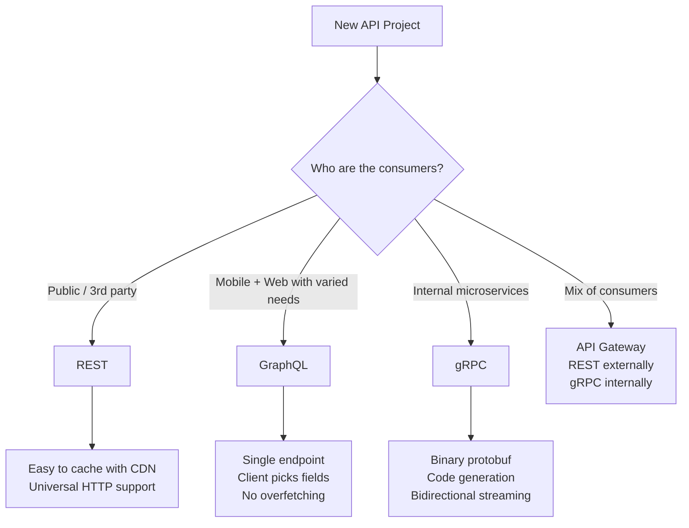
```mermaid
flowchart TD
    A[New API Project] --> B{Who are the consumers?}
    B -->|Public / 3rd party| C[REST]
    B -->|Mobile + Web with varied needs| D[GraphQL]
    B -->|Internal microservices| E[gRPC]
    C --> F[Easy to cache with CDN\nUniversal HTTP support]
    D --> G[Single endpoint\nClient picks fields\nNo overfetching]
    E --> H[Binary protobuf\nCode generation\nBidirectional streaming]
    B -->|Mix of consumers| I[API Gateway\nREST externally\ngRPC internally]
```

### Code Example — All Three in Python

```python
# === REST (FastAPI) ===
from fastapi import FastAPI
app = FastAPI()

@app.get("/users/{user_id}")
async def get_user(user_id: int):
    return {"id": user_id, "name": "Alice", "email": "alice@example.com"}

# === GraphQL (Strawberry + FastAPI) ===
import strawberry
from strawberry.fastapi import GraphQLRouter

@strawberry.type
class User:
    id: int
    name: str
    email: str

@strawberry.type
class Query:
    @strawberry.field
    def user(self, user_id: int) -> User:
        return User(id=user_id, name="Alice", email="alice@example.com")

schema = strawberry.Schema(query=Query)
graphql_app = GraphQLRouter(schema)
app.include_router(graphql_app, prefix="/graphql")

# === gRPC (grpcio) ===
# user.proto → generates user_pb2.py and user_pb2_grpc.py
# Server:
# class UserService(user_pb2_grpc.UserServiceServicer):
#     def GetUser(self, request, context):
#         return user_pb2.UserResponse(id=request.user_id, name="Alice")
```

### Key Takeaways
> - 💡 **REST** is the default for public APIs — simple, cacheable, universally supported
> - 💡 **GraphQL** solves overfetching/underfetching — ideal for mobile and varied client needs
> - 💡 **gRPC** excels at internal microservice communication — fast binary protocol with streaming
> - 💡 Many production systems use **a mix**: REST externally, gRPC internally, GraphQL for BFF
> - 💡 Choose based on **consumers**, not personal preference

---

## Question 92 — HTTP/1.1 vs HTTP/2 vs HTTP/3 — Key Differences for APIs
🟡 Mid | ★★☆ Common

### The Scenario
> *"Your team is evaluating whether to upgrade your API infrastructure from HTTP/1.1 to HTTP/2 or HTTP/3. What are the actual differences and what impact would this have on your REST APIs?"*

### The Answer

**Step 1: Compare the three versions**

| Feature | HTTP/1.1 | HTTP/2 | HTTP/3 |
|---------|----------|--------|--------|
| Year | 1997 | 2015 | 2022 |
| Transport | TCP | TCP | QUIC (UDP) |
| Multiplexing | No (one req per connection) | Yes (many streams per connection) | Yes + no head-of-line blocking |
| Header compression | None | HPACK | QPACK |
| Server push | No | Yes | Yes |
| Connection setup | TCP + TLS = 2-3 RTT | TCP + TLS = 2-3 RTT | 0-1 RTT (QUIC) |
| Head-of-line blocking | Yes (per connection) | No at HTTP level, yes at TCP | No (per-stream) |
| TLS required | Optional | Practically required | Built-in (mandatory) |

**Step 2: How each version handles requests**

```
HTTP/1.1 — Sequential on each connection:
┌──────┐    ┌──────┐    ┌──────┐
│ Req1 │───►│ Res1 │───►│ Req2 │───► ...
└──────┘    └──────┘    └──────┘
Connection 1: ████░░░░████░░░░
Connection 2: ░░░░████░░░░████   (need 6+ connections for parallelism)

HTTP/2 — Multiplexed on single connection:
┌──────────────────────────────┐
│  Stream 1: Req1 ──► Res1     │
│  Stream 2: Req2 ──► Res2     │  Single TCP connection
│  Stream 3: Req3 ──► Res3     │
└──────────────────────────────┘

HTTP/3 — Multiplexed on QUIC (UDP):
┌──────────────────────────────┐
│  Stream 1: Req1 ──► Res1     │
│  Stream 2: Req2 ──► Res2     │  No TCP head-of-line blocking
│  Stream 3: Req3 ──► Res3     │  0-RTT connection resumption
└──────────────────────────────┘
```

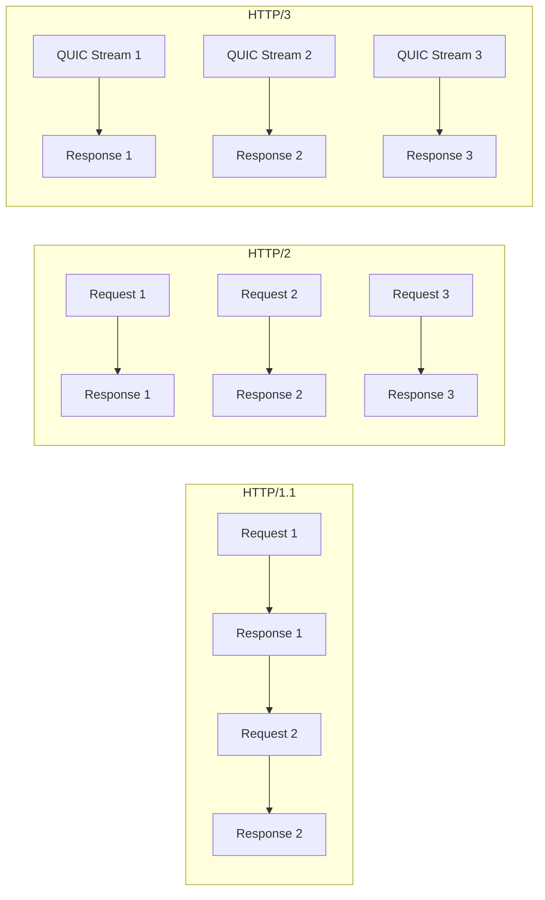
```mermaid
flowchart LR
    subgraph HTTP/1.1
        A1[Request 1] --> B1[Response 1]
        B1 --> A2[Request 2]
        A2 --> B2[Response 2]
    end
    subgraph HTTP/2
        C1[Request 1] --> D1[Response 1]
        C2[Request 2] --> D2[Response 2]
        C3[Request 3] --> D3[Response 3]
    end
    subgraph HTTP/3
        E1[QUIC Stream 1] --> F1[Response 1]
        E2[QUIC Stream 2] --> F2[Response 2]
        E3[QUIC Stream 3] --> F3[Response 3]
    end
```

### Code Example — Enabling HTTP/2 in Python

```python
# Using Hypercorn (ASGI server with HTTP/2 support)
# pip install hypercorn

# Run with HTTP/2:
# hypercorn main:app --bind 0.0.0.0:443 --certfile cert.pem --keyfile key.pem

# FastAPI app — no code changes needed
from fastapi import FastAPI, Request

app = FastAPI()

@app.get("/api/data")
async def get_data(request: Request):
    # You can check the HTTP version
    http_version = request.scope.get("http_version", "1.1")
    return {
        "http_version": http_version,
        "data": "Hello from HTTP/2!" if http_version == "2" else "Hello from HTTP/1.1!"
    }

# Nginx config for HTTP/2:
# server {
#     listen 443 ssl http2;
#     ssl_certificate /etc/ssl/cert.pem;
#     ssl_certificate_key /etc/ssl/key.pem;
#     location / {
#         proxy_pass http://127.0.0.1:8000;
#     }
# }
```

### Key Takeaways
> - 💡 **HTTP/2** gives multiplexing and header compression — significant gains for APIs with many parallel requests
> - 💡 **HTTP/3** eliminates TCP head-of-line blocking via QUIC — best for unreliable networks (mobile)
> - 💡 Your **API code doesn't change** — the protocol upgrade happens at the server/proxy level
> - 💡 Most REST APIs today should be served over **HTTP/2** at minimum (nginx, CloudFront, ALB all support it)
> - 💡 HTTP/3 adoption is growing — Cloudflare, Google, and AWS CloudFront already support it

---

## Question 93 — Idempotency Explained — Which HTTP Methods Are Idempotent and Why
🟢 Junior | ★★★ Very Common

### The Scenario
> *"Can you explain what idempotency means in the context of REST APIs? Which HTTP methods are idempotent and which are not? Why does it matter?"*

### The Answer

**Step 1: Define idempotency**

An operation is **idempotent** if performing it multiple times produces the **same result** as performing it once. The server state after N identical requests is the same as after 1 request.

**Step 2: HTTP methods and idempotency**

| Method | Idempotent? | Safe? | Explanation |
|--------|-------------|-------|-------------|
| GET | ✅ Yes | ✅ Yes | Reading data never changes state |
| HEAD | ✅ Yes | ✅ Yes | Same as GET without body |
| OPTIONS | ✅ Yes | ✅ Yes | Metadata request only |
| PUT | ✅ Yes | ❌ No | Replaces entire resource — same result each time |
| DELETE | ✅ Yes | ❌ No | Deleting an already-deleted resource = still deleted |
| PATCH | ❌ No* | ❌ No | "increment counter by 1" is not idempotent |
| POST | ❌ No | ❌ No | Creating a resource twice = two resources |

> *PATCH **can** be idempotent if implemented as "set field X to value Y" instead of "increment field X"*

**Step 3: Why idempotency matters**

```
WITHOUT IDEMPOTENCY:
Client ──POST /payments──► Server (creates payment)
         ← network timeout (response lost)
Client ──POST /payments──► Server (creates DUPLICATE payment!) ❌

WITH IDEMPOTENCY KEY:
Client ──POST /payments + Idempotency-Key: abc123──► Server (creates payment)
         ← network timeout (response lost)
Client ──POST /payments + Idempotency-Key: abc123──► Server (returns cached result) ✅
```

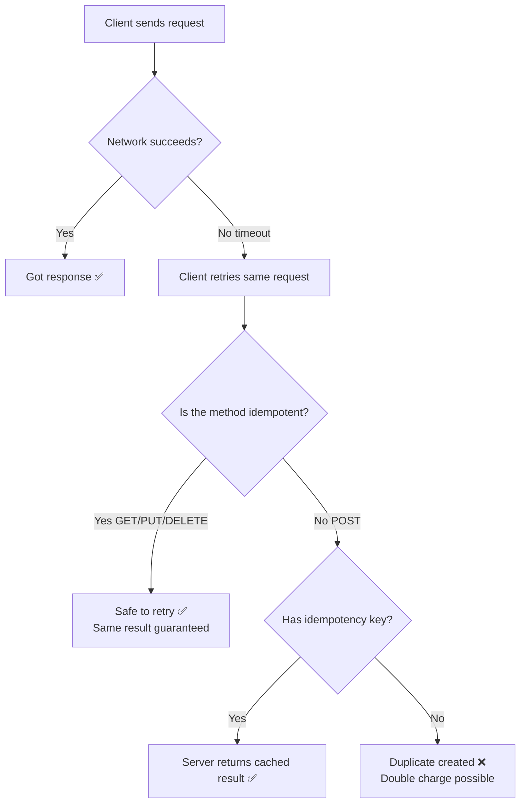
```mermaid
flowchart TD
    A[Client sends request] --> B{Network succeeds?}
    B -->|Yes| C[Got response ✅]
    B -->|No timeout| D[Client retries same request]
    D --> E{Is the method idempotent?}
    E -->|Yes GET/PUT/DELETE| F[Safe to retry ✅\nSame result guaranteed]
    E -->|No POST| G{Has idempotency key?}
    G -->|Yes| H[Server returns cached result ✅]
    G -->|No| I[Duplicate created ❌\nDouble charge possible]
```

### Code Example — Idempotent PUT vs Non-Idempotent POST

```python
from fastapi import FastAPI, HTTPException
from pydantic import BaseModel

app = FastAPI()

# In-memory store
users = {}

class UserCreate(BaseModel):
    name: str
    email: str

# PUT is idempotent — calling this 10 times = same result
@app.put("/users/{user_id}")
async def put_user(user_id: int, user: UserCreate):
    """Replace user entirely. Calling twice = same state."""
    users[user_id] = {"id": user_id, "name": user.name, "email": user.email}
    return users[user_id]

# POST is NOT idempotent — calling this 10 times = 10 users
@app.post("/users")
async def create_user(user: UserCreate):
    """Create new user. Calling twice = two different users."""
    user_id = len(users) + 1
    users[user_id] = {"id": user_id, "name": user.name, "email": user.email}
    return users[user_id]

# PATCH can be non-idempotent
@app.patch("/users/{user_id}/increment-login-count")
async def increment_login(user_id: int):
    """Non-idempotent PATCH: each call changes state differently."""
    if user_id not in users:
        raise HTTPException(404)
    users[user_id].setdefault("login_count", 0)
    users[user_id]["login_count"] += 1  # Each call adds 1
    return users[user_id]
```

### Key Takeaways
> - 💡 **Idempotent** = calling N times gives same result as calling once
> - 💡 **GET, PUT, DELETE** are idempotent by design; **POST** is not
> - 💡 Idempotency matters for **safe retries** — network failures are inevitable
> - 💡 For non-idempotent methods (POST), use **Idempotency-Key headers** to prevent duplicates
> - 💡 In interviews, always mention the **payment double-charge** example — it makes the concept concrete

---

## Question 94 — Stateless vs Stateful APIs — Trade-offs
🟢 Junior | ★★★ Very Common

### The Scenario
> *"REST APIs are supposed to be stateless. What does that mean exactly? What's the difference between stateless and stateful APIs, and what are the trade-offs?"*

### The Answer

**Step 1: Define stateless vs stateful**

| Aspect | Stateless API | Stateful API |
|--------|--------------|--------------|
| Server stores session? | No | Yes (in memory/session store) |
| Each request contains... | All info needed (token, params) | Session ID referencing server state |
| Scaling | Easy (any server can handle any request) | Hard (sticky sessions or shared state) |
| Load balancing | Round-robin works | Need session affinity |
| Fault tolerance | High (server crash = no data lost) | Low (server crash = sessions lost) |
| Example | JWT-based REST API | PHP sessions, WebSocket connections |

**Step 2: How they work**

```
STATELESS (REST):
┌────────┐        ┌────────────┐
│ Client ├─Token──► Server A   │  Any server can handle any request
│        ├─Token──► Server B   │  Token contains all context
│        ├─Token──► Server C   │  No shared state needed
└────────┘        └────────────┘

STATEFUL (Sessions):
┌────────┐        ┌────────────┐
│ Client ├─SID────► Server A   │  Only Server A has the session!
│        ├─SID──X─► Server B   │  ❌ Session not found
│        ├─SID──X─► Server C   │  ❌ Session not found
└────────┘        └────────────┘
                  (need sticky sessions or Redis session store)
```

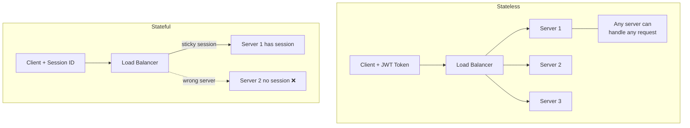
```mermaid
flowchart TD
    subgraph Stateless
        C1[Client + JWT Token] --> LB1[Load Balancer]
        LB1 --> S1[Server 1]
        LB1 --> S2[Server 2]
        LB1 --> S3[Server 3]
        S1 --- Note1[Any server can\nhandle any request]
    end
    subgraph Stateful
        C2[Client + Session ID] --> LB2[Load Balancer]
        LB2 -->|sticky session| S4[Server 1 has session]
        LB2 -.->|wrong server| S5[Server 2 no session ❌]
    end
```

### Code Example — Stateless JWT vs Stateful Session

```python
from fastapi import FastAPI, Depends, HTTPException, Request
from fastapi.security import HTTPBearer
import jwt
import uuid

app = FastAPI()
security = HTTPBearer()

SECRET = "your-secret-key"

# ── STATELESS approach (JWT) ──
# Token contains ALL information. Server stores NOTHING.
@app.post("/login/stateless")
async def login_stateless(username: str, password: str):
    # Validate credentials...
    token = jwt.encode(
        {"sub": username, "role": "admin", "exp": 1700000000},
        SECRET, algorithm="HS256"
    )
    return {"token": token}

@app.get("/profile/stateless")
async def get_profile_stateless(credentials=Depends(security)):
    payload = jwt.decode(credentials.credentials, SECRET, algorithms=["HS256"])
    return {"user": payload["sub"], "role": payload["role"]}
    # ✅ No database/Redis lookup needed — all info is in the token

# ── STATEFUL approach (Server-side session) ──
sessions = {}  # In production: Redis

@app.post("/login/stateful")
async def login_stateful(username: str, password: str):
    session_id = str(uuid.uuid4())
    sessions[session_id] = {"user": username, "role": "admin"}
    return {"session_id": session_id}

@app.get("/profile/stateful")
async def get_profile_stateful(request: Request):
    session_id = request.headers.get("X-Session-ID")
    if session_id not in sessions:
        raise HTTPException(401, "Session expired or invalid")
    return sessions[session_id]
    # ❌ Must look up session — if this server dies, session is lost
```

### Key Takeaways
> - 💡 **Stateless APIs** scale horizontally — any server instance can serve any request
> - 💡 **JWT tokens** are the standard way to make REST APIs stateless
> - 💡 Stateful APIs need **sticky sessions** or a **shared session store** (Redis)
> - 💡 REST's statelessness constraint is a **key reason** it scales well
> - 💡 WebSocket connections are inherently stateful — that's why they're harder to scale

---

## Question 95 — CAP Theorem — Consistency, Availability, Partition Tolerance in APIs
🔴 Senior | ★★☆ Common

### The Scenario
> *"Explain the CAP theorem. How does it apply to designing distributed REST APIs? Can you give real examples of systems choosing CP vs AP?"*

### The Answer

**Step 1: The three properties**

| Property | Meaning | Example |
|----------|---------|---------|
| **C**onsistency | Every read returns the most recent write | All API servers return the same data |
| **A**vailability | Every request receives a response (no errors) | API always responds, even during partitions |
| **P**artition tolerance | System works despite network partitions | API survives network splits between data centers |

**The theorem:** In a distributed system, when a **network partition** occurs, you must choose between **Consistency** and **Availability**. You can't have both.

**Step 2: CP vs AP in practice**

```
NETWORK PARTITION OCCURS:
┌─────────┐    ╳ network    ┌─────────┐
│ DC East │    ╳ broken     │ DC West │
│ (latest │    ╳            │ (stale  │
│  data)  │                 │  data)  │
└─────────┘                 └─────────┘

CP CHOICE: Reject requests to DC West (consistent but unavailable)
AP CHOICE: Serve stale data from DC West (available but inconsistent)
```

| System | Choice | Why |
|--------|--------|-----|
| Banking / Payments | **CP** | Wrong balance = money lost; better to show error |
| Social media feed | **AP** | Showing a slightly old post is fine; availability matters |
| Inventory (e-commerce) | **CP** | Overselling = revenue loss; prefer errors |
| DNS | **AP** | Stale records ok for a while; must always resolve |
| User sessions (Redis) | **AP** | Better to keep users logged in with stale data |
| Financial trading | **CP** | Stale prices = wrong trades |

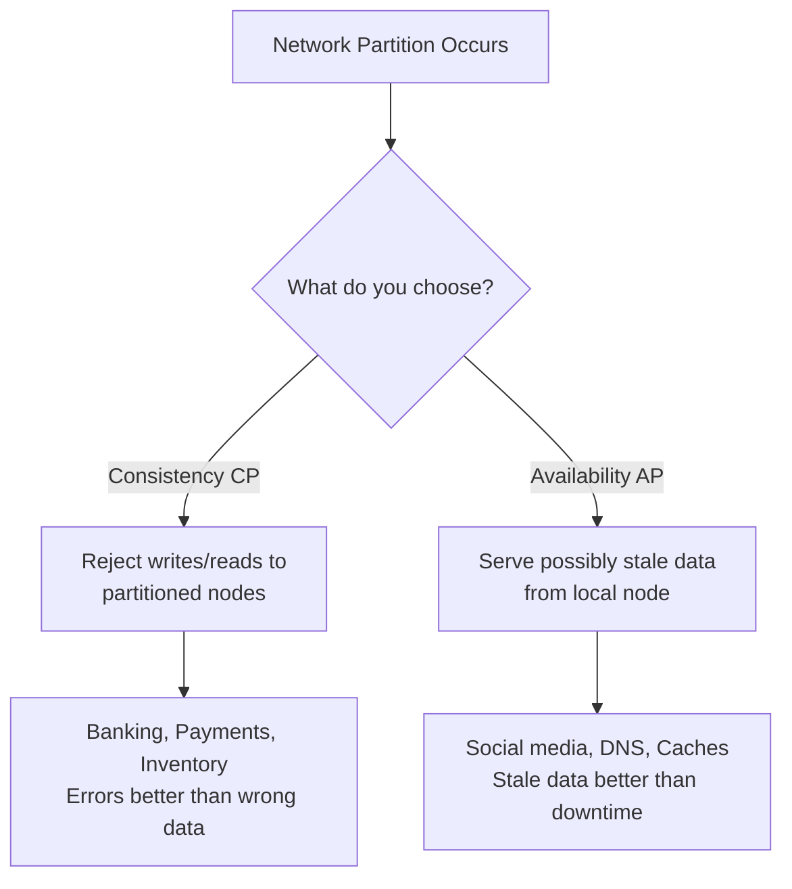
```mermaid
flowchart TD
    A[Network Partition Occurs] --> B{What do you choose?}
    B -->|Consistency CP| C[Reject writes/reads to\npartitioned nodes]
    B -->|Availability AP| D[Serve possibly stale data\nfrom local node]
    C --> E[Banking, Payments, Inventory\nErrors better than wrong data]
    D --> F[Social media, DNS, Caches\nStale data better than downtime]
```

### Code Example — CP vs AP Design

```python
from fastapi import FastAPI, HTTPException
import asyncio

app = FastAPI()

# === CP Design: Consistency over Availability ===
@app.get("/balance/{account_id}")
async def get_balance_cp(account_id: str):
    """
    CP: Always read from primary database.
    If primary is down, return error (not stale data).
    """
    try:
        balance = await read_from_primary_db(account_id)
        return {"account": account_id, "balance": balance, "consistency": "strong"}
    except ConnectionError:
        # Primary is down — refuse to serve stale data
        raise HTTPException(
            status_code=503,
            detail="Service temporarily unavailable. Cannot guarantee data consistency."
        )

# === AP Design: Availability over Consistency ===
@app.get("/feed/{user_id}")
async def get_feed_ap(user_id: str):
    """
    AP: Try primary, fall back to replica or cache.
    Always return something, even if slightly stale.
    """
    try:
        feed = await read_from_primary_db(user_id)
        return {"feed": feed, "source": "primary", "stale": False}
    except ConnectionError:
        # Primary is down — serve from replica/cache
        feed = await read_from_replica_or_cache(user_id)
        return {"feed": feed, "source": "replica", "stale": True}

# Helper stubs
async def read_from_primary_db(key: str):
    raise ConnectionError("Primary DB unreachable")

async def read_from_replica_or_cache(key: str):
    return [{"post": "Yesterday's cached post"}]
```

### Key Takeaways
> - 💡 **CAP theorem**: during a partition, choose **Consistency** or **Availability** — you can't have both
> - 💡 **CP** = banking, payments, inventory — wrong data is worse than downtime
> - 💡 **AP** = social feeds, DNS, caches — downtime is worse than slightly stale data
> - 💡 In practice, most systems are **CP or AP with tuning** — not absolute
> - 💡 The important thing in interviews is showing you understand the **trade-off** and can justify your choice

---

## Question 96 — HATEOAS — What It Is and When to Use It
🟡 Mid | ★★☆ Common

### The Scenario
> *"What is HATEOAS in REST APIs? Is it something you'd actually implement in production, or is it just theoretical?"*

### The Answer

**HATEOAS** = **H**ypermedia **A**s **T**he **E**ngine **O**f **A**pplication **S**tate

The idea: API responses include **links** that tell the client what actions are available next. The client doesn't hardcode URLs — it follows links.

**Step 1: Without vs with HATEOAS**

```
WITHOUT HATEOAS (typical REST):
GET /orders/123
{
  "id": 123,
  "status": "pending",
  "total": 99.99
}
→ Client must know: "To cancel, I should DELETE /orders/123"
→ Client must know: "To pay, I should POST /orders/123/payment"

WITH HATEOAS:
GET /orders/123
{
  "id": 123,
  "status": "pending",
  "total": 99.99,
  "_links": {
    "self":    {"href": "/orders/123"},
    "cancel":  {"href": "/orders/123", "method": "DELETE"},
    "payment": {"href": "/orders/123/payment", "method": "POST"},
    "items":   {"href": "/orders/123/items"}
  }
}
→ Client discovers available actions from the response
```

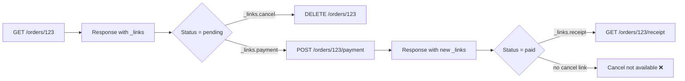
```mermaid
flowchart LR
    A[GET /orders/123] --> B[Response with _links]
    B --> C{Status = pending}
    C -->|_links.cancel| D[DELETE /orders/123]
    C -->|_links.payment| E[POST /orders/123/payment]
    E --> F[Response with new _links]
    F --> G{Status = paid}
    G -->|_links.receipt| H[GET /orders/123/receipt]
    G -->|no cancel link| I[Cancel not available ❌]
```

### Code Example — HATEOAS in FastAPI

```python
from fastapi import FastAPI
from pydantic import BaseModel

app = FastAPI()

class Link(BaseModel):
    href: str
    method: str = "GET"

class OrderResponse(BaseModel):
    id: int
    status: str
    total: float
    _links: dict[str, Link]

@app.get("/orders/{order_id}")
async def get_order(order_id: int):
    order = {"id": order_id, "status": "pending", "total": 99.99}

    # Build links based on current state
    links = {"self": Link(href=f"/orders/{order_id}")}

    if order["status"] == "pending":
        links["cancel"] = Link(href=f"/orders/{order_id}", method="DELETE")
        links["payment"] = Link(href=f"/orders/{order_id}/payment", method="POST")
    elif order["status"] == "paid":
        links["receipt"] = Link(href=f"/orders/{order_id}/receipt")
        links["refund"] = Link(href=f"/orders/{order_id}/refund", method="POST")
    # Note: no "cancel" link when paid — client discovers this automatically

    return {**order, "_links": links}
```

### Key Takeaways
> - 💡 **HATEOAS** means the API tells the client what it can do next via links in responses
> - 💡 It's the **highest maturity level** of REST (Richardson Maturity Model Level 3)
> - 💡 In practice, very few production APIs implement full HATEOAS — most stop at Level 2
> - 💡 It's useful for **workflow-driven APIs** (orders, approvals) where available actions change with state
> - 💡 In interviews, mention it to show depth, but note the **practical trade-offs** (complexity vs value)

---

## Question 97 — The 6 REST Architectural Constraints (Roy Fielding)
🟡 Mid | ★★★ Very Common

### The Scenario
> *"REST isn't just 'use HTTP with JSON.' Roy Fielding defined REST with specific architectural constraints. Can you name and explain them?"*

### The Answer

| # | Constraint | What It Means | Example |
|---|-----------|---------------|---------|
| 1 | **Client-Server** | Client and server are independent; client manages UI, server manages data | Mobile app (client) ↔ FastAPI server |
| 2 | **Stateless** | Each request contains all information needed; server stores no session | JWT token in every request header |
| 3 | **Cacheable** | Responses must indicate if they're cacheable | `Cache-Control: max-age=3600`, ETags |
| 4 | **Uniform Interface** | Standard way to interact with resources (URLs, HTTP methods, representations) | GET /users/1, POST /users, DELETE /users/1 |
| 5 | **Layered System** | Client doesn't know if it's talking to the real server or a proxy/CDN | Request goes through CDN → Load Balancer → API |
| 6 | **Code on Demand** (optional) | Server can send executable code to client | JavaScript in web responses, WASM |

```
┌─────────────────────────────────────────────────────────────────┐
│                   THE 6 REST CONSTRAINTS                        │
├─────────────────────────────────────────────────────────────────┤
│                                                                 │
│  1. CLIENT-SERVER        Client ←──────→ Server (separated)     │
│                                                                 │
│  2. STATELESS            Each request is self-contained         │
│                          (no server-side sessions)              │
│                                                                 │
│  3. CACHEABLE            Responses say: "cache me for 1 hour"   │
│                          or "don't cache me"                    │
│                                                                 │
│  4. UNIFORM INTERFACE    Resources have URIs                    │
│                          Standard HTTP methods                  │
│                          Self-descriptive messages               │
│                          HATEOAS (hypermedia links)             │
│                                                                 │
│  5. LAYERED SYSTEM       CDN → LB → Gateway → Server           │
│                          Client doesn't know/care               │
│                                                                 │
│  6. CODE ON DEMAND       (Optional) Server sends JS/WASM       │
│                                                                 │
└─────────────────────────────────────────────────────────────────┘
```

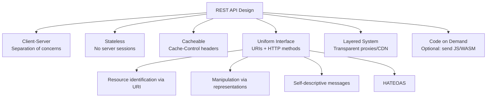
```mermaid
flowchart TD
    A[REST API Design] --> B[Client-Server\nSeparation of concerns]
    A --> C[Stateless\nNo server sessions]
    A --> D[Cacheable\nCache-Control headers]
    A --> E[Uniform Interface\nURIs + HTTP methods]
    A --> F[Layered System\nTransparent proxies/CDN]
    A --> G[Code on Demand\nOptional: send JS/WASM]
    E --> E1[Resource identification via URI]
    E --> E2[Manipulation via representations]
    E --> E3[Self-descriptive messages]
    E --> E4[HATEOAS]
```

### Code Example — Applying REST Constraints in FastAPI

```python
from fastapi import FastAPI
from fastapi.middleware.cors import CORSMiddleware
from fastapi.responses import JSONResponse

app = FastAPI()

# Constraint 1: Client-Server — FastAPI serves only the API, no UI
# Constraint 4: Uniform Interface — standard resource-based URLs
@app.get("/users/{user_id}")
async def get_user(user_id: int):
    user = {"id": user_id, "name": "Alice"}

    # Constraint 3: Cacheable — tell clients/proxies to cache
    response = JSONResponse(content=user)
    response.headers["Cache-Control"] = "public, max-age=300"
    response.headers["ETag"] = f'"{user_id}-v1"'
    return response

# Constraint 2: Stateless — auth token in each request, no server sessions
from fastapi.security import HTTPBearer
security = HTTPBearer()

@app.get("/me")
async def get_me(token=Depends(security)):
    # Token contains all context — no server session lookup
    payload = decode_jwt(token.credentials)
    return {"user": payload["sub"]}

# Constraint 5: Layered System — works behind CDN/LB without changes
# No special code needed — just deploy behind nginx/CloudFront

# Constraint 6: Code on Demand (optional) — rarely used in REST APIs
```

### Key Takeaways
> - 💡 REST is defined by **6 constraints**, not just "HTTP + JSON"
> - 💡 **Stateless** and **Uniform Interface** are the most important for interviews
> - 💡 Most real APIs violate at least one constraint (e.g., sessions = violates stateless)
> - 💡 **Code on Demand** is the only optional constraint — most APIs skip it
> - 💡 Knowing these constraints shows you understand REST **deeply**, not just superficially

---

## Question 98 — API Gateway vs Load Balancer vs Reverse Proxy
🟡 Mid | ★★★ Very Common

### The Scenario
> *"What's the difference between an API Gateway, a Load Balancer, and a Reverse Proxy? When would you use each one?"*

### The Answer

| Feature | Reverse Proxy | Load Balancer | API Gateway |
|---------|--------------|---------------|-------------|
| Primary job | Forward requests to backend | Distribute traffic across servers | Manage API lifecycle |
| Layer | L7 (HTTP) | L4 (TCP) or L7 (HTTP) | L7 (HTTP) |
| SSL termination | ✅ | ✅ | ✅ |
| Load balancing | Basic | ✅ Advanced (round-robin, least-conn) | ✅ |
| Rate limiting | Basic | ❌ | ✅ Advanced |
| Authentication | ❌ | ❌ | ✅ (JWT, OAuth, API keys) |
| Request transformation | ❌ | ❌ | ✅ (rewrite headers, body) |
| API versioning | ❌ | ❌ | ✅ |
| Analytics/monitoring | Basic logs | Health checks | ✅ Full API analytics |
| Examples | Nginx, HAProxy | AWS ALB/NLB, Nginx | Kong, AWS API Gateway, Traefik |

```
┌──────────────────────────────────────────────────────────────┐
│                        LAYERED ARCHITECTURE                  │
│                                                              │
│  Client ──► CDN ──► API Gateway ──► Load Balancer ──► Servers│
│                     │                                        │
│                     ├─ Auth (JWT/API key validation)         │
│                     ├─ Rate limiting (per client/tier)       │
│                     ├─ Request routing (/v1 vs /v2)          │
│                     ├─ SSL termination                       │
│                     └─ Logging & analytics                   │
│                                                              │
│             Load Balancer:                                    │
│             ├─ Health checks                                 │
│             ├─ Round-robin / least connections                │
│             └─ Sticky sessions (if needed)                   │
│                                                              │
│             Reverse Proxy (often combined with LB):          │
│             ├─ SSL termination                               │
│             ├─ Static file serving                           │
│             └─ Caching                                       │
└──────────────────────────────────────────────────────────────┘
```

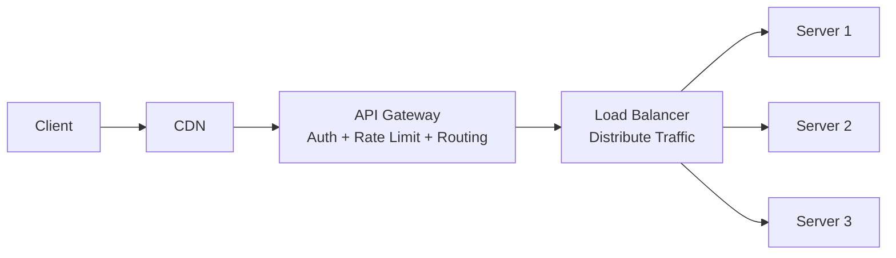
```mermaid
flowchart LR
    Client --> CDN
    CDN --> GW[API Gateway\nAuth + Rate Limit + Routing]
    GW --> LB[Load Balancer\nDistribute Traffic]
    LB --> S1[Server 1]
    LB --> S2[Server 2]
    LB --> S3[Server 3]
```

### Key Takeaways
> - 💡 **Reverse Proxy** = forward requests, SSL termination, basic caching (Nginx)
> - 💡 **Load Balancer** = distribute traffic across server instances (ALB/NLB)
> - 💡 **API Gateway** = full API management: auth, rate limiting, versioning, analytics (Kong)
> - 💡 In practice, Nginx often serves as **both** reverse proxy and load balancer
> - 💡 For microservices, an **API Gateway** is almost always needed on top of a load balancer

---

## Question 99 — Synchronous vs Asynchronous API Design Patterns
🟡 Mid | ★★★ Very Common

### The Scenario
> *"When should an API be synchronous (request-response) vs asynchronous (fire-and-forget with polling)? How do you design async APIs?"*

### The Answer

| Aspect | Synchronous | Asynchronous |
|--------|------------|--------------|
| Response time | Immediate (< 1-2 seconds) | Eventual (seconds to hours) |
| Client waits? | Yes, blocks until response | No, gets job ID immediately |
| Use when | Quick operations (CRUD, lookups) | Long tasks (reports, uploads, ML) |
| HTTP status | 200 OK | 202 Accepted |
| Scaling | Vertical (bigger servers) | Horizontal (worker queues) |
| Error handling | Direct in response | Callback/polling/webhook |

```
SYNCHRONOUS:
Client ─── GET /users/1 ───► Server ─── 200 {user} ──► Client
                   (waits 50ms)

ASYNCHRONOUS:
Client ─── POST /reports ────► Server ─── 202 {job_id} ──► Client  (instant)
                                  │
                                  ▼
                            Queue (Celery)
                                  │
                                  ▼
                              Worker processes report (5 min)
                                  │
                                  ▼
Client ─── GET /jobs/{id} ──► Server ─── 200 {status: "done", url: "..."} ──► Client
```

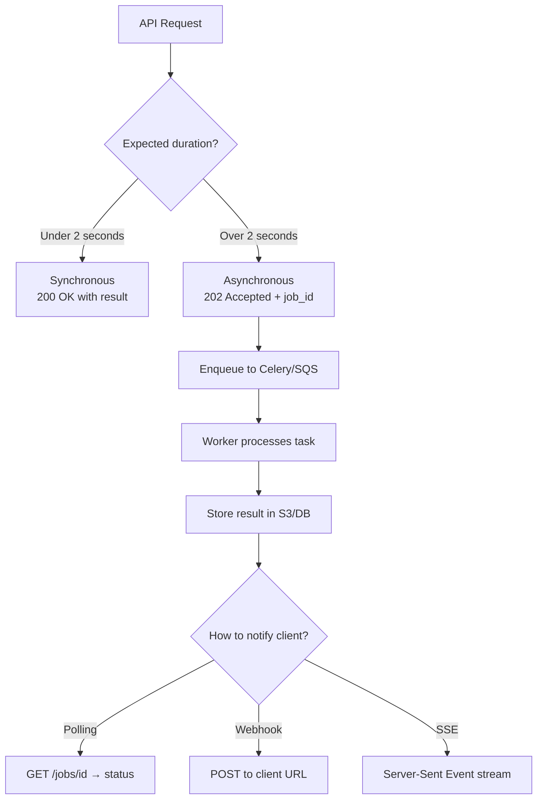
```mermaid
flowchart TD
    A[API Request] --> B{Expected duration?}
    B -->|Under 2 seconds| C[Synchronous\n200 OK with result]
    B -->|Over 2 seconds| D[Asynchronous\n202 Accepted + job_id]
    D --> E[Enqueue to Celery/SQS]
    E --> F[Worker processes task]
    F --> G[Store result in S3/DB]
    G --> H{How to notify client?}
    H -->|Polling| I[GET /jobs/id → status]
    H -->|Webhook| J[POST to client URL]
    H -->|SSE| K[Server-Sent Event stream]
```

### Code Example — Sync vs Async Endpoints

```python
from fastapi import FastAPI, BackgroundTasks
from celery import Celery
import uuid

app = FastAPI()
celery_app = Celery("tasks", broker="redis://localhost:6379")

# ── SYNCHRONOUS: Quick CRUD operation ──
@app.get("/users/{user_id}")
async def get_user(user_id: int):
    """Sync — returns immediately (< 100ms)"""
    user = await db.fetch_user(user_id)
    return {"id": user_id, "name": user["name"]}  # 200 OK

# ── ASYNCHRONOUS: Long-running report ──
@app.post("/reports", status_code=202)
async def generate_report(report_type: str):
    """Async — returns job ID, processes in background"""
    job_id = str(uuid.uuid4())
    celery_app.send_task("generate_report", args=[job_id, report_type])
    return {
        "job_id": job_id,
        "status": "accepted",
        "poll_url": f"/jobs/{job_id}"
    }  # 202 Accepted

@app.get("/jobs/{job_id}")
async def check_job(job_id: str):
    """Polling endpoint for async results"""
    job = await db.get_job(job_id)
    if job["status"] == "completed":
        return {"status": "completed", "download_url": job["result_url"]}
    return {"status": job["status"], "progress": job.get("progress", 0)}
```

### Key Takeaways
> - 💡 Use **synchronous** for operations under 2 seconds (CRUD, lookups, validations)
> - 💡 Use **asynchronous** (202 + job_id) for anything over 2 seconds (reports, ML, exports)
> - 💡 Three ways to deliver async results: **polling**, **webhooks**, **SSE**
> - 💡 Celery + Redis is the standard Python stack for async task processing
> - 💡 Always return `202 Accepted` (not 200) for async operations — it signals "received but not done"

---

## Question 100 — ETags and Conditional Requests — Cache Validation
🟢 Junior | ★★☆ Common

### The Scenario
> *"What are ETags? How do conditional requests work in REST APIs? Why would you use them?"*

### The Answer

**ETags** (Entity Tags) are identifiers for a specific version of a resource. They enable **conditional requests** — the server only sends data if it has changed.

| Header | Purpose | Used With |
|--------|---------|-----------|
| `ETag` | Response: "this is version abc123" | GET response |
| `If-None-Match` | Request: "only send if different from abc123" | GET (caching) |
| `If-Match` | Request: "only update if still abc123" | PUT/PATCH (concurrency) |

```
CONDITIONAL GET (Caching):
1st request:
  Client → GET /users/1
  Server → 200 + ETag: "v1" + {name: "Alice"}

2nd request:
  Client → GET /users/1 + If-None-Match: "v1"
  Server → 304 Not Modified (no body!)     ← Saves bandwidth
  Client uses cached response

CONDITIONAL PUT (Concurrency):
  Client A → GET /users/1 → ETag: "v1"
  Client B → GET /users/1 → ETag: "v1"
  Client A → PUT /users/1 + If-Match: "v1" → 200 OK (ETag now "v2")
  Client B → PUT /users/1 + If-Match: "v1" → 412 Precondition Failed!
```

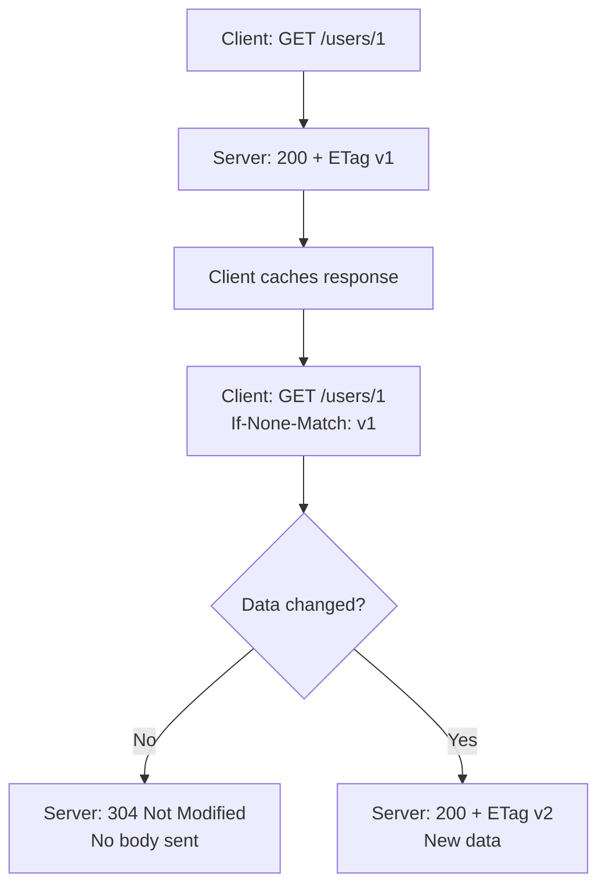
```mermaid
flowchart TD
    A[Client: GET /users/1] --> B[Server: 200 + ETag v1]
    B --> C[Client caches response]
    C --> D[Client: GET /users/1\nIf-None-Match: v1]
    D --> E{Data changed?}
    E -->|No| F[Server: 304 Not Modified\nNo body sent]
    E -->|Yes| G[Server: 200 + ETag v2\nNew data]
```

### Code Example — ETags in FastAPI

```python
import hashlib
from fastapi import FastAPI, Request, Response
from fastapi.responses import JSONResponse

app = FastAPI()

# Simulated database
users_db = {1: {"id": 1, "name": "Alice", "version": 1}}

def generate_etag(data: dict) -> str:
    """Generate ETag from data content"""
    content = str(sorted(data.items())).encode()
    return hashlib.md5(content).hexdigest()

@app.get("/users/{user_id}")
async def get_user(user_id: int, request: Request):
    user = users_db.get(user_id)
    if not user:
        return JSONResponse(status_code=404, content={"error": "Not found"})

    etag = f'"{generate_etag(user)}"'

    # Check If-None-Match (conditional GET for caching)
    if_none_match = request.headers.get("if-none-match")
    if if_none_match == etag:
        return Response(status_code=304)  # Not Modified — saves bandwidth

    response = JSONResponse(content=user)
    response.headers["ETag"] = etag
    response.headers["Cache-Control"] = "private, max-age=60"
    return response

@app.put("/users/{user_id}")
async def update_user(user_id: int, request: Request):
    user = users_db.get(user_id)
    if not user:
        return JSONResponse(status_code=404, content={"error": "Not found"})

    current_etag = f'"{generate_etag(user)}"'

    # Check If-Match (conditional PUT for concurrency)
    if_match = request.headers.get("if-match")
    if if_match and if_match != current_etag:
        return JSONResponse(
            status_code=412,
            content={"error": "Precondition Failed — resource was modified"}
        )

    body = await request.json()
    users_db[user_id] = {**user, **body, "version": user["version"] + 1}
    new_etag = f'"{generate_etag(users_db[user_id])}"'

    response = JSONResponse(content=users_db[user_id])
    response.headers["ETag"] = new_etag
    return response
```

### Key Takeaways
> - 💡 **ETags** are version identifiers for resources — like a fingerprint of the data
> - 💡 **If-None-Match** = caching (return 304 if unchanged, saving bandwidth)
> - 💡 **If-Match** = concurrency control (return 412 if resource was modified)
> - 💡 ETags reduce server load and bandwidth — critical for mobile and high-traffic APIs
> - 💡 Use ETags with `Cache-Control` headers for a complete caching strategy

---

## Question 101 — Content Negotiation — Accept Headers, Multiple Formats
🟢 Junior | ★★☆ Common

### The Scenario
> *"Your API currently returns only JSON. A client asks for XML responses. How do you support multiple response formats using content negotiation?"*

### The Answer

**Content negotiation** uses the `Accept` header to let clients specify their preferred response format.

| Header | Example | Purpose |
|--------|---------|---------|
| `Accept` | `application/json` | Client wants JSON |
| `Accept` | `application/xml` | Client wants XML |
| `Accept` | `text/csv` | Client wants CSV |
| `Accept` | `*/*` | Client accepts anything |
| `Content-Type` | `application/json` | Response IS JSON |

```
Client: GET /users Accept: application/xml
Server: 200 Content-Type: application/xml  <user><name>Alice</name></user>

Client: GET /users Accept: application/json
Server: 200 Content-Type: application/json  {"name": "Alice"}

Client: GET /users Accept: text/html
Server: 406 Not Acceptable (we don't support HTML)
```

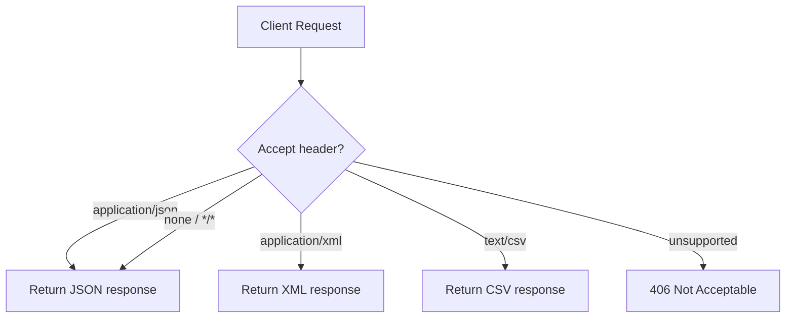
```mermaid
flowchart TD
    A[Client Request] --> B{Accept header?}
    B -->|application/json| C[Return JSON response]
    B -->|application/xml| D[Return XML response]
    B -->|text/csv| E[Return CSV response]
    B -->|unsupported| F[406 Not Acceptable]
    B -->|none / */*| C
```

### Code Example — Multi-Format API in FastAPI

```python
from fastapi import FastAPI, Request
from fastapi.responses import JSONResponse, Response
import dicttoxml
import csv
import io

app = FastAPI()

users = [
    {"id": 1, "name": "Alice", "email": "alice@example.com"},
    {"id": 2, "name": "Bob", "email": "bob@example.com"},
]

def to_xml(data) -> str:
    return dicttoxml.dicttoxml(data, custom_root="users", attr_type=False).decode()

def to_csv(data) -> str:
    output = io.StringIO()
    writer = csv.DictWriter(output, fieldnames=data[0].keys())
    writer.writeheader()
    writer.writerows(data)
    return output.getvalue()

@app.get("/users")
async def get_users(request: Request):
    accept = request.headers.get("accept", "application/json")

    if "application/xml" in accept:
        return Response(content=to_xml(users), media_type="application/xml")
    elif "text/csv" in accept:
        return Response(content=to_csv(users), media_type="text/csv")
    elif "application/json" in accept or "*/*" in accept:
        return JSONResponse(content=users)
    else:
        return JSONResponse(
            status_code=406,
            content={"error": "Not Acceptable", "supported": ["application/json", "application/xml", "text/csv"]}
        )
```

### Key Takeaways
> - 💡 **Content negotiation** uses the `Accept` header to let clients choose response format
> - 💡 Return `406 Not Acceptable` if you can't serve the requested format
> - 💡 Always include `Content-Type` in responses to confirm the actual format
> - 💡 Default to **JSON** when no Accept header is provided
> - 💡 This is useful for APIs serving both browsers (HTML) and mobile apps (JSON)

---

## Question 102 — API Rate Limiting Algorithms Compared
🟡 Mid | ★★★ Very Common

### The Scenario
> *"Explain the common rate limiting algorithms: token bucket, leaky bucket, fixed window, and sliding window. When would you use each?"*

### The Answer

| Algorithm | How It Works | Pros | Cons | Best For |
|-----------|-------------|------|------|----------|
| **Fixed Window** | Count requests per time window (e.g., 100/minute) | Simple to implement | Burst at window boundary (200 in 2 seconds) | Simple APIs, internal tools |
| **Sliding Window** | Rolling window based on current time | Smooth rate enforcement | More memory (store timestamps) | Public APIs needing fairness |
| **Token Bucket** | Tokens added at fixed rate, each request costs 1 | Allows controlled bursts | Slightly complex | AWS, Stripe, most cloud APIs |
| **Leaky Bucket** | Requests processed at fixed rate from queue | Perfectly smooth output | No burst tolerance | Network traffic shaping |

```
FIXED WINDOW (100 req/min):
00:00          00:59 01:00          01:59
[██████████100]      [██████████100]
         ↑  ↑
    90 reqs  99 at 00:59
              1 at 01:00 → allowed! (200 in 2 seconds)

SLIDING WINDOW (100 req/min):
Counts all requests in the LAST 60 seconds from NOW
At 01:00: counts from 00:00 to 01:00 → blocks the burst

TOKEN BUCKET (10 tokens/sec, max 50):
Bucket: [●●●●●●●●●●] → request consumes 1 token
         Refills 10/sec up to max 50
         Burst of 50 allowed, then throttled to 10/sec

LEAKY BUCKET:
Queue: [req][req][req][req] → processes 1 every 100ms
        Even if 100 arrive at once, output is smooth
```

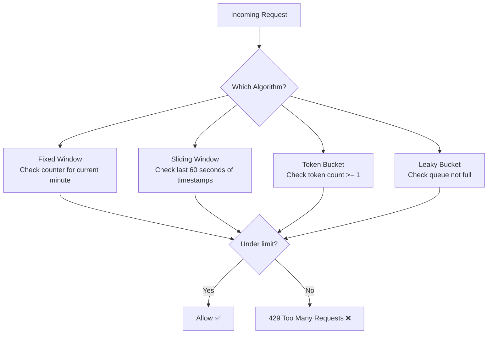
```mermaid
flowchart TD
    A[Incoming Request] --> B{Which Algorithm?}
    B --> C[Fixed Window\nCheck counter for current minute]
    B --> D[Sliding Window\nCheck last 60 seconds of timestamps]
    B --> E[Token Bucket\nCheck token count >= 1]
    B --> F[Leaky Bucket\nCheck queue not full]
    C --> G{Under limit?}
    D --> G
    E --> G
    F --> G
    G -->|Yes| H[Allow ✅]
    G -->|No| I[429 Too Many Requests ❌]
```

### Code Example — Token Bucket in Python

```python
import time
import asyncio
from fastapi import FastAPI, Request, HTTPException

app = FastAPI()

class TokenBucket:
    def __init__(self, rate: float, capacity: int):
        self.rate = rate          # tokens added per second
        self.capacity = capacity  # max tokens
        self.tokens = capacity    # current tokens
        self.last_refill = time.monotonic()

    def consume(self, tokens: int = 1) -> bool:
        now = time.monotonic()
        elapsed = now - self.last_refill
        self.tokens = min(self.capacity, self.tokens + elapsed * self.rate)
        self.last_refill = now

        if self.tokens >= tokens:
            self.tokens -= tokens
            return True
        return False

# Per-client buckets: 10 tokens/sec, burst of 50
client_buckets: dict[str, TokenBucket] = {}

@app.middleware("http")
async def rate_limit_middleware(request: Request, call_next):
    client_ip = request.client.host
    if client_ip not in client_buckets:
        client_buckets[client_ip] = TokenBucket(rate=10, capacity=50)

    bucket = client_buckets[client_ip]
    if not bucket.consume():
        raise HTTPException(
            status_code=429,
            detail="Rate limit exceeded. Try again shortly.",
            headers={
                "Retry-After": "1",
                "X-RateLimit-Limit": "50",
                "X-RateLimit-Remaining": "0",
            }
        )

    response = await call_next(request)
    response.headers["X-RateLimit-Remaining"] = str(int(bucket.tokens))
    return response
```

### Key Takeaways
> - 💡 **Token bucket** is the most popular — used by AWS, Stripe, and most cloud APIs
> - 💡 **Fixed window** is simplest but has the boundary-burst problem
> - 💡 **Sliding window** is fairest but uses more memory
> - 💡 **Leaky bucket** provides perfectly smooth output — good for network traffic shaping
> - 💡 Always return `429` with `Retry-After` and `X-RateLimit-*` headers

---

## Question 103 — Circuit Breaker Pattern — States and When to Use
🔴 Senior | ★★★ Very Common

### The Scenario
> *"Explain the circuit breaker pattern. What are the three states? When and why would you implement it in a REST API?"*

### The Answer

The **circuit breaker** pattern prevents cascading failures by stopping requests to a failing service. Like an electrical circuit breaker — it "trips" when there's a problem.

**The three states:**

| State | Behavior | Transitions |
|-------|----------|-------------|
| **Closed** (normal) | All requests pass through | → Open when failure threshold reached |
| **Open** (tripped) | All requests fail immediately (no call) | → Half-Open after timeout period |
| **Half-Open** (testing) | Allow a few test requests through | → Closed if success, → Open if failure |

```
                    success
              ┌─────────────────┐
              │                 │
              ▼                 │
         ┌─────────┐     ┌───────────┐
         │ CLOSED  │────►│   OPEN    │
         │(normal) │fail │(all fail  │
         └─────────┘     │instantly) │
              ▲          └─────┬─────┘
              │                │ timeout
              │          ┌─────▼─────┐
              │          │ HALF-OPEN │
              └──────────│(test 1    │
                success  │ request)  │
                         └───────────┘
                              │ fail
                              ▼
                         Back to OPEN
```

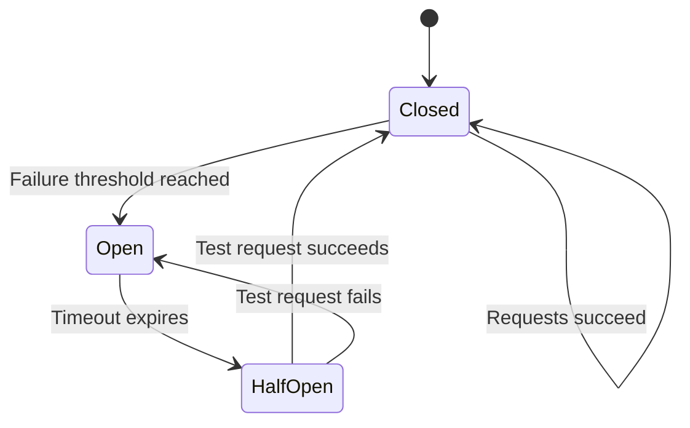
```mermaid
stateDiagram-v2
    [*] --> Closed
    Closed --> Open : Failure threshold reached
    Open --> HalfOpen : Timeout expires
    HalfOpen --> Closed : Test request succeeds
    HalfOpen --> Open : Test request fails
    Closed --> Closed : Requests succeed
```

### Code Example — Circuit Breaker Implementation

```python
import time
import asyncio
from enum import Enum
from fastapi import FastAPI, HTTPException

app = FastAPI()

class CircuitState(Enum):
    CLOSED = "closed"
    OPEN = "open"
    HALF_OPEN = "half_open"

class CircuitBreaker:
    def __init__(self, failure_threshold: int = 5, recovery_timeout: int = 30):
        self.state = CircuitState.CLOSED
        self.failure_count = 0
        self.failure_threshold = failure_threshold
        self.recovery_timeout = recovery_timeout
        self.last_failure_time = 0

    def can_execute(self) -> bool:
        if self.state == CircuitState.CLOSED:
            return True
        if self.state == CircuitState.OPEN:
            if time.monotonic() - self.last_failure_time > self.recovery_timeout:
                self.state = CircuitState.HALF_OPEN
                return True
            return False
        if self.state == CircuitState.HALF_OPEN:
            return True  # Allow test request
        return False

    def record_success(self):
        self.failure_count = 0
        self.state = CircuitState.CLOSED

    def record_failure(self):
        self.failure_count += 1
        self.last_failure_time = time.monotonic()
        if self.failure_count >= self.failure_threshold:
            self.state = CircuitState.OPEN

# One circuit breaker per downstream service
payment_cb = CircuitBreaker(failure_threshold=3, recovery_timeout=30)

@app.post("/checkout")
async def checkout(order_id: str):
    if not payment_cb.can_execute():
        # Circuit is OPEN — fail fast with fallback
        return {
            "status": "queued",
            "message": "Payment service temporarily unavailable. Order queued for retry."
        }

    try:
        result = await call_payment_service(order_id)
        payment_cb.record_success()
        return {"status": "paid", "transaction_id": result["id"]}
    except Exception as e:
        payment_cb.record_failure()
        raise HTTPException(503, f"Payment service error: {str(e)}")

async def call_payment_service(order_id: str):
    # Simulate external call
    raise ConnectionError("Payment service is down")
```

### Key Takeaways
> - 💡 Circuit breaker has 3 states: **Closed** (normal), **Open** (fail fast), **Half-Open** (testing)
> - 💡 It prevents **cascading failures** — one failing service doesn't bring down everything
> - 💡 Use one circuit breaker **per downstream service** — don't share
> - 💡 In Python, use libraries like `pybreaker` or `tenacity` in production
> - 💡 Always provide a **fallback response** when the circuit is open (queued, cached, degraded)

---

## Question 104 — Saga Pattern — Distributed Transactions in Microservices
🔴 Senior | ★★☆ Common

### The Scenario
> *"In microservices, you can't use a single database transaction across services. How do you handle distributed transactions? Explain the Saga pattern."*

### The Answer

A **Saga** is a sequence of local transactions. Each service performs its transaction and publishes an event. If any step fails, **compensating transactions** undo the previous steps.

**Two types of Sagas:**

| Type | How It Works | Pros | Cons |
|------|-------------|------|------|
| **Choreography** | Each service listens for events and acts | Decoupled, simple | Hard to track, complex flows |
| **Orchestration** | Central orchestrator tells each service what to do | Easy to understand, centralized logic | Single point of failure |

```
ORCHESTRATION SAGA — E-Commerce Checkout:

┌──────────────┐    ┌──────────────┐    ┌──────────────┐
│ Order Service │───►│ Payment Svc  │───►│ Inventory Svc│
│ Create Order  │    │ Charge Card  │    │ Reserve Stock│
└──────────────┘    └──────────────┘    └──────────────┘
                                              │
                                         ❌ FAIL!
                                              │
                    ┌──────────────┐    ┌──────────────┐
                    │ Payment Svc  │◄───│ Order Service │
                    │ REFUND Card  │    │ CANCEL Order  │
                    └──────────────┘    └──────────────┘
                    (compensating)      (compensating)
```

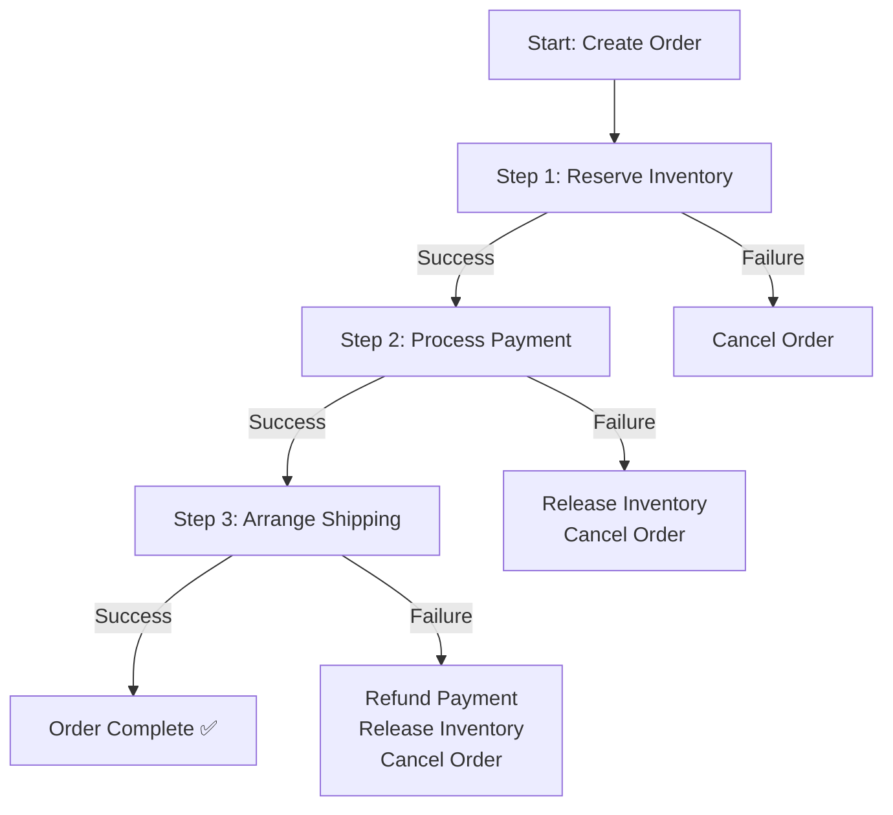
```mermaid
flowchart TD
    A[Start: Create Order] --> B[Step 1: Reserve Inventory]
    B -->|Success| C[Step 2: Process Payment]
    C -->|Success| D[Step 3: Arrange Shipping]
    D -->|Success| E[Order Complete ✅]
    B -->|Failure| F[Cancel Order]
    C -->|Failure| G[Release Inventory\nCancel Order]
    D -->|Failure| H[Refund Payment\nRelease Inventory\nCancel Order]
```

### Code Example — Orchestration Saga in FastAPI

```python
from fastapi import FastAPI, HTTPException
from enum import Enum
import uuid

app = FastAPI()

class SagaStep(Enum):
    ORDER_CREATED = "order_created"
    PAYMENT_CHARGED = "payment_charged"
    INVENTORY_RESERVED = "inventory_reserved"
    COMPLETED = "completed"
    FAILED = "failed"

class SagaOrchestrator:
    """Coordinates distributed transaction across services."""

    async def execute_checkout(self, order_data: dict) -> dict:
        saga_id = str(uuid.uuid4())
        completed_steps = []

        try:
            # Step 1: Create order
            order = await self.create_order(order_data)
            completed_steps.append(SagaStep.ORDER_CREATED)

            # Step 2: Process payment
            payment = await self.process_payment(order["id"], order_data["amount"])
            completed_steps.append(SagaStep.PAYMENT_CHARGED)

            # Step 3: Reserve inventory
            await self.reserve_inventory(order_data["items"])
            completed_steps.append(SagaStep.INVENTORY_RESERVED)

            return {"saga_id": saga_id, "status": "completed", "order": order}

        except Exception as e:
            # Compensate: undo completed steps in reverse order
            await self.compensate(completed_steps, order_data)
            raise HTTPException(500, f"Checkout failed, all changes rolled back: {str(e)}")

    async def compensate(self, completed_steps: list, order_data: dict):
        """Undo completed steps in reverse order."""
        for step in reversed(completed_steps):
            if step == SagaStep.INVENTORY_RESERVED:
                await self.release_inventory(order_data["items"])
            elif step == SagaStep.PAYMENT_CHARGED:
                await self.refund_payment(order_data["amount"])
            elif step == SagaStep.ORDER_CREATED:
                await self.cancel_order(order_data)

    # Service calls (stubs)
    async def create_order(self, data):
        return {"id": str(uuid.uuid4())}

    async def process_payment(self, order_id, amount):
        return {"transaction_id": "txn_123"}

    async def reserve_inventory(self, items):
        raise Exception("Out of stock!")  # Simulated failure

    async def release_inventory(self, items):
        pass  # Compensating transaction

    async def refund_payment(self, amount):
        pass  # Compensating transaction

    async def cancel_order(self, data):
        pass  # Compensating transaction

saga = SagaOrchestrator()

@app.post("/checkout")
async def checkout(order: dict):
    return await saga.execute_checkout(order)
```

### Key Takeaways
> - 💡 **Sagas** replace distributed transactions — each service commits locally, compensates on failure
> - 💡 **Orchestration** = central coordinator (simpler); **Choreography** = event-driven (decoupled)
> - 💡 Every forward step needs a **compensating transaction** (refund, release, cancel)
> - 💡 Use orchestration for complex workflows (checkout), choreography for simple chains
> - 💡 Track saga state in a database so you can recover from crashes mid-saga

---

## Question 105 — Event-Driven vs Request-Response Architecture
🟡 Mid | ★★☆ Common

### The Scenario
> *"What's the difference between event-driven and request-response architecture? When would you choose one over the other?"*

### The Answer

| Aspect | Request-Response | Event-Driven |
|--------|-----------------|--------------|
| Communication | Synchronous: Client waits | Asynchronous: Fire and forget |
| Coupling | Tight (caller knows callee) | Loose (publisher doesn't know subscribers) |
| Scaling | Scale both sides together | Scale independently |
| Failure impact | Caller fails if callee fails | Producer independent of consumers |
| Latency | Predictable (direct call) | Variable (queue processing time) |
| Use case | CRUD APIs, real-time queries | Notifications, analytics, data pipelines |

```
REQUEST-RESPONSE:
┌────────┐  request   ┌────────┐
│ Client ├───────────►│ Server │
│        │◄───────────┤        │
└────────┘  response  └────────┘
  (tight coupling, client waits)

EVENT-DRIVEN:
┌──────────┐  event   ┌───────────┐  event   ┌─────────────┐
│ Producer ├─────────►│ Event Bus ├─────────►│ Consumer A  │
└──────────┘          │ (Kafka/   ├─────────►│ Consumer B  │
                      │  RabbitMQ)├─────────►│ Consumer C  │
                      └───────────┘          └─────────────┘
  (loose coupling, producer doesn't wait or know consumers)
```

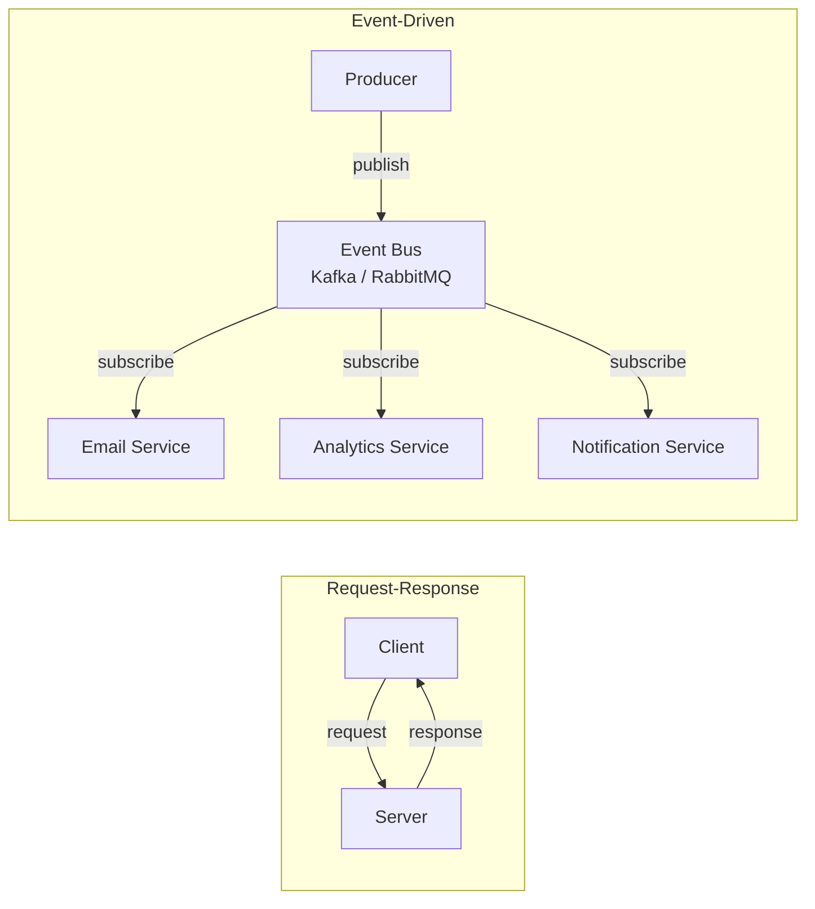
```mermaid
flowchart LR
    subgraph Request-Response
        C1[Client] -->|request| S1[Server]
        S1 -->|response| C1
    end
    subgraph Event-Driven
        P[Producer] -->|publish| EB[Event Bus\nKafka / RabbitMQ]
        EB -->|subscribe| C2[Email Service]
        EB -->|subscribe| C3[Analytics Service]
        EB -->|subscribe| C4[Notification Service]
    end
```

### Code Example — Both Patterns in One System

```python
from fastapi import FastAPI, BackgroundTasks
import json

app = FastAPI()

# Simulated event bus (use Kafka/RabbitMQ in production)
event_subscribers = []

def publish_event(event_type: str, data: dict):
    """Publish event to all subscribers"""
    for subscriber in event_subscribers:
        subscriber(event_type, data)

# ── Request-Response: Synchronous order creation ──
@app.post("/orders")
async def create_order(order: dict, background_tasks: BackgroundTasks):
    # Synchronous: validate, save, return response
    saved_order = {"id": "ord_123", **order, "status": "created"}

    # Asynchronous: publish event for side effects
    background_tasks.add_task(
        publish_event,
        "order.created",
        saved_order
    )

    return saved_order  # Client gets immediate response

# ── Event Consumers (would be separate services in production) ──
def email_consumer(event_type: str, data: dict):
    if event_type == "order.created":
        print(f"Sending confirmation email for order {data['id']}")

def analytics_consumer(event_type: str, data: dict):
    if event_type == "order.created":
        print(f"Tracking order analytics for {data['id']}")

def inventory_consumer(event_type: str, data: dict):
    if event_type == "order.created":
        print(f"Reserving inventory for order {data['id']}")

event_subscribers.extend([email_consumer, analytics_consumer, inventory_consumer])
```

### Key Takeaways
> - 💡 **Request-response** = synchronous, tight coupling, client waits (REST APIs)
> - 💡 **Event-driven** = asynchronous, loose coupling, fire-and-forget (Kafka, RabbitMQ)
> - 💡 Most real systems use **both**: REST for client-facing, events for internal side-effects
> - 💡 Events enable adding new consumers without changing the producer
> - 💡 Trade-off: event-driven is harder to debug and trace (use correlation IDs)

---

## Question 106 — OAuth 2.0 Flows — Authorization Code, Client Credentials, PKCE
🟡 Mid | ★★★ Very Common

### The Scenario
> *"Explain the main OAuth 2.0 flows. When would you use Authorization Code vs Client Credentials vs PKCE?"*

### The Answer

| Flow | Used For | Has User Login? | Client Type |
|------|----------|----------------|-------------|
| **Authorization Code** | Web apps (server-side) | Yes | Confidential (has backend) |
| **Authorization Code + PKCE** | Mobile / SPA apps | Yes | Public (no secret storage) |
| **Client Credentials** | Machine-to-machine | No | Confidential (server-to-server) |
| **Implicit** (deprecated) | Was for SPAs | Yes | Public — use PKCE instead |
| **Resource Owner Password** (deprecated) | Was for trusted apps | Yes | Deprecated — never use |

```
AUTHORIZATION CODE FLOW (Web App):
┌────────┐    ┌──────────┐    ┌────────────┐    ┌──────────┐
│  User  │───►│ Your App │───►│ Auth Server│───►│ Your API │
│Browser │    │(Backend) │    │(Google/Auth0)   │          │
└────────┘    └──────────┘    └────────────┘    └──────────┘
1. User clicks "Login with Google"
2. Redirect to Google login page
3. User logs in → Google returns "authorization code" to your backend
4. Your backend exchanges code for access_token (server-to-server, secret)
5. Your backend uses access_token to call APIs

CLIENT CREDENTIALS FLOW (Machine-to-Machine):
┌──────────┐    ┌────────────┐    ┌──────────┐
│ Service A│───►│ Auth Server│───►│ Service B│
│(backend) │    │            │    │          │
└──────────┘    └────────────┘    └──────────┘
1. Service A sends client_id + client_secret to Auth Server
2. Auth Server returns access_token
3. Service A calls Service B with access_token
(No user involved!)
```

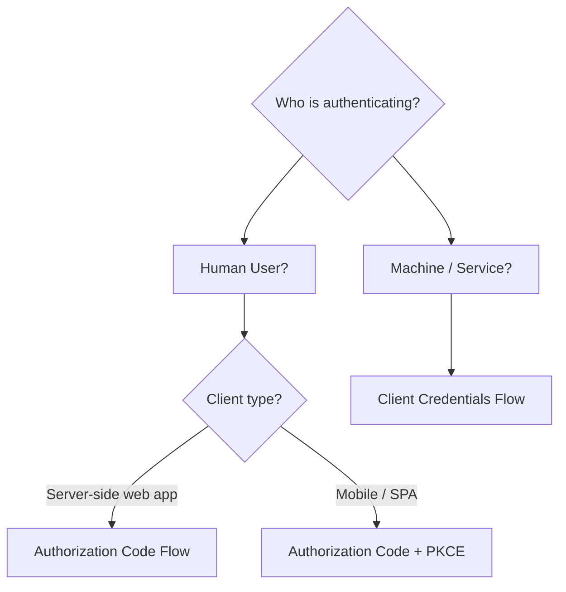
```mermaid
flowchart TD
    A{Who is authenticating?} --> B[Human User?]
    A --> C[Machine / Service?]
    B --> D{Client type?}
    D -->|Server-side web app| E[Authorization Code Flow]
    D -->|Mobile / SPA| F[Authorization Code + PKCE]
    C --> G[Client Credentials Flow]
```

### Code Example — Client Credentials in FastAPI

```python
import httpx
from fastapi import FastAPI, Depends, HTTPException
from fastapi.security import HTTPBearer
import jwt

app = FastAPI()
security = HTTPBearer()

# ── Client Credentials: Service-to-service auth ──
async def get_service_token():
    """Get token for machine-to-machine communication"""
    async with httpx.AsyncClient() as client:
        response = await client.post(
            "https://auth.example.com/oauth/token",
            data={
                "grant_type": "client_credentials",
                "client_id": "service-a-id",
                "client_secret": "service-a-secret",
                "audience": "https://api.example.com"
            }
        )
        return response.json()["access_token"]

@app.get("/internal/data")
async def get_internal_data(credentials=Depends(security)):
    """Endpoint protected by OAuth 2.0 — validates JWT"""
    try:
        payload = jwt.decode(
            credentials.credentials,
            options={"verify_signature": True},
            algorithms=["RS256"],
            audience="https://api.example.com"
        )
        if payload.get("gty") != "client-credentials":
            raise HTTPException(403, "This endpoint requires service auth")
        return {"data": "internal service data", "caller": payload["sub"]}
    except jwt.InvalidTokenError:
        raise HTTPException(401, "Invalid token")

# ── Call another service using Client Credentials ──
@app.get("/aggregate")
async def aggregate_data():
    token = await get_service_token()
    async with httpx.AsyncClient() as client:
        response = await client.get(
            "https://service-b.example.com/internal/data",
            headers={"Authorization": f"Bearer {token}"}
        )
        return response.json()
```

### Key Takeaways
> - 💡 **Authorization Code** = web apps with a backend (most common for user login)
> - 💡 **PKCE** = mobile and SPA apps (no client secret — use code verifier instead)
> - 💡 **Client Credentials** = machine-to-machine (no user involved)
> - 💡 **Implicit flow is deprecated** — always use PKCE for public clients
> - 💡 In interviews, draw the flow diagram — it shows you understand the redirect dance

---

## Question 107 — REST API Versioning Strategies Compared
🟡 Mid | ★★★ Very Common

### The Scenario
> *"Your API has breaking changes for v2, but v1 clients can't migrate immediately. Compare the different versioning strategies: URL path, header, query parameter, and content negotiation."*

### The Answer

| Strategy | Example | Pros | Cons |
|----------|---------|------|------|
| **URL Path** | `GET /v1/users` | Simple, visible, cacheable | URL changes, tight coupling |
| **Query Param** | `GET /users?version=1` | Easy to add | Easy to forget, not RESTful |
| **Custom Header** | `X-API-Version: 1` | Clean URLs | Hidden, harder to test in browser |
| **Content Negotiation** | `Accept: application/vnd.myapp.v1+json` | Most RESTful | Complex, poor tooling support |

```
URL PATH (Most Popular — used by GitHub, Stripe, Twitter):
  /v1/users → old format
  /v2/users → new format
  Easy to understand, easy to route, easy to cache

CUSTOM HEADER:
  GET /users
  X-API-Version: 2
  Clean URL but version is hidden

QUERY PARAM:
  GET /users?version=2
  Simple but messy

CONTENT NEGOTIATION:
  GET /users
  Accept: application/vnd.myapp.v2+json
  Most RESTful but complex
```

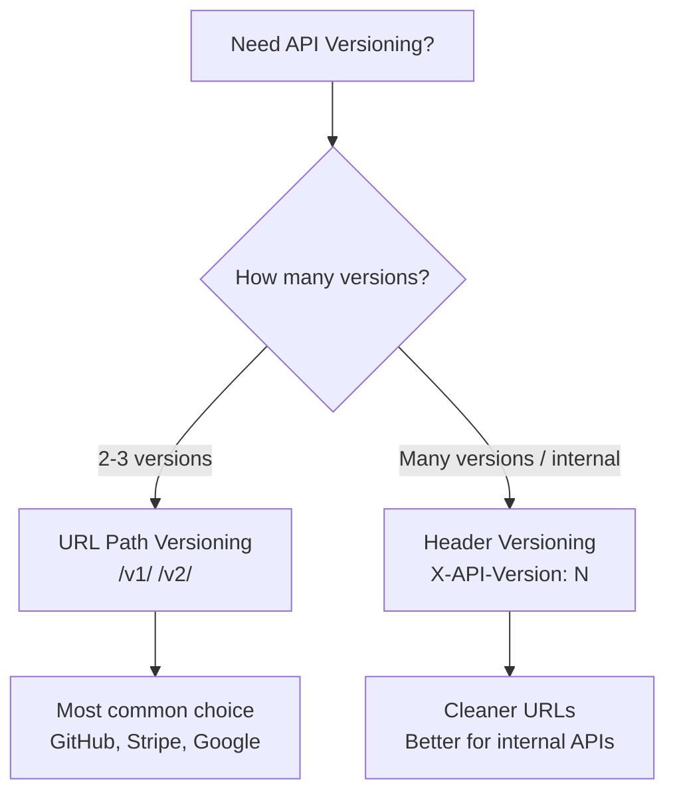
```mermaid
flowchart TD
    A[Need API Versioning?] --> B{How many versions?}
    B -->|2-3 versions| C[URL Path Versioning\n/v1/ /v2/]
    B -->|Many versions / internal| D[Header Versioning\nX-API-Version: N]
    C --> E[Most common choice\nGitHub, Stripe, Google]
    D --> F[Cleaner URLs\nBetter for internal APIs]
```

### Code Example — URL Path Versioning in FastAPI

```python
from fastapi import FastAPI, APIRouter

app = FastAPI()

# V1 Router
v1_router = APIRouter(prefix="/v1")

@v1_router.get("/users/{user_id}")
async def get_user_v1(user_id: int):
    """V1: Returns basic user info"""
    return {"id": user_id, "name": "Alice"}

# V2 Router — breaking change: different response structure
v2_router = APIRouter(prefix="/v2")

@v2_router.get("/users/{user_id}")
async def get_user_v2(user_id: int):
    """V2: Returns nested structure with metadata"""
    return {
        "data": {"id": user_id, "name": "Alice", "email": "alice@example.com"},
        "meta": {"api_version": "v2", "deprecated_fields": []}
    }

app.include_router(v1_router)
app.include_router(v2_router)

# Deprecation header middleware for v1
from starlette.middleware.base import BaseHTTPMiddleware
from starlette.responses import Response

class DeprecationMiddleware(BaseHTTPMiddleware):
    async def dispatch(self, request, call_next):
        response: Response = await call_next(request)
        if request.url.path.startswith("/v1"):
            response.headers["Deprecation"] = "true"
            response.headers["Sunset"] = "2025-12-31"
            response.headers["Link"] = '</v2/users>; rel="successor-version"'
        return response

app.add_middleware(DeprecationMiddleware)
```

### Key Takeaways
> - 💡 **URL path versioning** (`/v1/`, `/v2/`) is the most popular — used by GitHub, Stripe, Google
> - 💡 **Header versioning** is cleaner but harder to discover and test
> - 💡 Always send **Deprecation** and **Sunset** headers for old versions
> - 💡 Share the **service layer** between versions — only the API layer should differ
> - 💡 In interviews, recommend URL versioning and explain the trade-offs of alternatives

---

## Question 108 — Idempotency Keys — Design and Implementation
🟡 Mid | ★★★ Very Common

### The Scenario
> *"How would you design an idempotency key system for a payment API? What happens when a client retries a POST request?"*

### The Answer

An **idempotency key** is a unique identifier sent by the client that ensures the same operation isn't processed twice, even if the request is retried.

```
HOW IT WORKS:

Request 1: POST /payments + Idempotency-Key: "pay_abc123"
  → Server: Process payment, store result with key "pay_abc123"
  → Response: 200 {transaction_id: "txn_001"} ← network drops

Request 2 (retry): POST /payments + Idempotency-Key: "pay_abc123"
  → Server: Key exists! Return stored result
  → Response: 200 {transaction_id: "txn_001"} ← same response!

No duplicate payment! ✅
```

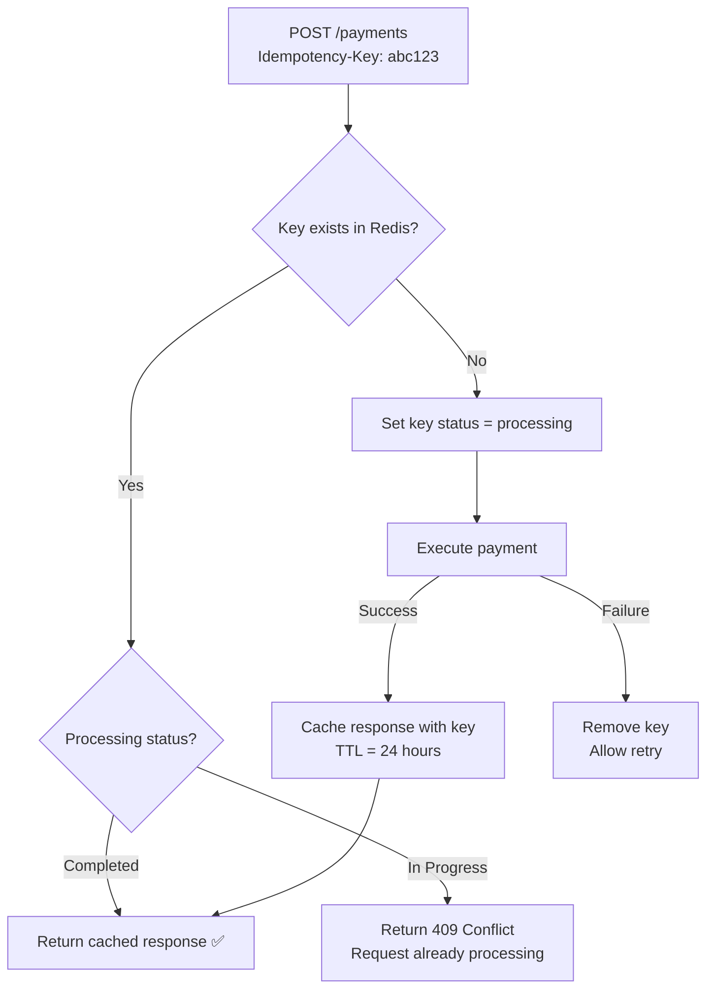
```mermaid
flowchart TD
    A[POST /payments\nIdempotency-Key: abc123] --> B{Key exists in Redis?}
    B -->|Yes| C{Processing status?}
    C -->|Completed| D[Return cached response ✅]
    C -->|In Progress| E[Return 409 Conflict\nRequest already processing]
    B -->|No| F[Set key status = processing]
    F --> G[Execute payment]
    G -->|Success| H[Cache response with key\nTTL = 24 hours]
    G -->|Failure| I[Remove key\nAllow retry]
    H --> D
```

### Code Example — Idempotency Key System

```python
import json
import hashlib
from fastapi import FastAPI, Request, HTTPException
from pydantic import BaseModel

app = FastAPI()

# In production: use Redis with TTL
idempotency_store: dict[str, dict] = {}

class PaymentRequest(BaseModel):
    amount: float
    currency: str
    recipient: str

@app.post("/payments")
async def create_payment(payment: PaymentRequest, request: Request):
    # Step 1: Get idempotency key from header
    idem_key = request.headers.get("Idempotency-Key")
    if not idem_key:
        raise HTTPException(400, "Idempotency-Key header required for POST requests")

    # Step 2: Check if we've already processed this key
    if idem_key in idempotency_store:
        cached = idempotency_store[idem_key]
        if cached["status"] == "processing":
            raise HTTPException(409, "Request with this idempotency key is already processing")
        # Return the exact same response as the first time
        return cached["response"]

    # Step 3: Validate request body matches (prevent key reuse with different data)
    body_hash = hashlib.sha256(payment.model_dump_json().encode()).hexdigest()

    # Step 4: Mark as processing (prevents concurrent duplicate requests)
    idempotency_store[idem_key] = {
        "status": "processing",
        "body_hash": body_hash
    }

    try:
        # Step 5: Process the payment
        result = {
            "transaction_id": f"txn_{idem_key[:8]}",
            "amount": payment.amount,
            "currency": payment.currency,
            "status": "completed"
        }

        # Step 6: Cache the response (TTL 24h in production)
        idempotency_store[idem_key] = {
            "status": "completed",
            "body_hash": body_hash,
            "response": result
        }

        return result

    except Exception as e:
        # Step 7: On failure, remove key so client can retry
        del idempotency_store[idem_key]
        raise HTTPException(500, f"Payment failed: {str(e)}")
```

### Key Takeaways
> - 💡 **Idempotency keys** prevent duplicate operations when clients retry POST requests
> - 💡 Store the key + response in **Redis with TTL** (typically 24 hours)
> - 💡 Handle three states: **not seen**, **in progress**, **completed**
> - 💡 Hash the request body to prevent **key reuse** with different data
> - 💡 Used by **Stripe, PayPal, AWS** — mention this in interviews for credibility

---

## Question 109 — Backpressure and Flow Control in APIs
🔴 Senior | ★☆☆ Rare

### The Scenario
> *"What is backpressure in the context of APIs and distributed systems? How do you implement flow control to prevent your API from being overwhelmed?"*

### The Answer

**Backpressure** is a mechanism where a system signals upstream that it cannot handle more work. Instead of accepting everything and crashing, it pushes back.

| Strategy | How It Works | Example |
|----------|-------------|---------|
| **Rate limiting** | Reject requests over threshold | 429 Too Many Requests |
| **Load shedding** | Drop low-priority requests when overloaded | Return 503 for non-critical endpoints |
| **Queue depth limits** | Reject when queue is full | Bounded queues in Celery/RabbitMQ |
| **Adaptive concurrency** | Dynamically adjust based on latency | Netflix Concurrency Limiter |
| **Circuit breaker** | Stop calling failing downstream | Return fallback response |

```
WITHOUT BACKPRESSURE:
Clients ──1000 req/s──► API ──1000 req/s──► DB (capacity: 200/s)
                                             💥 DB crashes!

WITH BACKPRESSURE:
Clients ──1000 req/s──► API ──200 req/s──► DB (capacity: 200/s)
                         │                    ✅ DB is healthy
                         └── 800 req/s → 429 "Slow down"
                              or → Queue for later
```

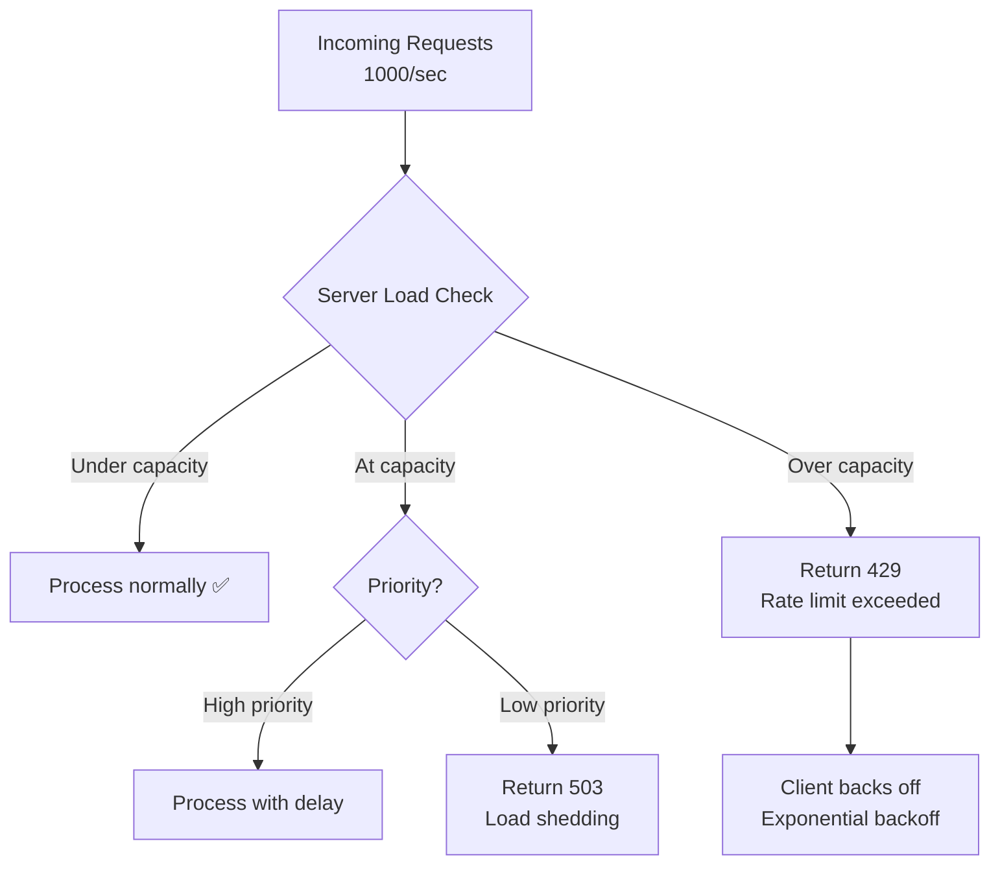
```mermaid
flowchart TD
    A[Incoming Requests\n1000/sec] --> B{Server Load Check}
    B -->|Under capacity| C[Process normally ✅]
    B -->|At capacity| D{Priority?}
    D -->|High priority| E[Process with delay]
    D -->|Low priority| F[Return 503\nLoad shedding]
    B -->|Over capacity| G[Return 429\nRate limit exceeded]
    G --> H[Client backs off\nExponential backoff]
```

### Code Example — Backpressure with Bounded Queue

```python
import asyncio
from fastapi import FastAPI, HTTPException

app = FastAPI()

# Bounded semaphore = max concurrent requests
MAX_CONCURRENT = 50
semaphore = asyncio.Semaphore(MAX_CONCURRENT)
pending_count = 0

@app.middleware("http")
async def backpressure_middleware(request, call_next):
    global pending_count
    pending_count += 1

    # Load shedding: reject if too many pending requests
    if pending_count > MAX_CONCURRENT * 2:
        pending_count -= 1
        raise HTTPException(
            status_code=503,
            detail="Server is overloaded. Please retry later.",
            headers={"Retry-After": "5"}
        )

    # Concurrency control: limit parallel processing
    try:
        acquired = semaphore._value > 0  # Check without blocking
        if not acquired:
            raise HTTPException(
                status_code=429,
                detail="Too many concurrent requests.",
                headers={"Retry-After": "1"}
            )
        async with semaphore:
            response = await call_next(request)
            return response
    finally:
        pending_count -= 1
```

### Key Takeaways
> - 💡 **Backpressure** = telling upstream "slow down, I can't handle more"
> - 💡 Without it, systems crash under load; with it, they degrade gracefully
> - 💡 Implement via **rate limiting** (429), **load shedding** (503), or **bounded queues**
> - 💡 Clients should implement **exponential backoff** when they receive 429/503
> - 💡 Monitor queue depths and response latencies to detect when backpressure is needed

---

## Question 110 — API Contract-First Design (OpenAPI/Swagger-First)
🟡 Mid | ★★☆ Common

### The Scenario
> *"What is contract-first API design? How does it differ from code-first? What are the advantages of designing your API schema before writing code?"*

### The Answer

| Approach | Flow | Tools |
|----------|------|-------|
| **Code-First** | Write code → generate OpenAPI spec | FastAPI (auto-generates docs) |
| **Contract-First** | Write OpenAPI spec → generate code/stubs | Swagger Editor → codegen |

```
CODE-FIRST (FastAPI default):
1. Write Python code with type hints
2. FastAPI auto-generates OpenAPI spec
3. Spec is a byproduct of code

CONTRACT-FIRST:
1. Design OpenAPI/Swagger spec (YAML)
2. All teams agree on the contract
3. Backend generates server stubs
4. Frontend generates client SDKs
5. Tests validate contract compliance
```

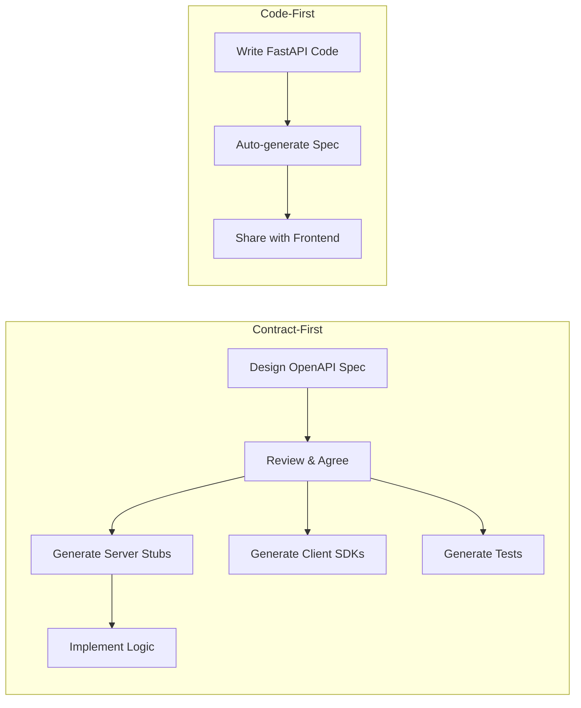
```mermaid
flowchart LR
    subgraph Contract-First
        A[Design OpenAPI Spec] --> B[Review & Agree]
        B --> C[Generate Server Stubs]
        B --> D[Generate Client SDKs]
        B --> E[Generate Tests]
        C --> F[Implement Logic]
    end
    subgraph Code-First
        G[Write FastAPI Code] --> H[Auto-generate Spec]
        H --> I[Share with Frontend]
    end
```

### Code Example — Contract-First with OpenAPI Spec

```yaml
# openapi.yaml — The contract (designed first)
openapi: 3.0.3
info:
  title: User API
  version: "1.0"
paths:
  /users/{user_id}:
    get:
      operationId: getUser
      parameters:
        - name: user_id
          in: path
          required: true
          schema:
            type: integer
      responses:
        '200':
          description: User found
          content:
            application/json:
              schema:
                $ref: '#/components/schemas/User'
        '404':
          description: User not found
components:
  schemas:
    User:
      type: object
      required: [id, name, email]
      properties:
        id:
          type: integer
        name:
          type: string
        email:
          type: string
          format: email
```

```python
# FastAPI implementation matching the contract
from fastapi import FastAPI, HTTPException
from pydantic import BaseModel, EmailStr

app = FastAPI(
    title="User API",
    version="1.0",
    # Point to the pre-designed spec
)

class User(BaseModel):
    id: int
    name: str
    email: EmailStr

# Implementation must match the contract exactly
@app.get("/users/{user_id}", response_model=User)
async def get_user(user_id: int):
    user = await fetch_user(user_id)
    if not user:
        raise HTTPException(404, "User not found")
    return user

# Contract testing: validate implementation matches spec
# pip install schemathesis
# schemathesis run http://localhost:8000/openapi.json
```

### Key Takeaways
> - 💡 **Contract-first** = design the API spec before writing code; ensures agreement across teams
> - 💡 **Code-first** = write code first, spec is auto-generated (FastAPI's default approach)
> - 💡 Contract-first is better for **large teams** and **multi-language** environments
> - 💡 Use **Schemathesis** or **Dredd** to validate your implementation matches the contract
> - 💡 FastAPI's auto-generation makes code-first very practical for smaller teams

---

## Question 111 — Retry Strategies — Exponential Backoff, Jitter, Max Retries
🟡 Mid | ★★★ Very Common

### The Scenario
> *"Your API calls a downstream service that sometimes fails. How do you implement retries properly? What is exponential backoff and why is jitter important?"*

### The Answer

| Strategy | Formula | Example Delays | Problem Solved |
|----------|---------|---------------|----------------|
| **Fixed interval** | `delay = constant` | 1s, 1s, 1s, 1s | Simple but can cause thundering herd |
| **Exponential backoff** | `delay = base * 2^attempt` | 1s, 2s, 4s, 8s | Gives server time to recover |
| **With jitter** | `delay = random(0, base * 2^attempt)` | 0.7s, 1.3s, 3.8s, 7.1s | Prevents synchronized retries |
| **Decorrelated jitter** | `delay = random(base, prev_delay * 3)` | 1.2s, 2.9s, 5.1s | Best distribution of retries |

```
WITHOUT JITTER (Thundering Herd):
Time 0s: Server fails
Time 1s: ALL 1000 clients retry simultaneously → server crashes again!
Time 2s: ALL 1000 clients retry simultaneously → still crashed!

WITH JITTER:
Time 0s:    Server fails
Time 0.3s:  Client A retries
Time 0.7s:  Client B retries
Time 1.1s:  Client C retries
Time 1.5s:  Client D retries
→ Retries spread out, server recovers gradually ✅
```

```mermaid
flowchart TD
    A[API Call Fails] --> B{Retry count < max?}
    B -->|No| C[Return error to caller ❌]
    B -->|Yes| D[Calculate delay\nbase × 2^attempt]
    D --> E[Add random jitter\n± 0-50%]
    E --> F[Wait delay seconds]
    F --> G[Retry the call]
    G --> H{Success?}
    H -->|Yes| I[Return result ✅]
    H -->|No| B
```

### Code Example — Retry with Exponential Backoff + Jitter

```python
import asyncio
import random
import httpx
from fastapi import FastAPI

app = FastAPI()

async def retry_with_backoff(
    func,
    max_retries: int = 3,
    base_delay: float = 1.0,
    max_delay: float = 30.0,
    retryable_status: set = {429, 500, 502, 503, 504}
):
    """Retry with exponential backoff and full jitter."""
    for attempt in range(max_retries + 1):
        try:
            result = await func()
            if hasattr(result, 'status_code') and result.status_code in retryable_status:
                raise httpx.HTTPStatusError(
                    f"Status {result.status_code}",
                    request=result.request,
                    response=result
                )
            return result
        except (httpx.HTTPStatusError, httpx.ConnectError, httpx.TimeoutException) as e:
            if attempt == max_retries:
                raise  # Final attempt failed

            # Exponential backoff with full jitter
            delay = min(base_delay * (2 ** attempt), max_delay)
            jittered_delay = random.uniform(0, delay)

            print(f"Attempt {attempt + 1} failed. Retrying in {jittered_delay:.1f}s...")
            await asyncio.sleep(jittered_delay)

@app.get("/data")
async def get_data():
    async def call_downstream():
        async with httpx.AsyncClient(timeout=5.0) as client:
            return await client.get("https://api.downstream.com/data")

    response = await retry_with_backoff(call_downstream, max_retries=3)
    return response.json()

# Using tenacity library (production recommended)
# pip install tenacity
from tenacity import retry, stop_after_attempt, wait_exponential_jitter

@retry(
    stop=stop_after_attempt(3),
    wait=wait_exponential_jitter(initial=1, max=30, jitter=5)
)
async def call_payment_service(order_id: str):
    async with httpx.AsyncClient() as client:
        response = await client.post(
            "https://payments.example.com/charge",
            json={"order_id": order_id}
        )
        response.raise_for_status()
        return response.json()
```

### Key Takeaways
> - 💡 **Exponential backoff** = double the wait time after each failure (1s, 2s, 4s, 8s)
> - 💡 **Jitter** = add randomness to prevent thundering herd (all clients retrying at once)
> - 💡 Always set a **maximum retry count** (typically 3-5) and **maximum delay** (30-60s)
> - 💡 Only retry **retryable errors**: 429, 500, 502, 503, 504, timeouts — never retry 400/401/403
> - 💡 In production, use the `tenacity` library instead of rolling your own

---

## Question 112 — Service Mesh vs API Gateway
🔴 Senior | ★★☆ Common

### The Scenario
> *"What's the difference between a service mesh and an API gateway? Do you need both? When would you use one vs the other?"*

### The Answer

| Feature | API Gateway | Service Mesh |
|---------|------------|-------------|
| **Where** | Edge (between client and services) | Inside (between services) |
| **Traffic** | North-South (external → internal) | East-West (service → service) |
| **Auth** | Client auth (JWT, API keys) | mTLS (service identity) |
| **Rate limiting** | Per client/tier | Per service |
| **Load balancing** | Basic (round-robin) | Advanced (per-request, zone-aware) |
| **Observability** | API-level metrics | Service-to-service tracing |
| **Implementation** | Centralized (Kong, AWS API GW) | Sidecar proxy (Istio/Envoy, Linkerd) |
| **Overhead** | Single hop | Sidecar per pod (resource cost) |

```
┌─────────────────────────────────────────────────────────────┐
│                      ARCHITECTURE                            │
│                                                              │
│  External ──► API Gateway ──► ┌────────────────────────────┐│
│  Clients      (North-South)   │   Service Mesh             ││
│                               │   (East-West)              ││
│                               │                            ││
│                               │  ┌─────┐     ┌─────┐      ││
│                               │  │Svc A│◄───►│Svc B│      ││
│                               │  │+proxy│    │+proxy│     ││
│                               │  └─────┘     └──┬──┘      ││
│                               │                  │         ││
│                               │              ┌───▼──┐      ││
│                               │              │Svc C │      ││
│                               │              │+proxy│      ││
│                               │              └──────┘      ││
│                               └────────────────────────────┘│
└─────────────────────────────────────────────────────────────┘
```

```mermaid
flowchart LR
    C[External Client] --> GW[API Gateway\nAuth, Rate Limit\nNorth-South]
    GW --> SA[Service A + Sidecar]
    SA -->|mTLS via mesh| SB[Service B + Sidecar]
    SA -->|mTLS via mesh| SC[Service C + Sidecar]
    SB -->|mTLS via mesh| SC
```

### Key Takeaways
> - 💡 **API Gateway** = edge layer for external traffic (north-south), handles client auth and rate limiting
> - 💡 **Service Mesh** = internal layer for service-to-service (east-west), handles mTLS and observability
> - 💡 Most production systems with microservices need **both**
> - 💡 Popular service meshes: **Istio** (Envoy proxy), **Linkerd** — both run as sidecar proxies
> - 💡 Service mesh adds **resource overhead** (sidecar per pod) — only worth it at scale (10+ services)

---

## Question 113 — Blue-Green vs Canary Deployments for APIs
🟡 Mid | ★★☆ Common

### The Scenario
> *"Compare blue-green and canary deployment strategies for REST APIs. When would you use each? How do they minimize downtime and risk?"*

### The Answer

| Aspect | Blue-Green | Canary |
|--------|-----------|--------|
| How | Two identical environments; switch all traffic at once | Gradually shift traffic from old to new (1% → 10% → 100%) |
| Rollback | Instant (switch back to old environment) | Instant (route back to old version) |
| Risk | Medium (all traffic switches at once) | Low (only a fraction sees new version) |
| Cost | High (need 2x infrastructure during deploy) | Lower (gradual, shared infrastructure) |
| Testing | All-or-nothing | Partial — can test with real traffic |
| Detection | Smoke tests after switch | Monitor error rates per version |

```
BLUE-GREEN:
Before: All traffic → Blue (v1) ████████████
After:  All traffic → Green (v2) ████████████
Switch: Instant (DNS/LB change)
Rollback: Switch back to Blue

CANARY:
Step 1:  95% → v1 ████████████  |  5% → v2 █
Step 2:  75% → v1 ████████████  | 25% → v2 ███
Step 3:  50% → v1 ██████        | 50% → v2 ██████
Step 4:   0% → v1               |100% → v2 ████████████
If errors spike at any step → route 100% back to v1
```

```mermaid
flowchart TD
    subgraph Blue-Green
        LB1[Load Balancer] -->|100%| B[Blue v1 Active]
        LB1 -.->|0%| G[Green v2 Standby]
        G -->|Switch| LB1
    end
    subgraph Canary
        LB2[Load Balancer] -->|95%| V1[v1 Stable]
        LB2 -->|5%| V2[v2 Canary]
        V2 --> M{Metrics OK?}
        M -->|Yes| INC[Increase to 25% → 50% → 100%]
        M -->|No| RB[Rollback to 0%]
    end
```

### Code Example — Canary Routing in FastAPI

```python
import random
from fastapi import FastAPI, Request
from fastapi.responses import JSONResponse

app = FastAPI()

# Canary configuration (in production: use feature flag service)
CANARY_PERCENTAGE = 5  # 5% of traffic goes to v2

def is_canary_request(request: Request) -> bool:
    """Determine if request should go to canary (v2)."""
    # Option 1: Random percentage
    if random.randint(1, 100) <= CANARY_PERCENTAGE:
        return True
    # Option 2: Header-based (for testing)
    if request.headers.get("X-Canary") == "true":
        return True
    # Option 3: User-based (consistent per user)
    user_id = request.headers.get("X-User-ID", "")
    if user_id and hash(user_id) % 100 < CANARY_PERCENTAGE:
        return True
    return False

@app.get("/users/{user_id}")
async def get_user(user_id: int, request: Request):
    if is_canary_request(request):
        # V2: New response format
        return JSONResponse(
            content={
                "data": {"id": user_id, "name": "Alice", "email": "alice@example.com"},
                "meta": {"version": "v2"}
            },
            headers={"X-Served-By": "canary-v2"}
        )
    else:
        # V1: Current stable response
        return JSONResponse(
            content={"id": user_id, "name": "Alice"},
            headers={"X-Served-By": "stable-v1"}
        )
```

### Key Takeaways
> - 💡 **Blue-green** = two environments, instant switch — simple but needs 2x resources
> - 💡 **Canary** = gradual rollout (1% → 5% → 25% → 100%) — lower risk but more complex
> - 💡 Canary is preferred for **high-traffic APIs** — you detect issues before full rollout
> - 💡 Both strategies enable **instant rollback** — the key benefit over in-place deployments
> - 💡 Use **Kubernetes** with Istio or Argo Rollouts for automated canary deployments

---

*⬅️ Previous: [07 — Real-World Integration](./07-real-world-integration.md)*

*📝 Next: [09 — Advanced Scenarios →](./09-advanced-scenarios.md)*

*⚡ Quick Reference: [All 113 Questions →](./QUICK_REFERENCE.md)*
